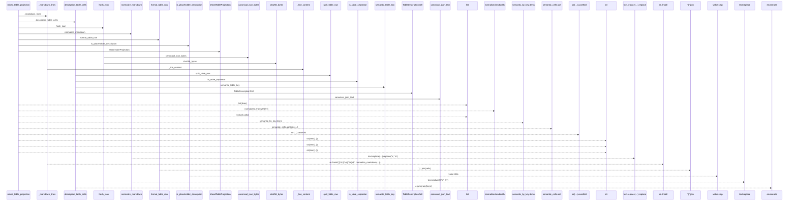
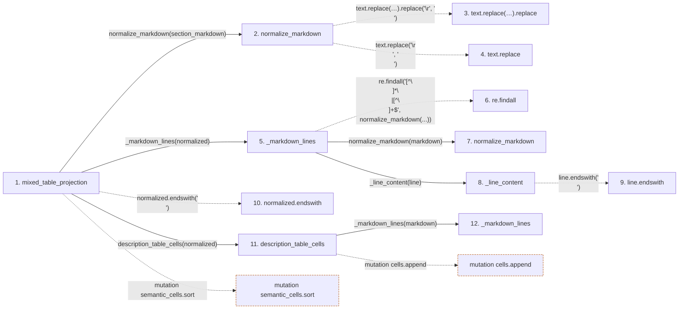

# mixed_table_projection

**Entry point:** `mixed_table_projection` (`api`)
**Source:** [markdown_sections](../modules/markdown_sections.md)
**Modules touched:** [knowledge_evidence](../modules/knowledge_evidence.md), [markdown_sections](../modules/markdown_sections.md)

## Call sequence

> Static overview in presentation order, not runtime execution order. Arrows retain captured callers; representative internal continuations and boundary examples precede repeated helper detail.

<!-- Auto-generated from static call edges. Dashed arrows are external or unresolved calls. Reviewed runtime conditions and side effects belong in Behavior. -->

```mermaid
sequenceDiagram
    participant p0 as mixed_table_projection
    participant p1 as _markdown_lines
    participant p2 as description_table_cells
    participant p3 as hash_json
    participant p4 as normalize_markdown
    participant p5 as format_table_row
    participant p6 as is_placeholder_description
    participant p7 as MixedTableProjection
    participant p8 as canonical_json_bytes
    participant p9 as sha256_bytes
    participant p10 as _line_content
    participant p11 as split_table_row
    participant p12 as is_table_separator
    participant p13 as semantic_table_key
    participant p14 as TableDescriptionCell
    participant p15 as canonical_json_text
    participant p16 as list
    participant p17 as normalized.endswith
    participant p18 as semantic_by_key.items
    participant p19 as semantic_cells.sort
    participant p20 as str(…).casefold
    participant p21 as str
    participant p22 as text.replace(…).replace
    participant p23 as re.findall
    participant p24 as ' | '.join
    participant p25 as value.strip
    participant p26 as text.replace
    participant p27 as enumerate
    p0->>p1: _markdown_lines
    p0->>p2: description_table_cells
    p0->>p3: hash_json
    p0->>p4: normalize_markdown
    p0->>p5: format_table_row
    p0->>p6: is_placeholder_description
    p0->>p7: MixedTableProjection
    p3->>p8: canonical_json_bytes
    p3->>p9: sha256_bytes
    p1->>p10: _line_content
    p2->>p11: split_table_row
    p2->>p12: is_table_separator
    p2->>p13: semantic_table_key
    p2->>p14: TableDescriptionCell
    p8->>p15: canonical_json_text
    p0-->>p16: list(lines)
    p0-->>p17: normalized.endswith('\n')
    p0-->>p16: list(cell.cells)
    p0-->>p18: semantic_by_key.items
    p0-->>p19: semantic_cells.sort(key=...)
    p0-->>p20: str(…).casefold
    p0-->>p21: str(item[...])
    p0-->>p21: str(item[...])
    p0-->>p21: str(item[...])
    p4-->>p22: text.replace(…).replace('\r', '\n')
    p1-->>p23: re.findall('[^\\n]*\\n|[^\\n]+$', normalize_markdown(...))
    p5-->>p24: ' | '.join(cells)
    p6-->>p25: value.strip
    p4-->>p26: text.replace('\r\n', '\n')
    p2-->>p27: enumerate(lines)
```

> Call sequence diagram shows 30 of 74 interactions; 44 omitted to keep the visualization within the 30-interaction and generated-diagram limits, with uncertain identities omitted rather than inferred.

> Captured boundary calls: external 7 of 22 (15 omitted); unresolved 8 of 32 (24 omitted). These counts cover the captured static trace.

Omitted captured detail, grouped by actual caller occurrence and target module:

| Caller | Parent step | Target module | Kind | Omitted interactions |
| --- | --- | --- | --- | --- |
| `src/llm_wiki_cli/services/markdown_sections.py:_markdown_lines` | 5 | [src/llm_wiki_cli/services/markdown_sections.py](../modules/markdown_sections.md) | internal | 1 |
| `src/llm_wiki_cli/services/markdown_sections.py:_line_content` | 8 | - | unresolved | 1 |
| `src/llm_wiki_cli/services/markdown_sections.py:description_table_cells` | 11 | [src/llm_wiki_cli/services/markdown_sections.py](../modules/markdown_sections.md) | internal | 3 |
| `src/llm_wiki_cli/services/markdown_sections.py:split_table_row` | 14 | - | unresolved | 12 |
| `src/llm_wiki_cli/services/markdown_sections.py:split_table_row` | 14 | - | external | 3 |
| `src/llm_wiki_cli/services/markdown_sections.py:description_table_cells` | 11 | - | unresolved | 3 |
| `src/llm_wiki_cli/services/markdown_sections.py:description_table_cells` | 11 | - | external | 7 |
| `src/llm_wiki_cli/services/markdown_sections.py:is_table_separator` | 32 | - | external | 2 |
> Omission summary shows 8 of 17 groups; 9 further groups are not expanded here. Counts above include all omitted interactions.
> Detailed flow queries retain their own coverage and limits; omitted paths may execute at runtime.

## Data flow

<!-- Auto-generated static analysis. Treat values and boundaries as best-effort hints, not runtime proof. -->

### Analysis coverage

**Effect analysis partially available.** Flow assembly and source effect analysis are separate; empty observations do not prove an empty handler body.

Source steps: 21; effect analysis evaluated: 19, partial: 0, unavailable: 2. Counts include steps omitted from the displayed trace.

- Callable record unavailable; the selected entry symbol has no represented callable body.
- Effect collector totals unavailable; observed counts cover captured records only.

| Step | Callable record | Effect analysis | Collector totals |
|---|---|---|---|
| `mixed_table_projection` | `available` | `evaluated` | `available` |
| `normalize_markdown` | `available` | `evaluated` | `available` |
| `text.replace(…).replace` | `not_applicable` | `not_applicable` | `not_applicable` |
| `text.replace` | `not_applicable` | `not_applicable` | `not_applicable` |
| `_markdown_lines` | `available` | `evaluated` | `available` |
| `re.findall` | `not_applicable` | `not_applicable` | `not_applicable` |
| `normalize_markdown` | `available` | `evaluated` | `available` |
| `_line_content` | `available` | `evaluated` | `available` |
| `line.endswith` | `not_applicable` | `not_applicable` | `not_applicable` |
| `normalized.endswith` | `not_applicable` | `not_applicable` | `not_applicable` |
| `description_table_cells` | `available` | `evaluated` | `available` |
| `_markdown_lines` | `available` | `evaluated` | `available` |

```mermaid
flowchart LR
    s1["1. mixed_table_projection"]
    s2["2. normalize_markdown"]
    s3["3. text.replace(…).replace"]
    s4["4. text.replace"]
    s5["5. _markdown_lines"]
    s6["6. re.findall"]
    s7["7. normalize_markdown"]
    s8["8. _line_content"]
    s9["9. line.endswith"]
    s10["10. normalized.endswith"]
    s11["11. description_table_cells"]
    s12["12. _markdown_lines"]
    s1 -->|"normalize_markdown(section_markdown)"| s2
    s2 -. "text.replace(…).replace('\r', '\n')" .-> s3
    s2 -. "text.replace('\r\n', '\n')" .-> s4
    s1 -->|"_markdown_lines(normalized)"| s5
    s5 -. "re.findall('[^\\n]*\\n|[^\\n]+$', normalize_markdown(...))" .-> s6
    s5 -->|"normalize_markdown(markdown)"| s7
    s5 -->|"_line_content(line)"| s8
    s8 -. "line.endswith('\n')" .-> s9
    s1 -. "normalized.endswith('\n')" .-> s10
    s1 -->|"description_table_cells(normalized)"| s11
    s11 -->|"_markdown_lines(markdown)"| s12
    b0["mutation semantic_cells.sort"]
    s1 -. "mutation semantic_cells.sort" .-> b0
    b1["mutation cells.append"]
    s11 -. "mutation cells.append" .-> b1
    click s1 "../modules/markdown_sections.md"
    click s2 "../modules/markdown_sections.md"
    click s5 "../modules/markdown_sections.md"
    click s7 "../modules/markdown_sections.md"
    click s8 "../modules/markdown_sections.md"
    click s11 "../modules/markdown_sections.md"
    click s12 "../modules/markdown_sections.md"
    classDef boundary stroke:#b45309,stroke-dasharray: 4 2
    class b0 boundary
    class b1 boundary
```

### Step data

| Step | Inputs | Reads | Writes | Returns |
|---|---|---|---|---|
| `mixed_table_projection` | `section_markdown: str` | `MIXED_TABLE_DOMAIN`, `MIXED_TABLE_DOMAIN` | `row[...]`, `structural_lines[...]`, `semantic_by_key[...]` | `MixedTableProjection(...)` |
| `normalize_markdown` | `text: str` | - | - | `...` |
| `text.replace(…).replace` | - | - | - | - |
| `text.replace` | - | - | - | - |
| `_markdown_lines` | `markdown: str`, `keepends: bool` | - | - | `...` |
| `re.findall` | - | - | - | - |
| `normalize_markdown` | `text: str` | - | - | `...` |
| `_line_content` | `line: str` | - | - | `...` |
| `line.endswith` | - | - | - | - |
| `normalized.endswith` | - | - | - | - |
| `description_table_cells` | `markdown: str` | - | `occurrences[...]` | `tuple(...)`, `(...)` |
| `_markdown_lines` | `markdown: str`, `keepends: bool` | - | - | `...` |

### Call data

| From | To | Line | Call |
|---|---|---:|---|
| mixed_table_projection | normalize_markdown | 613 | `normalize_markdown(section_markdown)` |
| normalize_markdown | text.replace(…).replace | 82 | `text.replace('\r\n', '\n').replace('\r', '\n')` |
| normalize_markdown | text.replace | 82 | `text.replace('\r\n', '\n')` |
| mixed_table_projection | _markdown_lines | 614 | `_markdown_lines(normalized)` |
| _markdown_lines | re.findall | 218 | `re.findall('[^\\n]*\\n\|[^\\n]+$', normalize_markdown(...))` |
| _markdown_lines | normalize_markdown | 218 | `normalize_markdown(markdown)` |
| _markdown_lines | _line_content | 219 | `_line_content(line)` |
| _line_content | line.endswith | 212 | `line.endswith('\n')` |
| mixed_table_projection | normalized.endswith | 615 | `normalized.endswith('\n')` |
| mixed_table_projection | description_table_cells | 616 | `description_table_cells(normalized)` |
| description_table_cells | _markdown_lines | 566 | `_markdown_lines(markdown)` |

### Boundary effects

| Kind | Target | Step | Line |
|---|---|---|---:|
| mutation | `semantic_cells.sort` | `mixed_table_projection` | 637 |
| mutation | `cells.append` | `description_table_cells` | 589 |

### Static analysis gaps

| Kind | Step | Target | Line |
|---|---|---|---:|
| unresolved_call | `normalize_markdown` | `text.replace('\r\n', '\n').replace` | 82 |
| unresolved_call | `normalize_markdown` | `text.replace` | 82 |
| external_call | `_markdown_lines` | `re.findall` | 218 |
| unresolved_call | `_line_content` | `line.endswith` | 212 |
| unresolved_call | `mixed_table_projection` | `normalized.endswith` | 615 |
| step_limit | `mixed_table_projection` | `first 12 steps` | 0 |

## Behavior

This flow starts at `mixed_table_projection` and is classified as `api`. The generated call and data-flow sections are bounded static projections; runtime conditions and side effects require source-level confirmation.
