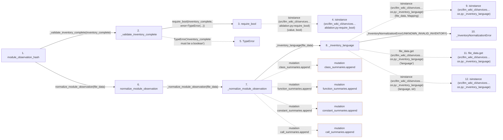

# module_observation_hash

**Entry point:** `module_observation_hash` (`api`)
**Source:** [knowledge_evidence](../modules/knowledge_evidence.md)
**Modules touched:** [knowledge_evidence](../modules/knowledge_evidence.md), [validation](../modules/validation.md)

## Call sequence

```mermaid
sequenceDiagram
    participant p0 as module_observation_hash
    participant p1 as _validate_inventory_complete
    participant p2 as require_bool
    participant p3 as isinstance (src/llm_wiki_cli/services…alidation.py:require_bool)
    participant p4 as TypeError
    participant p5 as normalize_module_observation
    participant p6 as _normalize_module_observation
    participant p7 as _inventory_language
    participant p8 as isinstance (src/llm_wiki_cli/services…ce.py:_inventory_language)
    participant p9 as _InventoryNormalizationError
    participant p10 as file_data.get (src/llm_wiki_cli/services…ce.py:_inventory_language)
    participant p11 as isinstance (src/llm_wiki_cli/services…malize_module_observation)
    participant p12 as _record_array
    participant p13 as isinstance (src/llm_wiki_cli/services…evidence.py:_record_array)
    participant p14 as all (src/llm_wiki_cli/services…evidence.py:_record_array)
    participant p15 as _validate_import_record
    participant p16 as record.get (src/llm_wiki_cli/services…y:_validate_import_record)
    participant p17 as isinstance (src/llm_wiki_cli/services…y:_validate_import_record)
    participant p18 as _validate_optional_strings
    participant p19 as require_string
    participant p20 as isinstance (src/llm_wiki_cli/services…idation.py:require_string)
    p0->>p1: _validate_inventory_complete
    p1->>p2: require_bool
    p2-->>p3: isinstance (src/llm_wiki_cli/services…alidation.py:require_bool)
    p1-->>p4: TypeError
    p0->>p5: normalize_module_observation
    p5->>p6: _normalize_module_observation
    p6->>p7: _inventory_language
    p7-->>p8: isinstance (src/llm_wiki_cli/services…ce.py:_inventory_language)
    p7->>p9: _InventoryNormalizationError
    p7-->>p10: file_data.get (src/llm_wiki_cli/services…ce.py:_inventory_language)
    p7-->>p8: isinstance (src/llm_wiki_cli/services…ce.py:_inventory_language)
    p7->>p9: _InventoryNormalizationError
    p7->>p9: _InventoryNormalizationError
    p6-->>p11: isinstance (src/llm_wiki_cli/services…malize_module_observation)
    p6->>p12: _record_array
    p12->>p9: _InventoryNormalizationError
    p12-->>p13: isinstance (src/llm_wiki_cli/services…evidence.py:_record_array)
    p12->>p9: _InventoryNormalizationError
    p12-->>p14: all (src/llm_wiki_cli/services…evidence.py:_record_array)
    p12-->>p13: isinstance (src/llm_wiki_cli/services…evidence.py:_record_array)
    p12->>p9: _InventoryNormalizationError
    p6->>p12: _record_array
    p6->>p12: _record_array
    p6->>p15: _validate_import_record
    p15-->>p16: record.get (src/llm_wiki_cli/services…y:_validate_import_record)
    p15-->>p17: isinstance (src/llm_wiki_cli/services…y:_validate_import_record)
    p15->>p9: _InventoryNormalizationError
    p15->>p18: _validate_optional_strings
    p18->>p19: require_string
    p19-->>p20: isinstance (src/llm_wiki_cli/services…idation.py:require_string)
```

<!-- Auto-generated from static call edges. Dashed arrows are external or unresolved calls. Reviewed runtime conditions and side effects belong in Behavior. -->

> Call sequence diagram shows 30 of 130 interactions; 100 omitted to keep the visualization within the 30-interaction and generated-diagram limits.

> Trace truncated at the depth limit; deeper calls are omitted.

## Data flow

<!-- Auto-generated static analysis. Treat values and boundaries as best-effort hints, not runtime proof. -->

### Step data

| Step | Inputs | Reads | Writes | Returns |
|---|---|---|---|---|
| `module_observation_hash` | `file_data: Mapping[str, Any]`, `inventory_complete: bool` | - | - | `None`, `_hash_normalized_observation(...)` |
| `_validate_inventory_complete` | `inventory_complete: object` | - | - | - |
| `require_bool` | `value: object`, `error: Exception` | - | - | `value` |
| `isinstance (src/llm_wiki_cli/services…alidation.py:require_bool)` | - | - | - | - |
| `TypeError` | - | - | - | - |
| `normalize_module_observation` | `file_data: Mapping[str, Any]` | `_InventoryNormalizationError` | - | `_normalize_module_observation(...)`, `None` |
| `_normalize_module_observation` | `file_data: Mapping[str, Any] \| None` | `Mapping`, `_MODULE_ENTITY_FIELDS`, `_MODULE_NONSTRUCTURAL_KEYS`, `_MODULE_FUNCTION_FIELDS`, `_MODULE_NONSTRUCTURAL_KEYS`, `MODULE_OBSERVATION_SCOPE`, `_MODULE_NONSTRUCTURAL_KEYS`, `UNKNOWN_INVALID_INVENTORY` | `seen_names[...]`, `summary[...]`, `payload[...]`, `payload[...]`, `payload[...]`, `payload[...]` | `payload` |
| `_inventory_language` | `file_data: Mapping[str, Any] \| None` | `Mapping`, `UNKNOWN_INVALID_INVENTORY`, `UNKNOWN_INVALID_INVENTORY`, `_SUPPORTED_OBSERVATION_LANGUAGES`, `UNKNOWN_UNSUPPORTED_LANGUAGE` | - | `language` |
| `isinstance (src/llm_wiki_cli/services…ce.py:_inventory_language)` | - | - | - | - |
| `_InventoryNormalizationError` | - | - | - | - |
| `file_data.get (src/llm_wiki_cli/services…ce.py:_inventory_language)` | - | - | - | - |
| `isinstance (src/llm_wiki_cli/services…ce.py:_inventory_language)` | - | - | - | - |

### Call data

| From | To | Line | Call |
|---|---|---:|---|
| module_observation_hash | _validate_inventory_complete | 255 | `_validate_inventory_complete(inventory_complete)` |
| _validate_inventory_complete | require_bool | 852 | `require_bool(inventory_complete, error=TypeError(...))` |
| require_bool | isinstance (src/llm_wiki_cli/services…alidation.py:require_bool) | 772 | `isinstance(value, bool)` |
| _validate_inventory_complete | TypeError | 854 | `TypeError('inventory_complete must be a boolean')` |
| module_observation_hash | normalize_module_observation | 258 | `normalize_module_observation(file_data)` |
| normalize_module_observation | _normalize_module_observation | 219 | `_normalize_module_observation(file_data)` |
| _normalize_module_observation | _inventory_language | 426 | `_inventory_language(file_data)` |
| _inventory_language | isinstance (src/llm_wiki_cli/services…ce.py:_inventory_language) | 542 | `isinstance(file_data, Mapping)` |
| _inventory_language | _InventoryNormalizationError | 543 | `_InventoryNormalizationError(UNKNOWN_INVALID_INVENTORY)` |
| _inventory_language | file_data.get (src/llm_wiki_cli/services…ce.py:_inventory_language) | 544 | `file_data.get('language')` |
| _inventory_language | isinstance (src/llm_wiki_cli/services…ce.py:_inventory_language) | 545 | `isinstance(language, str)` |

### Boundary effects

| Kind | Target | Step | Line |
|---|---|---|---:|
| mutation | `class_summaries.append` | `_normalize_module_observation` | 446 |
| mutation | `function_summaries.append` | `_normalize_module_observation` | 451 |
| mutation | `constant_summaries.append` | `_normalize_module_observation` | 480 |
| mutation | `call_summaries.append` | `_normalize_module_observation` | 495 |

### Static analysis gaps

| Kind | Step | Target | Line |
|---|---|---|---:|
| external_call | `require_bool` | `isinstance` | 772 |
| external_call | `_validate_inventory_complete` | `TypeError` | 854 |
| external_call | `_inventory_language` | `isinstance` | 542 |
| unresolved_call | `_inventory_language` | `file_data.get` | 544 |
| external_call | `_inventory_language` | `isinstance` | 545 |
| step_limit | `module_observation_hash` | `first 12 steps` | 0 |
| truncated_flow | `module_observation_hash` | `depth limit` | 0 |

## Behavior

This flow starts at `module_observation_hash` and is classified as `api`. The generated call and data-flow sections are bounded static projections; runtime conditions and side effects require source-level confirmation.
