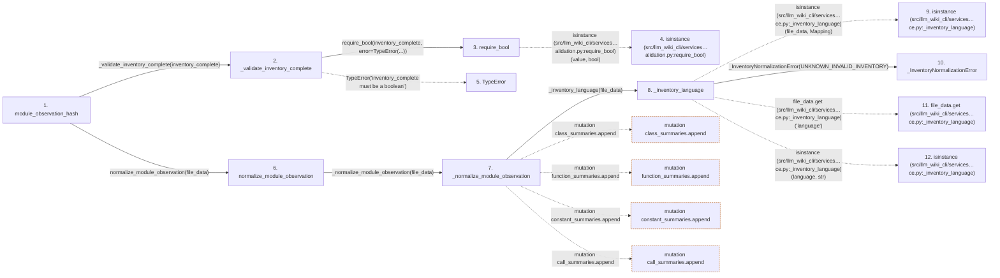

# module_observation_hash

**Entry point:** `module_observation_hash` (`api`)
**Source:** [knowledge_evidence](../modules/knowledge_evidence.md)
**Modules touched:** [knowledge_evidence](../modules/knowledge_evidence.md), [validation](../modules/validation.md)

## Call sequence

> Static overview in presentation order, not runtime execution order. Arrows retain captured callers; siblings are shown before deeper helper detail.

<!-- Auto-generated from static call edges. Dashed arrows are external or unresolved calls. Reviewed runtime conditions and side effects belong in Behavior. -->

```mermaid
sequenceDiagram
    participant p0 as module_observation_hash
    participant p1 as _validate_inventory_complete
    participant p2 as normalize_module_observation
    participant p3 as _hash_normalized_observation
    participant p4 as require_bool
    participant p5 as _normalize_module_observation
    participant p6 as hash_json
    participant p7 as TypeError
    participant p8 as isinstance (src/llm_wiki_cli/services…alidation.py:require_bool)
    participant p9 as _inventory_language
    participant p10 as sha256_bytes
    participant p11 as isinstance (src/llm_wiki_cli/services…malize_module_observation)
    participant p12 as canonical_json_bytes
    participant p13 as _record_array
    participant p14 as _validate_import_record
    participant p15 as _record_name
    participant p16 as _validate_module_entity_record
    participant p17 as seen_names.get
    participant p18 as _copy_selected_fields
    participant p19 as class_summaries.append
    participant p20 as _validate_callable_record
    participant p21 as function_summaries.append
    participant p22 as _structural_copy
    participant p23 as module_name.strip
    participant p24 as _InventoryNormalizationError
    participant p25 as _json_array
    participant p26 as _validate_string_array
    p0->>p1: _validate_inventory_complete
    p0->>p2: normalize_module_observation
    p0->>p3: _hash_normalized_observation
    p1->>p4: require_bool
    p2->>p5: _normalize_module_observation
    p3->>p6: hash_json
    p1-->>p7: TypeError('inventory_complete must be a boolean')
    p4-->>p8: isinstance (src/llm_wiki_cli/services…alidation.py:require_bool)(value, bool)
    p5->>p9: _inventory_language
    p6->>p10: sha256_bytes
    p5-->>p11: isinstance (src/llm_wiki_cli/services…malize_module_observation)(file_data, Mapping)
    p6->>p12: canonical_json_bytes
    p5->>p13: _record_array
    p5->>p13: _record_array
    p5->>p13: _record_array
    p5->>p14: _validate_import_record
    p5->>p15: _record_name
    p5->>p16: _validate_module_entity_record
    p5-->>p17: seen_names.get(name, 0)
    p5->>p18: _copy_selected_fields
    p5-->>p19: class_summaries.append(summary)
    p5->>p20: _validate_callable_record
    p5-->>p21: function_summaries.append(_copy_selected_fields(...))
    p5->>p18: _copy_selected_fields
    p5->>p22: _structural_copy
    p5-->>p11: isinstance (src/llm_wiki_cli/services…malize_module_observation)(module_name, str)
    p5-->>p23: module_name.strip
    p5->>p24: _InventoryNormalizationError
    p5->>p25: _json_array
    p5->>p26: _validate_string_array
```

> Call sequence diagram shows 30 of 129 interactions; 99 omitted to keep the visualization within the 30-interaction and generated-diagram limits, with uncertain identities omitted rather than inferred.

> Captured boundary calls: external 4 of 27 (23 omitted); unresolved 4 of 22 (18 omitted). These counts cover the captured static trace.

Omitted captured detail, grouped by actual caller occurrence and target module:

| Caller | Parent step | Target module | Kind | Omitted interactions |
| --- | --- | --- | --- | --- |
| `src/llm_wiki_cli/services/knowledge_evidence.py:_inventory_language` | 8 | - | external | 2 |
| `src/llm_wiki_cli/services/knowledge_evidence.py:_inventory_language` | 8 | [src/llm_wiki_cli/services/knowledge_evidence.py](../modules/knowledge_evidence.md) | internal | 3 |
| `src/llm_wiki_cli/services/knowledge_evidence.py:_inventory_language` | 8 | - | unresolved | 1 |
| `src/llm_wiki_cli/services/knowledge_evidence.py:_record_array` | 16 | [src/llm_wiki_cli/services/knowledge_evidence.py](../modules/knowledge_evidence.md) | internal | 3 |
| `src/llm_wiki_cli/services/knowledge_evidence.py:_record_array` | 16 | - | external | 3 |
| `src/llm_wiki_cli/services/knowledge_evidence.py:_validate_import_record` | 25 | - | unresolved | 1 |
| `src/llm_wiki_cli/services/knowledge_evidence.py:_validate_import_record` | 25 | - | external | 1 |
| `src/llm_wiki_cli/services/knowledge_evidence.py:_validate_import_record` | 25 | [src/llm_wiki_cli/services/knowledge_evidence.py](../modules/knowledge_evidence.md) | internal | 4 |
> Omission summary shows 8 of 51 groups; 43 further groups are not expanded here. Counts above include all omitted interactions.
> Detailed flow queries retain their own coverage and limits; omitted paths may execute at runtime.

> Trace truncated at the depth limit; deeper calls are omitted.

## Data flow

<!-- Auto-generated static analysis. Treat values and boundaries as best-effort hints, not runtime proof. -->

```mermaid
flowchart LR
    s1["1. module_observation_hash"]
    s2["2. _validate_inventory_complete"]
    s3["3. require_bool"]
    s4["4. isinstance (src/llm_wiki_cli/services…alidation.py:require_bool)"]
    s5["5. TypeError"]
    s6["6. normalize_module_observation"]
    s7["7. _normalize_module_observation"]
    s8["8. _inventory_language"]
    s9["9. isinstance (src/llm_wiki_cli/services…ce.py:_inventory_language)"]
    s10["10. _InventoryNormalizationError"]
    s11["11. file_data.get (src/llm_wiki_cli/services…ce.py:_inventory_language)"]
    s12["12. isinstance (src/llm_wiki_cli/services…ce.py:_inventory_language)"]
    s1 -->|"_validate_inventory_complete(inventory_complete)"| s2
    s2 -->|"require_bool(inventory_complete, error=TypeError(...))"| s3
    s3 -. "isinstance (src/llm_wiki_cli/services…alidation.py:require_bool)(value, bool)" .-> s4
    s2 -. "TypeError('inventory_complete must be a boolean')" .-> s5
    s1 -->|"normalize_module_observation(file_data)"| s6
    s6 -->|"_normalize_module_observation(file_data)"| s7
    s7 -->|"_inventory_language(file_data)"| s8
    s8 -. "isinstance (src/llm_wiki_cli/services…ce.py:_inventory_language)(file_data, Mapping)" .-> s9
    s8 -->|"_InventoryNormalizationError(UNKNOWN_INVALID_INVENTORY)"| s10
    s8 -. "file_data.get (src/llm_wiki_cli/services…ce.py:_inventory_language)('language')" .-> s11
    s8 -. "isinstance (src/llm_wiki_cli/services…ce.py:_inventory_language)(language, str)" .-> s12
    b0["mutation class_summaries.append"]
    s7 -. "mutation class_summaries.append" .-> b0
    b1["mutation function_summaries.append"]
    s7 -. "mutation function_summaries.append" .-> b1
    b2["mutation constant_summaries.append"]
    s7 -. "mutation constant_summaries.append" .-> b2
    b3["mutation call_summaries.append"]
    s7 -. "mutation call_summaries.append" .-> b3
    click s1 "../modules/knowledge_evidence.md"
    click s2 "../modules/knowledge_evidence.md"
    click s3 "../modules/validation.md"
    click s6 "../modules/knowledge_evidence.md"
    click s7 "../modules/knowledge_evidence.md"
    click s8 "../modules/knowledge_evidence.md"
    click s10 "../modules/knowledge_evidence.md"
    classDef boundary stroke:#b45309,stroke-dasharray: 4 2
    class b0 boundary
    class b1 boundary
    class b2 boundary
    class b3 boundary
```

### Step data

| Step | Inputs | Reads | Writes | Returns |
|---|---|---|---|---|
| `module_observation_hash` | `file_data: Mapping[str, Any]`, `inventory_complete: bool` | - | - | `None`, `_hash_normalized_observation(...)` |
| `_validate_inventory_complete` | `inventory_complete: object` | - | - | - |
| `require_bool` | `value: object`, `error: Exception` | - | - | `value` |
| `isinstance (src/llm_wiki_cli/services…alidation.py:require_bool)` | - | - | - | - |
| `TypeError` | - | - | - | - |
| `normalize_module_observation` | `file_data: Mapping[str, Any]` | `_InventoryNormalizationError` | - | `_normalize_module_observation(...)`, `None` |
| `_normalize_module_observation` | `file_data: Mapping[str, Any] \| None` | `Mapping`, `_MODULE_ENTITY_FIELDS`, `_MODULE_NONSTRUCTURAL_KEYS`, `_MODULE_FUNCTION_FIELDS`, `_MODULE_NONSTRUCTURAL_KEYS`, `MODULE_OBSERVATION_SCOPE`, `_MODULE_NONSTRUCTURAL_KEYS`, `UNKNOWN_INVALID_INVENTORY` | `seen_names[...]`, `summary[...]`, `payload[...]`, `payload[...]`, `payload[...]`, `payload[...]` | `payload` |
| `_inventory_language` | `file_data: Mapping[str, Any] \| None` | `Mapping`, `UNKNOWN_INVALID_INVENTORY`, `UNKNOWN_INVALID_INVENTORY`, `_SUPPORTED_OBSERVATION_LANGUAGES`, `UNKNOWN_UNSUPPORTED_LANGUAGE` | - | `language` |
| `isinstance (src/llm_wiki_cli/services…ce.py:_inventory_language)` | - | - | - | - |
| `_InventoryNormalizationError` | - | - | - | - |
| `file_data.get (src/llm_wiki_cli/services…ce.py:_inventory_language)` | - | - | - | - |
| `isinstance (src/llm_wiki_cli/services…ce.py:_inventory_language)` | - | - | - | - |

### Call data

| From | To | Line | Call |
|---|---|---:|---|
| module_observation_hash | _validate_inventory_complete | 256 | `_validate_inventory_complete(inventory_complete)` |
| _validate_inventory_complete | require_bool | 853 | `require_bool(inventory_complete, error=TypeError(...))` |
| require_bool | isinstance (src/llm_wiki_cli/services…alidation.py:require_bool) | 810 | `isinstance(value, bool)` |
| _validate_inventory_complete | TypeError | 855 | `TypeError('inventory_complete must be a boolean')` |
| module_observation_hash | normalize_module_observation | 259 | `normalize_module_observation(file_data)` |
| normalize_module_observation | _normalize_module_observation | 220 | `_normalize_module_observation(file_data)` |
| _normalize_module_observation | _inventory_language | 427 | `_inventory_language(file_data)` |
| _inventory_language | isinstance (src/llm_wiki_cli/services…ce.py:_inventory_language) | 543 | `isinstance(file_data, Mapping)` |
| _inventory_language | _InventoryNormalizationError | 544 | `_InventoryNormalizationError(UNKNOWN_INVALID_INVENTORY)` |
| _inventory_language | file_data.get (src/llm_wiki_cli/services…ce.py:_inventory_language) | 545 | `file_data.get('language')` |
| _inventory_language | isinstance (src/llm_wiki_cli/services…ce.py:_inventory_language) | 546 | `isinstance(language, str)` |

### Boundary effects

| Kind | Target | Step | Line |
|---|---|---|---:|
| mutation | `class_summaries.append` | `_normalize_module_observation` | 447 |
| mutation | `function_summaries.append` | `_normalize_module_observation` | 452 |
| mutation | `constant_summaries.append` | `_normalize_module_observation` | 481 |
| mutation | `call_summaries.append` | `_normalize_module_observation` | 496 |

### Static analysis gaps

| Kind | Step | Target | Line |
|---|---|---|---:|
| external_call | `require_bool` | `isinstance` | 810 |
| external_call | `_validate_inventory_complete` | `TypeError` | 855 |
| external_call | `_inventory_language` | `isinstance` | 543 |
| unresolved_call | `_inventory_language` | `file_data.get` | 545 |
| external_call | `_inventory_language` | `isinstance` | 546 |
| step_limit | `module_observation_hash` | `first 12 steps` | 0 |
| truncated_flow | `module_observation_hash` | `depth limit` | 0 |

## Behavior

This flow starts at `module_observation_hash` and is classified as `api`. The generated call and data-flow sections are bounded static projections; runtime conditions and side effects require source-level confirmation.
