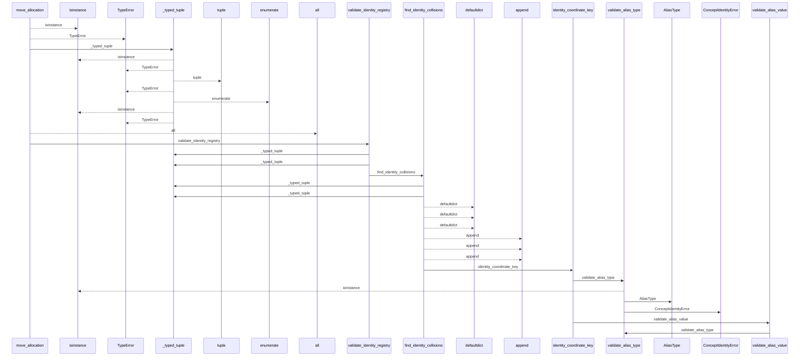
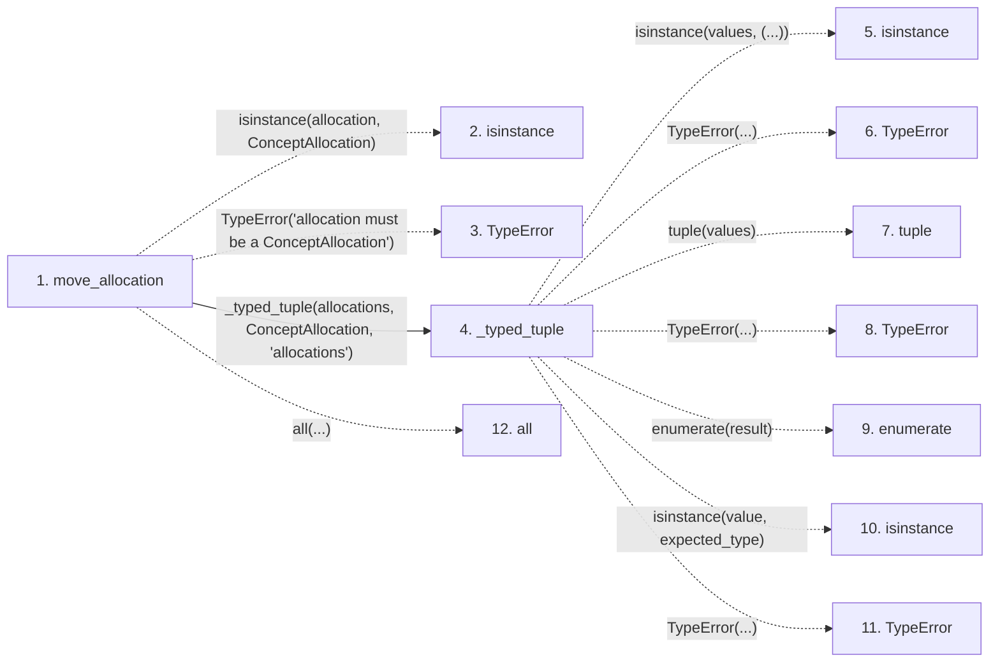

# move_allocation

**Entry point:** `move_allocation` (`api`)
**Source:** [concept_identity](../modules/concept_identity.md)
**Modules touched:** [concept_identity](../modules/concept_identity.md), [wiki_surface](../modules/wiki_surface.md)

## Call sequence

<!-- Auto-generated from static call edges. Dashed arrows are external or unresolved calls. Reviewed runtime conditions and side effects belong in Behavior. -->

> Call sequence diagram shows 30 of 168 interactions; 138 omitted to keep the visualization within the 30-interaction and generated-diagram limits.

> Trace truncated at the depth limit; deeper calls are omitted.

## Data flow

<!-- Auto-generated static analysis. Treat values and boundaries as best-effort hints, not runtime proof. -->

### Step data

| Step | Inputs | Reads | Writes | Returns |
|---|---|---|---|---|
| `move_allocation` | `allocation: ConceptAllocation`, `new_reference: ConceptReference`, `allocations: Iterable[ConceptAllocation]`, `aliases: Iterable[IdentityAlias]` | `ConceptAllocation`, `ConceptAllocation` | - | `IdentityUpdate(...)` |
| `isinstance` | - | - | - | - |
| `TypeError` | - | - | - | - |
| `_typed_tuple` | `values: Iterable[_RecordT]`, `expected_type: type[_RecordT]`, `field: str` | - | - | `result` |
| `isinstance` | - | - | - | - |
| `TypeError` | - | - | - | - |
| `tuple` | - | - | - | - |
| `TypeError` | - | - | - | - |
| `enumerate` | - | - | - | - |
| `isinstance` | - | - | - | - |
| `TypeError` | - | - | - | - |
| `all` | - | - | - | - |

### Call data

| From | To | Line | Call |
|---|---|---:|---|
| move_allocation | isinstance | 820 | `isinstance(allocation, ConceptAllocation)` |
| move_allocation | TypeError | 821 | `TypeError('allocation must be a ConceptAllocation')` |
| move_allocation | _typed_tuple | 822 | `_typed_tuple(allocations, ConceptAllocation, 'allocations')` |
| _typed_tuple | isinstance | 983 | `isinstance(values, (...))` |
| _typed_tuple | TypeError | 984 | `TypeError(...)` |
| _typed_tuple | tuple | 986 | `tuple(values)` |
| _typed_tuple | TypeError | 988 | `TypeError(...)` |
| _typed_tuple | enumerate | 991 | `enumerate(result)` |
| _typed_tuple | isinstance | 992 | `isinstance(value, expected_type)` |
| _typed_tuple | TypeError | 993 | `TypeError(...)` |
| move_allocation | all | 823 | `all(...)` |

### Boundary effects

*No boundary effects detected.*

### Static analysis gaps

| Kind | Step | Target | Line |
|---|---|---|---:|
| unresolved_call | `move_allocation` | `isinstance` | 820 |
| unresolved_call | `move_allocation` | `TypeError` | 821 |
| unresolved_call | `_typed_tuple` | `isinstance` | 983 |
| unresolved_call | `_typed_tuple` | `TypeError` | 984 |
| unresolved_call | `_typed_tuple` | `TypeError` | 988 |
| unresolved_call | `_typed_tuple` | `enumerate` | 991 |
| unresolved_call | `_typed_tuple` | `isinstance` | 992 |
| unresolved_call | `_typed_tuple` | `TypeError` | 993 |
| unresolved_call | `move_allocation` | `all` | 823 |
| step_limit | `move_allocation` | `first 12 steps` | 0 |
| truncated_flow | `move_allocation` | `depth limit` | 0 |

## Behavior

This flow starts at `move_allocation` and is classified as `api`. The generated call and data-flow sections are bounded static projections; runtime conditions and side effects require source-level confirmation.
