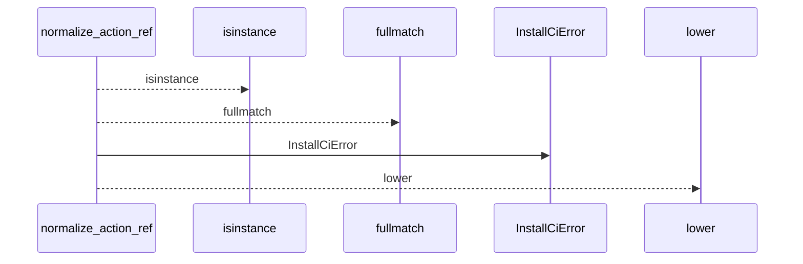
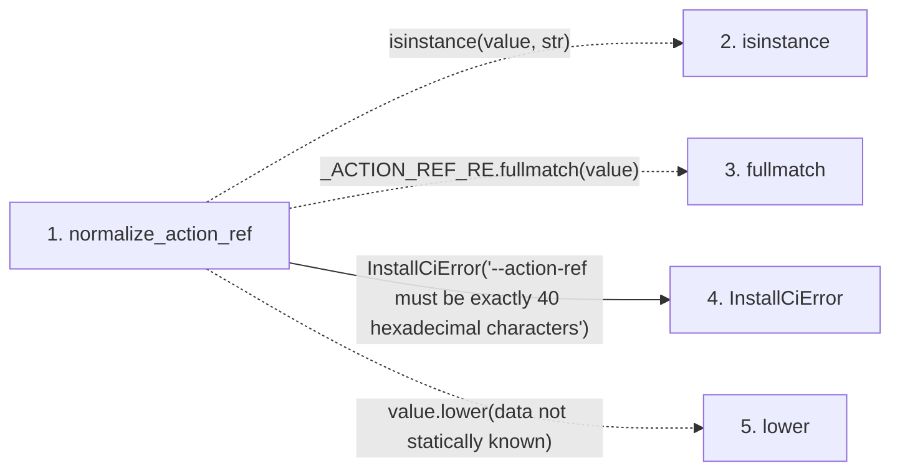

# normalize_action_ref

**Entry point:** `normalize_action_ref` (`api`)
**Source:** [ci_installer](../modules/ci_installer.md)
**Modules touched:** [ci_installer](../modules/ci_installer.md)

## Call sequence

<!-- Auto-generated from static call edges. Dashed arrows are external or unresolved calls. Reviewed runtime conditions and side effects belong in Behavior. -->

## Data flow

<!-- Auto-generated static analysis. Treat values and boundaries as best-effort hints, not runtime proof. -->

### Step data

| Step | Inputs | Reads | Writes | Returns |
|---|---|---|---|---|
| `normalize_action_ref` | `value: object` | - | - | `value.lower(...)` |
| `isinstance` | - | - | - | - |
| `fullmatch` | - | - | - | - |
| `InstallCiError` | - | - | - | - |
| `lower` | - | - | - | - |

### Call data

| From | To | Line | Call |
|---|---|---:|---|
| normalize_action_ref | isinstance | 63 | `isinstance(value, str)` |
| normalize_action_ref | fullmatch | 63 | `_ACTION_REF_RE.fullmatch(value)` |
| normalize_action_ref | InstallCiError | 64 | `InstallCiError('--action-ref must be exactly 40 hexadecimal characters')` |
| normalize_action_ref | lower | 65 | `value.lower(data not statically known)` |

### Boundary effects

*No boundary effects detected.*

### Static analysis gaps

| Kind | Step | Target | Line |
|---|---|---|---:|
| unresolved_call | `normalize_action_ref` | `isinstance` | 63 |
| unresolved_call | `normalize_action_ref` | `_ACTION_REF_RE.fullmatch` | 63 |
| unresolved_call | `normalize_action_ref` | `value.lower` | 65 |

## Behavior

This flow starts at `normalize_action_ref` and is classified as `api`. The generated call and data-flow sections are bounded static projections; runtime conditions and side effects require source-level confirmation.
