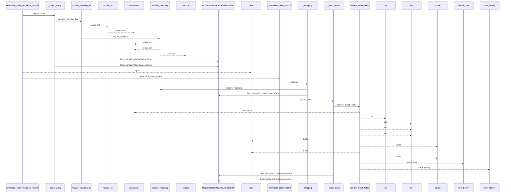
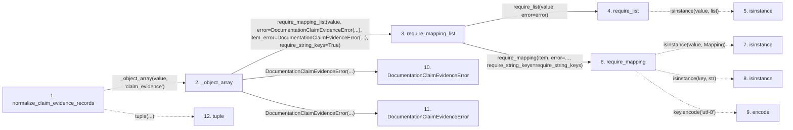

# normalize_claim_evidence_records

**Entry point:** `normalize_claim_evidence_records` (`api`)
**Source:** [documentation_claim_evidence](../modules/documentation_claim_evidence.md)
**Modules touched:** [documentation_claim_evidence](../modules/documentation_claim_evidence.md), [knowledge_graph](../modules/knowledge_graph.md), [validation](../modules/validation.md)

## Call sequence

<!-- Auto-generated from static call edges. Dashed arrows are external or unresolved calls. Reviewed runtime conditions and side effects belong in Behavior. -->

> Call sequence diagram shows 30 of 257 interactions; 227 omitted to keep the visualization within the 30-interaction and generated-diagram limits.

> Trace truncated at the depth limit; deeper calls are omitted.

## Data flow

<!-- Auto-generated static analysis. Treat values and boundaries as best-effort hints, not runtime proof. -->

### Step data

| Step | Inputs | Reads | Writes | Returns |
|---|---|---|---|---|
| `normalize_claim_evidence_records` | `value: object` | - | - | `tuple(...)` |
| `_object_array` | `value: object`, `field_name: str` | - | - | `require_mapping_list(...)` |
| `require_mapping_list` | `value: object`, `error: Exception`, `item_error: Exception \| None`, `require_string_keys: bool` | - | - | `items` |
| `require_list` | `value: object`, `error: Exception` | - | - | `value` |
| `isinstance` | - | - | - | - |
| `require_mapping` | `value: object`, `error: Exception`, `require_string_keys: bool`, `key_error: Exception \| None`, `require_utf8_keys: bool`, `utf8_key_error: Exception \| None` | `Mapping` | - | `value` |
| `isinstance` | - | - | - | - |
| `isinstance` | - | - | - | - |
| `encode` | - | - | - | - |
| `DocumentationClaimEvidenceError` | - | - | - | - |
| `DocumentationClaimEvidenceError` | - | - | - | - |
| `tuple` | - | - | - | - |

### Call data

| From | To | Line | Call |
|---|---|---:|---|
| normalize_claim_evidence_records | _object_array | 192 | `_object_array(value, 'claim_evidence')` |
| _object_array | require_mapping_list | 1431 | `require_mapping_list(value, error=DocumentationClaimEvidenceError(...), item_error=DocumentationClaimEvidenceError(...), require_string_keys=True)` |
| require_mapping_list | require_list | 1015 | `require_list(value, error=error)` |
| require_list | isinstance | 764 | `isinstance(value, list)` |
| require_mapping_list | require_mapping | 1017 | `require_mapping(item, error=..., require_string_keys=require_string_keys)` |
| require_mapping | isinstance | 727 | `isinstance(value, Mapping)` |
| require_mapping | isinstance | 731 | `isinstance(key, str)` |
| require_mapping | encode | 736 | `key.encode('utf-8')` |
| _object_array | DocumentationClaimEvidenceError | 1433 | `DocumentationClaimEvidenceError(...)` |
| _object_array | DocumentationClaimEvidenceError | 1434 | `DocumentationClaimEvidenceError(...)` |
| normalize_claim_evidence_records | tuple | 193 | `tuple(...)` |

### Boundary effects

*No boundary effects detected.*

### Static analysis gaps

| Kind | Step | Target | Line |
|---|---|---|---:|
| unresolved_call | `require_list` | `isinstance` | 764 |
| unresolved_call | `require_mapping` | `isinstance` | 727 |
| unresolved_call | `require_mapping` | `isinstance` | 731 |
| unresolved_call | `require_mapping` | `key.encode` | 736 |
| step_limit | `normalize_claim_evidence_records` | `first 12 steps` | 0 |
| truncated_flow | `normalize_claim_evidence_records` | `depth limit` | 0 |

## Behavior

This flow starts at `normalize_claim_evidence_records` and is classified as `api`. The generated call and data-flow sections are bounded static projections; runtime conditions and side effects require source-level confirmation.
