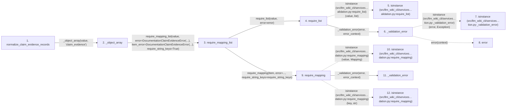

# normalize_claim_evidence_records

**Entry point:** `normalize_claim_evidence_records` (`api`)
**Source:** [documentation_claim_evidence](../modules/documentation_claim_evidence.md)
**Modules touched:** [documentation_claim_evidence](../modules/documentation_claim_evidence.md), [knowledge_graph](../modules/knowledge_graph.md), [validation](../modules/validation.md)

## Call sequence

> Static overview in presentation order, not runtime execution order. Arrows retain captured callers; representative internal continuations and boundary examples precede repeated helper detail.

<!-- Auto-generated from static call edges. Dashed arrows are external or unresolved calls. Reviewed runtime conditions and side effects belong in Behavior. -->

```mermaid
sequenceDiagram
    participant p0 as normalize_claim_evidence_records
    participant p1 as _object_array
    participant p2 as _normalize_claim_record
    participant p3 as DocumentationClaimEvidenceError
    participant p4 as require_mapping_list
    participant p5 as _mapping
    participant p6 as _exact_fields
    participant p7 as _portable_path
    participant p8 as _enum
    participant p9 as _optional_identifier
    participant p10 as _optional_locator
    participant p11 as _section_locator
    participant p12 as _structural_evidence
    participant p13 as _freshness
    participant p14 as _lifecycle_review
    participant p15 as _normalize_graph_query
    participant p16 as _bounds
    participant p17 as _safe_evidence_link
    participant p18 as _internal_evidence_ref
    participant p19 as require_list
    participant p20 as require_exact_fields
    participant p21 as _text
    participant p22 as require_exact_choice
    participant p23 as _identifier
    participant p24 as require_mapping
    participant p25 as require_portable_relative_path
    participant p26 as _bound_record
    participant p27 as _reason
    participant p28 as _analyzer_bounds
    participant p29 as tuple (src/llm_wiki_cli/services…ze_claim_evidence_records)
    participant p30 as record.get
    p0->>p1: _object_array
    p0->>p2: _normalize_claim_record
    p0->>p3: DocumentationClaimEvidenceError
    p1->>p4: require_mapping_list
    p2->>p5: _mapping
    p2->>p6: _exact_fields
    p2->>p7: _portable_path
    p2->>p8: _enum
    p2->>p9: _optional_identifier
    p2->>p10: _optional_locator
    p2->>p11: _section_locator
    p2->>p12: _structural_evidence
    p2->>p13: _freshness
    p2->>p14: _lifecycle_review
    p2->>p15: _normalize_graph_query
    p2->>p16: _bounds
    p2->>p17: _safe_evidence_link
    p2->>p18: _internal_evidence_ref
    p4->>p19: require_list
    p6->>p20: require_exact_fields
    p7->>p21: _text
    p8->>p22: require_exact_choice
    p9->>p23: _identifier
    p4->>p24: require_mapping
    p7->>p25: require_portable_relative_path
    p16->>p26: _bound_record
    p12->>p27: _reason
    p16->>p28: _analyzer_bounds
    p0-->>p29: tuple (src/llm_wiki_cli/services…ze_claim_evidence_records)(...)
    p2-->>p30: record.get('concept_uid')
```

> Call sequence diagram shows 30 of 285 interactions; 255 omitted to keep the visualization within the 30-interaction and generated-diagram limits, with uncertain identities omitted rather than inferred.

> Captured boundary calls: external 1 of 85 (84 omitted); unresolved 1 of 48 (47 omitted). These counts cover the captured static trace.

Omitted captured detail, grouped by actual caller occurrence and target module:

| Caller | Parent step | Target module | Kind | Omitted interactions |
| --- | --- | --- | --- | --- |
| `src/llm_wiki_cli/services/validation.py:require_list` | 4 | - | external | 1 |
| `src/llm_wiki_cli/services/validation.py:require_list` | 4 | [src/llm_wiki_cli/services/validation.py](../modules/validation.md) | internal | 1 |
| `src/llm_wiki_cli/services/validation.py:_validation_error` | 6 | - | external | 1 |
| `src/llm_wiki_cli/services/validation.py:_validation_error` | 6 | - | unresolved | 1 |
| `src/llm_wiki_cli/services/validation.py:require_mapping` | 9 | - | external | 2 |
| `src/llm_wiki_cli/services/validation.py:require_mapping` | 9 | [src/llm_wiki_cli/services/validation.py](../modules/validation.md) | internal | 3 |
| `src/llm_wiki_cli/services/validation.py:require_mapping` | 9 | - | unresolved | 1 |
| `src/llm_wiki_cli/services/documentation_claim_evidence.py:_object_array` | 2 | [src/llm_wiki_cli/services/documentation_claim_evidence.py](../modules/documentation_claim_evidence.md) | internal | 2 |
> Omission summary shows 8 of 86 groups; 78 further groups are not expanded here. Counts above include all omitted interactions.
> Detailed flow queries retain their own coverage and limits; omitted paths may execute at runtime.

> Trace truncated at the depth limit; deeper calls are omitted.

## Data flow

<!-- Auto-generated static analysis. Treat values and boundaries as best-effort hints, not runtime proof. -->

### Analysis coverage

**Effect analysis partially available.** Flow assembly and source effect analysis are separate; empty observations do not prove an empty handler body.

Source steps: 153; effect analysis evaluated: 105, partial: 4, unavailable: 44. Counts include steps omitted from the displayed trace.

Collector observations for 109 source steps with known totals: observed: 442, emitted: 428, omitted: 14. Unavailable totals are excluded.

- Callable record unavailable for one or more source steps; those steps have no represented callable body.
- Effect collector omitted observations before flow assembly; displayed effects are partial.
- Effect collector totals unavailable; observed counts cover captured records only.

| Step | Callable record | Effect analysis | Collector totals | Observed | Emitted | Omitted |
|---|---|---|---|---:|---:|---:|
| `normalize_claim_evidence_records` | `available` | `evaluated` | `available` | `2` | `2` | `0` |
| `_object_array` | `available` | `evaluated` | `available` | `3` | `3` | `0` |
| `require_mapping_list` | `available` | `evaluated` | `available` | `5` | `5` | `0` |
| `require_list` | `available` | `evaluated` | `available` | `4` | `4` | `0` |
| `isinstance (src/llm_wiki_cli/services…alidation.py:require_list)` | `not_applicable` | `not_applicable` | `not_applicable` | — | — | — |
| `_validation_error` | `available` | `evaluated` | `available` | `3` | `3` | `0` |
| `isinstance (src/llm_wiki_cli/services…tion.py:_validation_error)` | `not_applicable` | `not_applicable` | `not_applicable` | — | — | — |
| `error` | `not_applicable` | `not_applicable` | `not_applicable` | — | — | — |
| `require_mapping` | `available` | `evaluated` | `available` | `9` | `9` | `0` |
| `isinstance (src/llm_wiki_cli/services…dation.py:require_mapping)` | `not_applicable` | `not_applicable` | `not_applicable` | — | — | — |
| `_validation_error` | `available` | `evaluated` | `available` | `3` | `3` | `0` |
| `isinstance (src/llm_wiki_cli/services…dation.py:require_mapping)` | `not_applicable` | `not_applicable` | `not_applicable` | — | — | — |

```mermaid
flowchart LR
    s1["1. normalize_claim_evidence_records"]
    s2["2. _object_array"]
    s3["3. require_mapping_list"]
    s4["4. require_list"]
    s5["5. isinstance (src/llm_wiki_cli/services…alidation.py:require_list)"]
    s6["6. _validation_error"]
    s7["7. isinstance (src/llm_wiki_cli/services…tion.py:_validation_error)"]
    s8["8. error"]
    s9["9. require_mapping"]
    s10["10. isinstance (src/llm_wiki_cli/services…dation.py:require_mapping)"]
    s11["11. _validation_error"]
    s12["12. isinstance (src/llm_wiki_cli/services…dation.py:require_mapping)"]
    s1 -->|"_object_array(value, 'claim_evidence')"| s2
    s2 -->|"require_mapping_list(value, error=DocumentationClaimEvidenceError(...), item_error=DocumentationClaimEvidenceError(...), require_string_keys=True)"| s3
    s3 -->|"require_list(value, error=error)"| s4
    s4 -. "isinstance (src/llm_wiki_cli/services…alidation.py:require_list)(value, list)" .-> s5
    s4 -->|"_validation_error(error, error_context)"| s6
    s6 -. "isinstance (src/llm_wiki_cli/services…tion.py:_validation_error)(error, Exception)" .-> s7
    s6 -. "error(context)" .-> s8
    s3 -->|"require_mapping(item, error=..., require_string_keys=require_string_keys)"| s9
    s9 -. "isinstance (src/llm_wiki_cli/services…dation.py:require_mapping)(value, Mapping)" .-> s10
    s9 -->|"_validation_error(error, error_context)"| s11
    s9 -. "isinstance (src/llm_wiki_cli/services…dation.py:require_mapping)(key, str)" .-> s12
    click s1 "../modules/documentation_claim_evidence.md"
    click s2 "../modules/documentation_claim_evidence.md"
    click s3 "../modules/validation.md"
    click s4 "../modules/validation.md"
    click s6 "../modules/validation.md"
    click s9 "../modules/validation.md"
    click s11 "../modules/validation.md"
```

### Step data

| Step | Inputs | Reads | Writes | Returns |
|---|---|---|---|---|
| `normalize_claim_evidence_records` | `value: object` | - | - | `tuple(...)` |
| `_object_array` | `value: object`, `field_name: str` | - | - | `require_mapping_list(...)` |
| `require_mapping_list` | `value: object`, `error: Exception`, `item_error: Exception \| None`, `require_string_keys: bool` | - | - | `items` |
| `require_list` | `value: object`, `error: _ValidationError`, `error_context: str` | - | - | `value` |
| `isinstance (src/llm_wiki_cli/services…alidation.py:require_list)` | - | - | - | - |
| `_validation_error` | `error: _ValidationError`, `context: str` | - | - | `...` |
| `isinstance (src/llm_wiki_cli/services…tion.py:_validation_error)` | - | - | - | - |
| `error` | - | - | - | - |
| `require_mapping` | `value: object`, `error: _ValidationError`, `error_context: str`, `require_string_keys: bool`, `key_error: _ValidationError \| None`, `require_utf8_keys: bool`, `utf8_key_error: _ValidationError \| None` | `Mapping` | - | `value` |
| `isinstance (src/llm_wiki_cli/services…dation.py:require_mapping)` | - | - | - | - |
| `_validation_error` | `error: _ValidationError`, `context: str` | - | - | `...` |
| `isinstance (src/llm_wiki_cli/services…dation.py:require_mapping)` | - | - | - | - |

### Call data

| From | To | Line | Call |
|---|---|---:|---|
| normalize_claim_evidence_records | _object_array | 192 | `_object_array(value, 'claim_evidence')` |
| _object_array | require_mapping_list | 1431 | `require_mapping_list(value, error=DocumentationClaimEvidenceError(...), item_error=DocumentationClaimEvidenceError(...), require_string_keys=True)` |
| require_mapping_list | require_list | 1073 | `require_list(value, error=error)` |
| require_list | isinstance (src/llm_wiki_cli/services…alidation.py:require_list) | 820 | `isinstance(value, list)` |
| require_list | _validation_error | 821 | `_validation_error(error, error_context)` |
| _validation_error | isinstance (src/llm_wiki_cli/services…tion.py:_validation_error) | 95 | `isinstance(error, Exception)` |
| _validation_error | error | 95 | `error(context)` |
| require_mapping_list | require_mapping | 1075 | `require_mapping(item, error=..., require_string_keys=require_string_keys)` |
| require_mapping | isinstance (src/llm_wiki_cli/services…dation.py:require_mapping) | 783 | `isinstance(value, Mapping)` |
| require_mapping | _validation_error | 784 | `_validation_error(error, error_context)` |
| require_mapping | isinstance (src/llm_wiki_cli/services…dation.py:require_mapping) | 787 | `isinstance(key, str)` |

### Boundary effects

*No boundary-effect observations were captured in this static trace.*

### Static analysis gaps

| Kind | Step | Target | Line |
|---|---|---|---:|
| external_call | `require_list` | `isinstance` | 820 |
| external_call | `_validation_error` | `isinstance` | 95 |
| unresolved_call | `_validation_error` | `error` | 95 |
| external_call | `require_mapping` | `isinstance` | 783 |
| external_call | `require_mapping` | `isinstance` | 787 |
| step_limit | `normalize_claim_evidence_records` | `first 12 steps` | 0 |
| truncated_flow | `normalize_claim_evidence_records` | `depth limit` | 0 |

## Behavior

This flow starts at `normalize_claim_evidence_records` and is classified as `api`. The generated call and data-flow sections are bounded static projections; runtime conditions and side effects require source-level confirmation.
