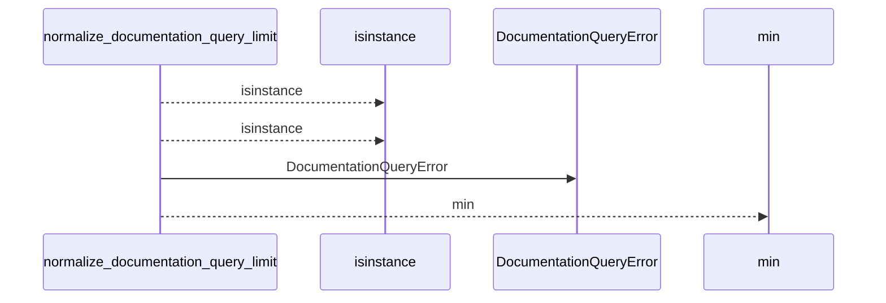
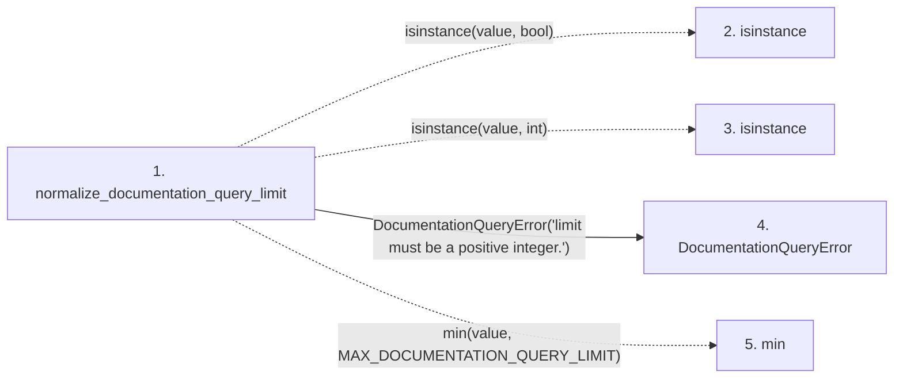

# normalize_documentation_query_limit

**Entry point:** `normalize_documentation_query_limit` (`api`)
**Source:** [documentation_query_builder](../modules/documentation_query_builder.md)
**Modules touched:** [documentation_queries](../modules/documentation_queries.md), [documentation_query_builder](../modules/documentation_query_builder.md)

## Call sequence

<!-- Auto-generated from static call edges. Dashed arrows are external or unresolved calls. Reviewed runtime conditions and side effects belong in Behavior. -->

## Data flow

<!-- Auto-generated static analysis. Treat values and boundaries as best-effort hints, not runtime proof. -->

### Step data

| Step | Inputs | Reads | Writes | Returns |
|---|---|---|---|---|
| `normalize_documentation_query_limit` | `value: object` | `MAX_DOCUMENTATION_QUERY_LIMIT` | - | `min(...)` |
| `isinstance` | - | - | - | - |
| `isinstance` | - | - | - | - |
| `DocumentationQueryError` | - | - | - | - |
| `min` | - | - | - | - |

### Call data

| From | To | Line | Call |
|---|---|---:|---|
| normalize_documentation_query_limit | isinstance | 52 | `isinstance(value, bool)` |
| normalize_documentation_query_limit | isinstance | 52 | `isinstance(value, int)` |
| normalize_documentation_query_limit | DocumentationQueryError | 53 | `DocumentationQueryError('limit must be a positive integer.')` |
| normalize_documentation_query_limit | min | 54 | `min(value, MAX_DOCUMENTATION_QUERY_LIMIT)` |

### Boundary effects

*No boundary effects detected.*

### Static analysis gaps

| Kind | Step | Target | Line |
|---|---|---|---:|
| unresolved_call | `normalize_documentation_query_limit` | `isinstance` | 52 |
| unresolved_call | `normalize_documentation_query_limit` | `min` | 54 |

## Behavior

This flow starts at `normalize_documentation_query_limit` and is classified as `api`. The generated call and data-flow sections are bounded static projections; runtime conditions and side effects require source-level confirmation.
