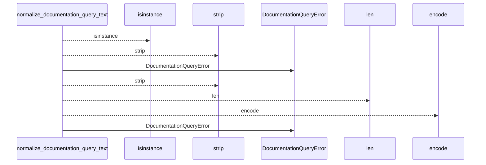
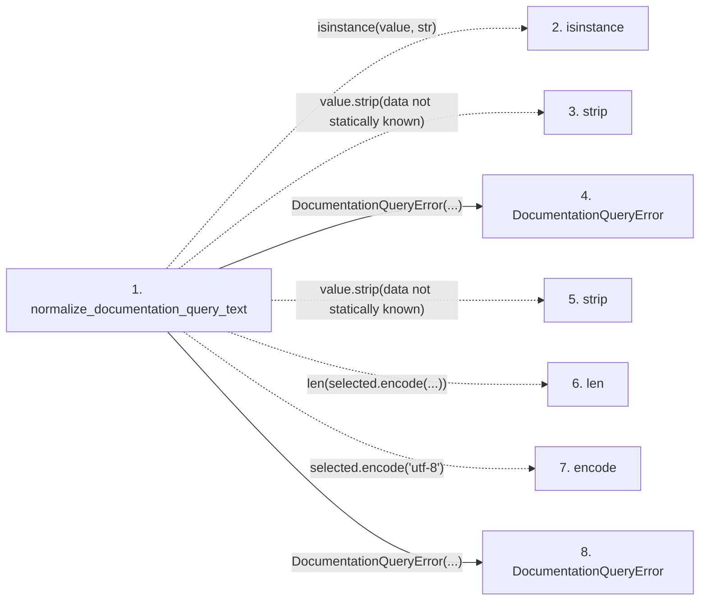

# normalize_documentation_query_text

**Entry point:** `normalize_documentation_query_text` (`api`)
**Source:** [documentation_query_builder](../modules/documentation_query_builder.md)
**Modules touched:** [documentation_queries](../modules/documentation_queries.md), [documentation_query_builder](../modules/documentation_query_builder.md)

## Call sequence

<!-- Auto-generated from static call edges. Dashed arrows are external or unresolved calls. Reviewed runtime conditions and side effects belong in Behavior. -->

## Data flow

<!-- Auto-generated static analysis. Treat values and boundaries as best-effort hints, not runtime proof. -->

### Step data

| Step | Inputs | Reads | Writes | Returns |
|---|---|---|---|---|
| `normalize_documentation_query_text` | `value: object`, `field: str` | `QUERY_IDENTITY_BYTE_LIMIT`, `QUERY_IDENTITY_BYTE_LIMIT` | - | `selected` |
| `isinstance` | - | - | - | - |
| `strip` | - | - | - | - |
| `DocumentationQueryError` | - | - | - | - |
| `strip` | - | - | - | - |
| `len` | - | - | - | - |
| `encode` | - | - | - | - |
| `DocumentationQueryError` | - | - | - | - |

### Call data

| From | To | Line | Call |
|---|---|---:|---|
| normalize_documentation_query_text | isinstance | 60 | `isinstance(value, str)` |
| normalize_documentation_query_text | strip | 60 | `value.strip(data not statically known)` |
| normalize_documentation_query_text | DocumentationQueryError | 61 | `DocumentationQueryError(...)` |
| normalize_documentation_query_text | strip | 62 | `value.strip(data not statically known)` |
| normalize_documentation_query_text | len | 63 | `len(selected.encode(...))` |
| normalize_documentation_query_text | encode | 63 | `selected.encode('utf-8')` |
| normalize_documentation_query_text | DocumentationQueryError | 64 | `DocumentationQueryError(...)` |

### Boundary effects

*No boundary effects detected.*

### Static analysis gaps

| Kind | Step | Target | Line |
|---|---|---|---:|
| unresolved_call | `normalize_documentation_query_text` | `isinstance` | 60 |
| unresolved_call | `normalize_documentation_query_text` | `value.strip` | 60 |
| unresolved_call | `normalize_documentation_query_text` | `value.strip` | 62 |
| unresolved_call | `normalize_documentation_query_text` | `selected.encode` | 63 |

## Behavior

This flow starts at `normalize_documentation_query_text` and is classified as `api`. The generated call and data-flow sections are bounded static projections; runtime conditions and side effects require source-level confirmation.
