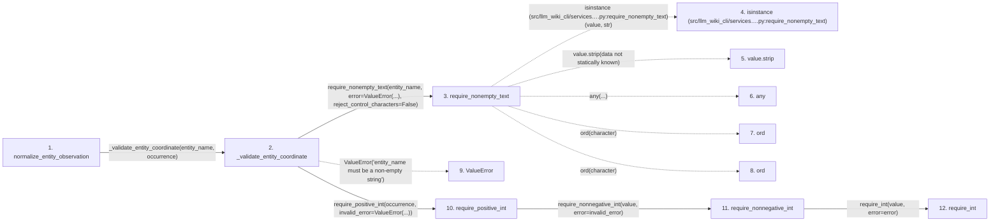

# normalize_entity_observation

**Entry point:** `normalize_entity_observation` (`api`)
**Source:** [knowledge_evidence](../modules/knowledge_evidence.md)
**Modules touched:** [knowledge_evidence](../modules/knowledge_evidence.md), [validation](../modules/validation.md)

## Call sequence

```mermaid
sequenceDiagram
    participant p0 as normalize_entity_observation
    participant p1 as _validate_entity_coordinate
    participant p2 as require_nonempty_text
    participant p3 as isinstance (src/llm_wiki_cli/services….py:require_nonempty_text)
    participant p4 as value.strip
    participant p5 as any
    participant p6 as ord
    participant p7 as ValueError
    participant p8 as require_positive_int
    participant p9 as require_nonnegative_int
    participant p10 as require_int
    participant p11 as isinstance (src/llm_wiki_cli/services/validation.py:require_int)
    participant p12 as _normalize_entity_observation
    participant p13 as _inventory_language
    participant p14 as isinstance (src/llm_wiki_cli/services…ce.py:_inventory_language)
    participant p15 as _InventoryNormalizationError
    participant p16 as file_data.get
    participant p17 as isinstance (src/llm_wiki_cli/services…malize_entity_observation)
    participant p18 as _record_array
    participant p19 as isinstance (src/llm_wiki_cli/services…evidence.py:_record_array)
    participant p20 as all (src/llm_wiki_cli/services…evidence.py:_record_array)
    p0->>p1: _validate_entity_coordinate
    p1->>p2: require_nonempty_text
    p2-->>p3: isinstance (src/llm_wiki_cli/services….py:require_nonempty_text)
    p2-->>p4: value.strip
    p2-->>p5: any
    p2-->>p6: ord
    p2-->>p6: ord
    p1-->>p7: ValueError
    p1->>p8: require_positive_int
    p8->>p9: require_nonnegative_int
    p9->>p10: require_int
    p10-->>p11: isinstance (src/llm_wiki_cli/services/validation.py:require_int)
    p10-->>p11: isinstance (src/llm_wiki_cli/services/validation.py:require_int)
    p1-->>p7: ValueError
    p0->>p12: _normalize_entity_observation
    p12->>p13: _inventory_language
    p13-->>p14: isinstance (src/llm_wiki_cli/services…ce.py:_inventory_language)
    p13->>p15: _InventoryNormalizationError
    p13-->>p16: file_data.get
    p13-->>p14: isinstance (src/llm_wiki_cli/services…ce.py:_inventory_language)
    p13->>p15: _InventoryNormalizationError
    p13->>p15: _InventoryNormalizationError
    p12-->>p17: isinstance (src/llm_wiki_cli/services…malize_entity_observation)
    p12->>p18: _record_array
    p18->>p15: _InventoryNormalizationError
    p18-->>p19: isinstance (src/llm_wiki_cli/services…evidence.py:_record_array)
    p18->>p15: _InventoryNormalizationError
    p18-->>p20: all (src/llm_wiki_cli/services…evidence.py:_record_array)
    p18-->>p19: isinstance (src/llm_wiki_cli/services…evidence.py:_record_array)
    p18->>p15: _InventoryNormalizationError
```

<!-- Auto-generated from static call edges. Dashed arrows are external or unresolved calls. Reviewed runtime conditions and side effects belong in Behavior. -->

> Call sequence diagram shows 30 of 110 interactions; 80 omitted to keep the visualization within the 30-interaction and generated-diagram limits.

> Trace truncated at the depth limit; deeper calls are omitted.

## Data flow

<!-- Auto-generated static analysis. Treat values and boundaries as best-effort hints, not runtime proof. -->

### Step data

| Step | Inputs | Reads | Writes | Returns |
|---|---|---|---|---|
| `normalize_entity_observation` | `file_data: Mapping[str, Any]`, `entity_name: str`, `occurrence: int` | `_InventoryNormalizationError` | - | `_normalize_entity_observation(...)`, `None` |
| `_validate_entity_coordinate` | `entity_name: object`, `occurrence: object` | - | - | - |
| `require_nonempty_text` | `value: object`, `error: Exception`, `trim_error: Exception \| None`, `normalize: bool`, `require_trimmed: bool`, `reject_control_characters: bool`, `reject_delete_character: bool` | - | - | `parsed` |
| `isinstance (src/llm_wiki_cli/services….py:require_nonempty_text)` | - | - | - | - |
| `value.strip` | - | - | - | - |
| `any` | - | - | - | - |
| `ord` | - | - | - | - |
| `ord` | - | - | - | - |
| `ValueError` | - | - | - | - |
| `require_positive_int` | `value: object`, `invalid_error: Exception`, `zero_error: Exception \| None` | - | - | `parsed` |
| `require_nonnegative_int` | `value: object`, `error: Exception` | - | - | `parsed` |
| `require_int` | `value: object`, `error: Exception` | - | - | `value` |

### Call data

| From | To | Line | Call |
|---|---|---:|---|
| normalize_entity_observation | _validate_entity_coordinate | 237 | `_validate_entity_coordinate(entity_name, occurrence)` |
| _validate_entity_coordinate | require_nonempty_text | 908 | `require_nonempty_text(entity_name, error=ValueError(...), reject_control_characters=False)` |
| require_nonempty_text | isinstance (src/llm_wiki_cli/services….py:require_nonempty_text) | 574 | `isinstance(value, str)` |
| require_nonempty_text | value.strip | 576 | `value.strip(data not statically known)` |
| require_nonempty_text | any | 582 | `any(...)` |
| require_nonempty_text | ord | 583 | `ord(character)` |
| require_nonempty_text | ord | 584 | `ord(character)` |
| _validate_entity_coordinate | ValueError | 910 | `ValueError('entity_name must be a non-empty string')` |
| _validate_entity_coordinate | require_positive_int | 913 | `require_positive_int(occurrence, invalid_error=ValueError(...))` |
| require_positive_int | require_nonnegative_int | 810 | `require_nonnegative_int(value, error=invalid_error)` |
| require_nonnegative_int | require_int | 788 | `require_int(value, error=error)` |

### Boundary effects

*No boundary effects detected.*

### Static analysis gaps

| Kind | Step | Target | Line |
|---|---|---|---:|
| external_call | `require_nonempty_text` | `isinstance` | 574 |
| unresolved_call | `require_nonempty_text` | `value.strip` | 576 |
| external_call | `require_nonempty_text` | `any` | 582 |
| external_call | `require_nonempty_text` | `ord` | 583 |
| external_call | `require_nonempty_text` | `ord` | 584 |
| external_call | `_validate_entity_coordinate` | `ValueError` | 910 |
| step_limit | `normalize_entity_observation` | `first 12 steps` | 0 |
| truncated_flow | `normalize_entity_observation` | `depth limit` | 0 |

## Behavior

This flow starts at `normalize_entity_observation` and is classified as `api`. The generated call and data-flow sections are bounded static projections; runtime conditions and side effects require source-level confirmation.
