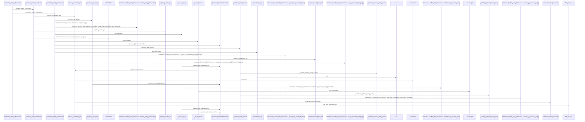
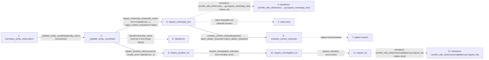

# normalize_entity_observation

**Entry point:** `normalize_entity_observation` (`api`)
**Source:** [knowledge_evidence](../modules/knowledge_evidence.md)
**Modules touched:** [knowledge_evidence](../modules/knowledge_evidence.md), [validation](../modules/validation.md)

## Call sequence

> Static overview in presentation order, not runtime execution order. Arrows retain captured callers; siblings are shown before deeper helper detail.

<!-- Auto-generated from static call edges. Dashed arrows are external or unresolved calls. Reviewed runtime conditions and side effects belong in Behavior. -->

```mermaid
sequenceDiagram
    participant p0 as normalize_entity_observation
    participant p1 as _validate_entity_coordinate
    participant p2 as _normalize_entity_observation
    participant p3 as require_nonempty_text
    participant p4 as _inventory_language
    participant p5 as ValueError
    participant p6 as isinstance (src/llm_wiki_cli/services…malize_entity_observation)
    participant p7 as require_positive_int
    participant p8 as _record_array
    participant p9 as _record_name
    participant p10 as _InventoryNormalizationError
    participant p11 as _validate_entity_record
    participant p12 as _structural_copy
    participant p13 as isinstance (src/llm_wiki_cli/services….py:require_nonempty_text)
    participant p14 as require_nonnegative_int
    participant p15 as isinstance (src/llm_wiki_cli/services…ce.py:_inventory_language)
    participant p16 as _validate_module_entity_record
    participant p17 as set
    participant p18 as value.strip
    participant p19 as isinstance (src/llm_wiki_cli/services…evidence.py:_record_array)
    participant p20 as record.get
    participant p21 as _validate_optional_string_array
    participant p22 as isinstance (src/llm_wiki_cli/services…dence.py:_structural_copy)
    participant p23 as contains_control_character
    participant p24 as file_data.get
    p0->>p1: _validate_entity_coordinate
    p0->>p2: _normalize_entity_observation
    p1->>p3: require_nonempty_text
    p2->>p4: _inventory_language
    p1-->>p5: ValueError('entity_name must be a non-empty string')
    p2-->>p6: isinstance (src/llm_wiki_cli/services…malize_entity_observation)(file_data, Mapping)
    p1->>p7: require_positive_int
    p2->>p8: _record_array
    p1-->>p5: ValueError('occurrence must be a positive integer')
    p2->>p9: _record_name
    p2->>p10: _InventoryNormalizationError
    p2->>p11: _validate_entity_record
    p2->>p12: _structural_copy
    p3-->>p13: isinstance (src/llm_wiki_cli/services….py:require_nonempty_text)(value, str)
    p7->>p14: require_nonnegative_int
    p4-->>p15: isinstance (src/llm_wiki_cli/services…ce.py:_inventory_language)(file_data, Mapping)
    p8->>p10: _InventoryNormalizationError
    p9->>p3: require_nonempty_text
    p11->>p16: _validate_module_entity_record
    p12-->>p17: set
    p3-->>p18: value.strip
    p4->>p10: _InventoryNormalizationError
    p8-->>p19: isinstance (src/llm_wiki_cli/services…evidence.py:_record_array)(value, list)
    p9-->>p20: record.get('name')
    p11->>p21: _validate_optional_string_array
    p12-->>p22: isinstance (src/llm_wiki_cli/services…dence.py:_structural_copy)(value, Mapping)
    p3->>p23: contains_control_character
    p4-->>p24: file_data.get('language')
    p8->>p10: _InventoryNormalizationError
    p9->>p10: _InventoryNormalizationError
```

> Call sequence diagram shows 30 of 109 interactions; 79 omitted to keep the visualization within the 30-interaction and generated-diagram limits, with uncertain identities omitted rather than inferred.

> Captured boundary calls: external 8 of 27 (19 omitted); unresolved 3 of 11 (8 omitted). These counts cover the captured static trace.

Omitted captured detail, grouped by actual caller occurrence and target module:

| Caller | Parent step | Target module | Kind | Omitted interactions |
| --- | --- | --- | --- | --- |
| `src/llm_wiki_cli/services/validation.py:contains_control_character` | 6 | - | unresolved | 1 |
| `src/llm_wiki_cli/services/validation.py:require_nonnegative_int` | 10 | [src/llm_wiki_cli/services/validation.py](../modules/validation.md) | internal | 1 |
| `src/llm_wiki_cli/services/validation.py:require_int` | 11 | - | external | 2 |
| `src/llm_wiki_cli/services/knowledge_evidence.py:_inventory_language` | 16 | - | external | 1 |
| `src/llm_wiki_cli/services/knowledge_evidence.py:_inventory_language` | 16 | [src/llm_wiki_cli/services/knowledge_evidence.py](../modules/knowledge_evidence.md) | internal | 2 |
| `src/llm_wiki_cli/services/knowledge_evidence.py:_record_array` | 24 | - | external | 2 |
| `src/llm_wiki_cli/services/knowledge_evidence.py:_record_array` | 24 | [src/llm_wiki_cli/services/knowledge_evidence.py](../modules/knowledge_evidence.md) | internal | 1 |
| `src/llm_wiki_cli/services/knowledge_evidence.py:_validate_module_entity_record` | 37 | [src/llm_wiki_cli/services/knowledge_evidence.py](../modules/knowledge_evidence.md) | internal | 3 |
> Omission summary shows 8 of 35 groups; 27 further groups are not expanded here. Counts above include all omitted interactions.
> Detailed flow queries retain their own coverage and limits; omitted paths may execute at runtime.

> Trace truncated at the depth limit; deeper calls are omitted.

## Data flow

<!-- Auto-generated static analysis. Treat values and boundaries as best-effort hints, not runtime proof. -->

```mermaid
flowchart LR
    s1["1. normalize_entity_observation"]
    s2["2. _validate_entity_coordinate"]
    s3["3. require_nonempty_text"]
    s4["4. isinstance (src/llm_wiki_cli/services….py:require_nonempty_text)"]
    s5["5. value.strip"]
    s6["6. contains_control_character"]
    s7["7. pattern.search"]
    s8["8. ValueError"]
    s9["9. require_positive_int"]
    s10["10. require_nonnegative_int"]
    s11["11. require_int"]
    s12["12. isinstance (src/llm_wiki_cli/services/validation.py:require_int)"]
    s1 -->|"_validate_entity_coordinate(entity_name, occurrence)"| s2
    s2 -->|"require_nonempty_text(entity_name, error=ValueError(...), reject_control_characters=False)"| s3
    s3 -. "isinstance (src/llm_wiki_cli/services….py:require_nonempty_text)(value, str)" .-> s4
    s3 -. "value.strip(data not statically known)" .-> s5
    s3 -->|"contains_control_character(parsed, reject_delete_character=reject_delete_character)"| s6
    s6 -. "pattern.search(value)" .-> s7
    s2 -. "ValueError('entity_name must be a non-empty string')" .-> s8
    s2 -->|"require_positive_int(occurrence, invalid_error=ValueError(...))"| s9
    s9 -->|"require_nonnegative_int(value, error=invalid_error)"| s10
    s10 -->|"require_int(value, error=error)"| s11
    s11 -. "isinstance (src/llm_wiki_cli/services/validation.py:require_int)(value, bool)" .-> s12
    click s1 "../modules/knowledge_evidence.md"
    click s2 "../modules/knowledge_evidence.md"
    click s3 "../modules/validation.md"
    click s6 "../modules/validation.md"
    click s9 "../modules/validation.md"
    click s10 "../modules/validation.md"
    click s11 "../modules/validation.md"
```

### Step data

| Step | Inputs | Reads | Writes | Returns |
|---|---|---|---|---|
| `normalize_entity_observation` | `file_data: Mapping[str, Any]`, `entity_name: str`, `occurrence: int` | `_InventoryNormalizationError` | - | `_normalize_entity_observation(...)`, `None` |
| `_validate_entity_coordinate` | `entity_name: object`, `occurrence: object` | - | - | - |
| `require_nonempty_text` | `value: object`, `error: Exception`, `trim_error: Exception \| None`, `normalize: bool`, `require_trimmed: bool`, `reject_control_characters: bool`, `reject_delete_character: bool` | - | - | `parsed` |
| `isinstance (src/llm_wiki_cli/services….py:require_nonempty_text)` | - | - | - | - |
| `value.strip` | - | - | - | - |
| `contains_control_character` | `value: str`, `reject_delete_character: bool` | `_ASCII_CONTROL_DELETE`, `_ASCII_CONTROL` | - | `...` |
| `pattern.search` | - | - | - | - |
| `ValueError` | - | - | - | - |
| `require_positive_int` | `value: object`, `invalid_error: Exception`, `zero_error: Exception \| None` | - | - | `parsed` |
| `require_nonnegative_int` | `value: object`, `error: Exception` | - | - | `parsed` |
| `require_int` | `value: object`, `error: Exception` | - | - | `value` |
| `isinstance (src/llm_wiki_cli/services/validation.py:require_int)` | - | - | - | - |

### Call data

| From | To | Line | Call |
|---|---|---:|---|
| normalize_entity_observation | _validate_entity_coordinate | 238 | `_validate_entity_coordinate(entity_name, occurrence)` |
| _validate_entity_coordinate | require_nonempty_text | 909 | `require_nonempty_text(entity_name, error=ValueError(...), reject_control_characters=False)` |
| require_nonempty_text | isinstance (src/llm_wiki_cli/services….py:require_nonempty_text) | 623 | `isinstance(value, str)` |
| require_nonempty_text | value.strip | 625 | `value.strip(data not statically known)` |
| require_nonempty_text | contains_control_character | 631 | `contains_control_character(parsed, reject_delete_character=reject_delete_character)` |
| contains_control_character | pattern.search | 685 | `pattern.search(value)` |
| _validate_entity_coordinate | ValueError | 911 | `ValueError('entity_name must be a non-empty string')` |
| _validate_entity_coordinate | require_positive_int | 914 | `require_positive_int(occurrence, invalid_error=ValueError(...))` |
| require_positive_int | require_nonnegative_int | 848 | `require_nonnegative_int(value, error=invalid_error)` |
| require_nonnegative_int | require_int | 826 | `require_int(value, error=error)` |
| require_int | isinstance (src/llm_wiki_cli/services/validation.py:require_int) | 818 | `isinstance(value, bool)` |

### Boundary effects

*No boundary effects detected.*

### Static analysis gaps

| Kind | Step | Target | Line |
|---|---|---|---:|
| external_call | `require_nonempty_text` | `isinstance` | 623 |
| unresolved_call | `require_nonempty_text` | `value.strip` | 625 |
| unresolved_call | `contains_control_character` | `pattern.search` | 685 |
| external_call | `_validate_entity_coordinate` | `ValueError` | 911 |
| external_call | `require_int` | `isinstance` | 818 |
| step_limit | `normalize_entity_observation` | `first 12 steps` | 0 |
| truncated_flow | `normalize_entity_observation` | `depth limit` | 0 |

## Behavior

This flow starts at `normalize_entity_observation` and is classified as `api`. The generated call and data-flow sections are bounded static projections; runtime conditions and side effects require source-level confirmation.
