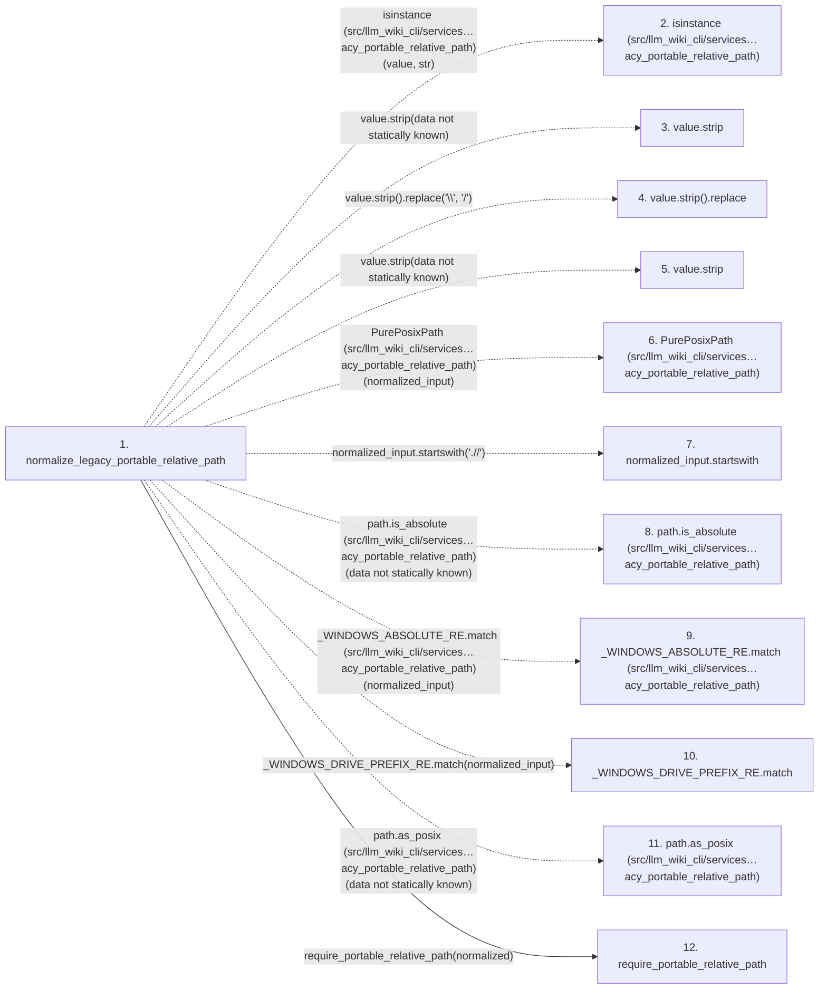

# normalize_legacy_portable_relative_path

**Entry point:** `normalize_legacy_portable_relative_path` (`api`)
**Source:** [validation](../modules/validation.md)
**Modules touched:** [validation](../modules/validation.md)

## Call sequence

```mermaid
sequenceDiagram
    participant p0 as normalize_legacy_portable_relative_path
    participant p1 as isinstance (src/llm_wiki_cli/services…acy_portable_relative_path)
    participant p2 as value.strip
    participant p3 as value.strip().replace
    participant p4 as PurePosixPath (src/llm_wiki_cli/services…acy_portable_relative_path)
    participant p5 as normalized_input.startswith
    participant p6 as path.is_absolute (src/llm_wiki_cli/services…acy_portable_relative_path)
    participant p7 as _WINDOWS_ABSOLUTE_RE.match (src/llm_wiki_cli/services…acy_portable_relative_path)
    participant p8 as _WINDOWS_DRIVE_PREFIX_RE.match
    participant p9 as path.as_posix (src/llm_wiki_cli/services…acy_portable_relative_path)
    participant p10 as require_portable_relative_path
    participant p11 as isinstance (src/llm_wiki_cli/services…ire_portable_relative_path)
    participant p12 as _default_path_error
    participant p13 as SharedValidationError
    participant p14 as os.fspath
    participant p15 as raw.encode
    participant p16 as raw.replace
    participant p17 as PurePosixPath (src/llm_wiki_cli/services…ire_portable_relative_path)
    participant p18 as path.is_absolute (src/llm_wiki_cli/services…ire_portable_relative_path)
    participant p19 as _WINDOWS_ABSOLUTE_RE.match (src/llm_wiki_cli/services…ire_portable_relative_path)
    participant p20 as path.as_posix (src/llm_wiki_cli/services…ire_portable_relative_path)
    participant p21 as normalized.strip
    participant p22 as canonical.casefold().endswith
    participant p23 as canonical.casefold
    p0-->>p1: isinstance (src/llm_wiki_cli/services…acy_portable_relative_path)
    p0-->>p2: value.strip
    p0-->>p3: value.strip().replace
    p0-->>p2: value.strip
    p0-->>p4: PurePosixPath (src/llm_wiki_cli/services…acy_portable_relative_path)
    p0-->>p5: normalized_input.startswith
    p0-->>p6: path.is_absolute (src/llm_wiki_cli/services…acy_portable_relative_path)
    p0-->>p7: _WINDOWS_ABSOLUTE_RE.match (src/llm_wiki_cli/services…acy_portable_relative_path)
    p0-->>p8: _WINDOWS_DRIVE_PREFIX_RE.match
    p0-->>p9: path.as_posix (src/llm_wiki_cli/services…acy_portable_relative_path)
    p0->>p10: require_portable_relative_path
    p10-->>p11: isinstance (src/llm_wiki_cli/services…ire_portable_relative_path)
    p10->>p12: _default_path_error
    p12->>p13: SharedValidationError
    p10-->>p14: os.fspath
    p10-->>p11: isinstance (src/llm_wiki_cli/services…ire_portable_relative_path)
    p10->>p12: _default_path_error
    p10-->>p15: raw.encode
    p10->>p12: _default_path_error
    p10->>p12: _default_path_error
    p10-->>p16: raw.replace
    p10-->>p17: PurePosixPath (src/llm_wiki_cli/services…ire_portable_relative_path)
    p10-->>p18: path.is_absolute (src/llm_wiki_cli/services…ire_portable_relative_path)
    p10-->>p19: _WINDOWS_ABSOLUTE_RE.match (src/llm_wiki_cli/services…ire_portable_relative_path)
    p10->>p12: _default_path_error
    p10->>p12: _default_path_error
    p10-->>p20: path.as_posix (src/llm_wiki_cli/services…ire_portable_relative_path)
    p10-->>p21: normalized.strip
    p10-->>p22: canonical.casefold().endswith
    p10-->>p23: canonical.casefold
```

<!-- Auto-generated from static call edges. Dashed arrows are external or unresolved calls. Reviewed runtime conditions and side effects belong in Behavior. -->

> Call sequence diagram shows 30 of 53 interactions; 23 omitted to keep the visualization within the 30-interaction and generated-diagram limits.

## Data flow

<!-- Auto-generated static analysis. Treat values and boundaries as best-effort hints, not runtime proof. -->

### Step data

| Step | Inputs | Reads | Writes | Returns |
|---|---|---|---|---|
| `normalize_legacy_portable_relative_path` | `value: object`, `text_error: Exception \| None`, `absolute_error: Exception \| None`, `traversal_error: Exception \| None`, `empty_error: Exception \| None`, `invalid_error: Exception \| None`, `reject_dot_prefixed_absolute: bool` | `SharedValidationError` | - | `None`, `None`, `None`, `None`, `require_portable_relative_path(...)`, `None` |
| `isinstance (src/llm_wiki_cli/services…acy_portable_relative_path)` | - | - | - | - |
| `value.strip` | - | - | - | - |
| `value.strip().replace` | - | - | - | - |
| `value.strip` | - | - | - | - |
| `PurePosixPath (src/llm_wiki_cli/services…acy_portable_relative_path)` | - | - | - | - |
| `normalized_input.startswith` | - | - | - | - |
| `path.is_absolute (src/llm_wiki_cli/services…acy_portable_relative_path)` | - | - | - | - |
| `_WINDOWS_ABSOLUTE_RE.match (src/llm_wiki_cli/services…acy_portable_relative_path)` | - | - | - | - |
| `_WINDOWS_DRIVE_PREFIX_RE.match` | - | - | - | - |
| `path.as_posix (src/llm_wiki_cli/services…acy_portable_relative_path)` | - | - | - | - |
| `require_portable_relative_path` | `value: object`, `normalize_backslashes: bool`, `normalize_posix_spelling: bool`, `required_suffix: str \| None`, `defer_non_nfc_error: bool`, `reject_delete_character: bool`, `text_error: Exception \| None`, `relative_error: Exception \| None` | `os` | - | `canonical` |

### Call data

| From | To | Line | Call |
|---|---|---:|---|
| normalize_legacy_portable_relative_path | isinstance (src/llm_wiki_cli/services…acy_portable_relative_path) | 338 | `isinstance(value, str)` |
| normalize_legacy_portable_relative_path | value.strip | 338 | `value.strip(data not statically known)` |
| normalize_legacy_portable_relative_path | value.strip().replace | 342 | `value.strip().replace('\\', '/')` |
| normalize_legacy_portable_relative_path | value.strip | 342 | `value.strip(data not statically known)` |
| normalize_legacy_portable_relative_path | PurePosixPath (src/llm_wiki_cli/services…acy_portable_relative_path) | 343 | `PurePosixPath(normalized_input)` |
| normalize_legacy_portable_relative_path | normalized_input.startswith | 347 | `normalized_input.startswith('.//')` |
| normalize_legacy_portable_relative_path | path.is_absolute (src/llm_wiki_cli/services…acy_portable_relative_path) | 349 | `path.is_absolute(data not statically known)` |
| normalize_legacy_portable_relative_path | _WINDOWS_ABSOLUTE_RE.match (src/llm_wiki_cli/services…acy_portable_relative_path) | 350 | `_WINDOWS_ABSOLUTE_RE.match(normalized_input)` |
| normalize_legacy_portable_relative_path | _WINDOWS_DRIVE_PREFIX_RE.match | 351 | `_WINDOWS_DRIVE_PREFIX_RE.match(normalized_input)` |
| normalize_legacy_portable_relative_path | path.as_posix (src/llm_wiki_cli/services…acy_portable_relative_path) | 360 | `path.as_posix(data not statically known)` |
| normalize_legacy_portable_relative_path | require_portable_relative_path | 366 | `require_portable_relative_path(normalized)` |

### Boundary effects

*No boundary effects detected.*

### Static analysis gaps

| Kind | Step | Target | Line |
|---|---|---|---:|
| external_call | `normalize_legacy_portable_relative_path` | `isinstance` | 338 |
| unresolved_call | `normalize_legacy_portable_relative_path` | `value.strip` | 338 |
| unresolved_call | `normalize_legacy_portable_relative_path` | `value.strip().replace` | 342 |
| unresolved_call | `normalize_legacy_portable_relative_path` | `value.strip` | 342 |
| external_call | `normalize_legacy_portable_relative_path` | `PurePosixPath` | 343 |
| unresolved_call | `normalize_legacy_portable_relative_path` | `normalized_input.startswith` | 347 |
| unresolved_call | `normalize_legacy_portable_relative_path` | `path.is_absolute` | 349 |
| unresolved_call | `normalize_legacy_portable_relative_path` | `_WINDOWS_ABSOLUTE_RE.match` | 350 |
| unresolved_call | `normalize_legacy_portable_relative_path` | `_WINDOWS_DRIVE_PREFIX_RE.match` | 351 |
| unresolved_call | `normalize_legacy_portable_relative_path` | `path.as_posix` | 360 |
| step_limit | `normalize_legacy_portable_relative_path` | `first 12 steps` | 0 |

## Behavior

This flow starts at `normalize_legacy_portable_relative_path` and is classified as `api`. The generated call and data-flow sections are bounded static projections; runtime conditions and side effects require source-level confirmation.
