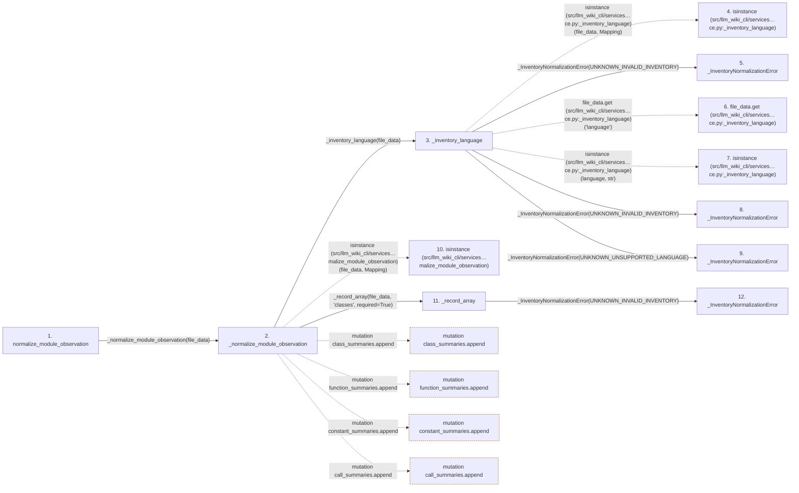

# normalize_module_observation

**Entry point:** `normalize_module_observation` (`api`)
**Source:** [knowledge_evidence](../modules/knowledge_evidence.md)
**Modules touched:** [knowledge_evidence](../modules/knowledge_evidence.md), [validation](../modules/validation.md)

## Call sequence

```mermaid
sequenceDiagram
    participant p0 as normalize_module_observation
    participant p1 as _normalize_module_observation
    participant p2 as _inventory_language
    participant p3 as isinstance (src/llm_wiki_cli/services…ce.py:_inventory_language)
    participant p4 as _InventoryNormalizationError
    participant p5 as file_data.get (src/llm_wiki_cli/services…ce.py:_inventory_language)
    participant p6 as isinstance (src/llm_wiki_cli/services…malize_module_observation)
    participant p7 as _record_array
    participant p8 as isinstance (src/llm_wiki_cli/services…evidence.py:_record_array)
    participant p9 as all (src/llm_wiki_cli/services…evidence.py:_record_array)
    participant p10 as _validate_import_record
    participant p11 as record.get (src/llm_wiki_cli/services…y:_validate_import_record)
    participant p12 as isinstance (src/llm_wiki_cli/services…y:_validate_import_record)
    participant p13 as _validate_optional_strings
    participant p14 as require_string
    participant p15 as isinstance (src/llm_wiki_cli/services…idation.py:require_string)
    participant p16 as value.encode
    participant p17 as _validate_optional_booleans
    participant p18 as require_bool
    p0->>p1: _normalize_module_observation
    p1->>p2: _inventory_language
    p2-->>p3: isinstance (src/llm_wiki_cli/services…ce.py:_inventory_language)
    p2->>p4: _InventoryNormalizationError
    p2-->>p5: file_data.get (src/llm_wiki_cli/services…ce.py:_inventory_language)
    p2-->>p3: isinstance (src/llm_wiki_cli/services…ce.py:_inventory_language)
    p2->>p4: _InventoryNormalizationError
    p2->>p4: _InventoryNormalizationError
    p1-->>p6: isinstance (src/llm_wiki_cli/services…malize_module_observation)
    p1->>p7: _record_array
    p7->>p4: _InventoryNormalizationError
    p7-->>p8: isinstance (src/llm_wiki_cli/services…evidence.py:_record_array)
    p7->>p4: _InventoryNormalizationError
    p7-->>p9: all (src/llm_wiki_cli/services…evidence.py:_record_array)
    p7-->>p8: isinstance (src/llm_wiki_cli/services…evidence.py:_record_array)
    p7->>p4: _InventoryNormalizationError
    p1->>p7: _record_array
    p1->>p7: _record_array
    p1->>p10: _validate_import_record
    p10-->>p11: record.get (src/llm_wiki_cli/services…y:_validate_import_record)
    p10-->>p12: isinstance (src/llm_wiki_cli/services…y:_validate_import_record)
    p10->>p4: _InventoryNormalizationError
    p10->>p13: _validate_optional_strings
    p13->>p14: require_string
    p14-->>p15: isinstance (src/llm_wiki_cli/services…idation.py:require_string)
    p14-->>p16: value.encode
    p13->>p4: _InventoryNormalizationError
    p10->>p13: _validate_optional_strings
    p10->>p17: _validate_optional_booleans
    p17->>p18: require_bool
```

<!-- Auto-generated from static call edges. Dashed arrows are external or unresolved calls. Reviewed runtime conditions and side effects belong in Behavior. -->

> Call sequence diagram shows 30 of 121 interactions; 91 omitted to keep the visualization within the 30-interaction and generated-diagram limits.

## Data flow

<!-- Auto-generated static analysis. Treat values and boundaries as best-effort hints, not runtime proof. -->

### Step data

| Step | Inputs | Reads | Writes | Returns |
|---|---|---|---|---|
| `normalize_module_observation` | `file_data: Mapping[str, Any]` | `_InventoryNormalizationError` | - | `_normalize_module_observation(...)`, `None` |
| `_normalize_module_observation` | `file_data: Mapping[str, Any] \| None` | `Mapping`, `_MODULE_ENTITY_FIELDS`, `_MODULE_NONSTRUCTURAL_KEYS`, `_MODULE_FUNCTION_FIELDS`, `_MODULE_NONSTRUCTURAL_KEYS`, `MODULE_OBSERVATION_SCOPE`, `_MODULE_NONSTRUCTURAL_KEYS`, `UNKNOWN_INVALID_INVENTORY` | `seen_names[...]`, `summary[...]`, `payload[...]`, `payload[...]`, `payload[...]`, `payload[...]` | `payload` |
| `_inventory_language` | `file_data: Mapping[str, Any] \| None` | `Mapping`, `UNKNOWN_INVALID_INVENTORY`, `UNKNOWN_INVALID_INVENTORY`, `_SUPPORTED_OBSERVATION_LANGUAGES`, `UNKNOWN_UNSUPPORTED_LANGUAGE` | - | `language` |
| `isinstance (src/llm_wiki_cli/services…ce.py:_inventory_language)` | - | - | - | - |
| `_InventoryNormalizationError` | - | - | - | - |
| `file_data.get (src/llm_wiki_cli/services…ce.py:_inventory_language)` | - | - | - | - |
| `isinstance (src/llm_wiki_cli/services…ce.py:_inventory_language)` | - | - | - | - |
| `_InventoryNormalizationError` | - | - | - | - |
| `_InventoryNormalizationError` | - | - | - | - |
| `isinstance (src/llm_wiki_cli/services…malize_module_observation)` | - | - | - | - |
| `_record_array` | `file_data: Mapping[str, Any]`, `field: str`, `required: bool` | `UNKNOWN_INVALID_INVENTORY`, `UNKNOWN_INVALID_INVENTORY`, `Mapping`, `UNKNOWN_INVALID_INVENTORY` | - | `[...]`, `value` |
| `_InventoryNormalizationError` | - | - | - | - |

### Call data

| From | To | Line | Call |
|---|---|---:|---|
| normalize_module_observation | _normalize_module_observation | 219 | `_normalize_module_observation(file_data)` |
| _normalize_module_observation | _inventory_language | 426 | `_inventory_language(file_data)` |
| _inventory_language | isinstance (src/llm_wiki_cli/services…ce.py:_inventory_language) | 542 | `isinstance(file_data, Mapping)` |
| _inventory_language | _InventoryNormalizationError | 543 | `_InventoryNormalizationError(UNKNOWN_INVALID_INVENTORY)` |
| _inventory_language | file_data.get (src/llm_wiki_cli/services…ce.py:_inventory_language) | 544 | `file_data.get('language')` |
| _inventory_language | isinstance (src/llm_wiki_cli/services…ce.py:_inventory_language) | 545 | `isinstance(language, str)` |
| _inventory_language | _InventoryNormalizationError | 546 | `_InventoryNormalizationError(UNKNOWN_INVALID_INVENTORY)` |
| _inventory_language | _InventoryNormalizationError | 548 | `_InventoryNormalizationError(UNKNOWN_UNSUPPORTED_LANGUAGE)` |
| _normalize_module_observation | isinstance (src/llm_wiki_cli/services…malize_module_observation) | 427 | `isinstance(file_data, Mapping)` |
| _normalize_module_observation | _record_array | 428 | `_record_array(file_data, 'classes', required=True)` |
| _record_array | _InventoryNormalizationError | 560 | `_InventoryNormalizationError(UNKNOWN_INVALID_INVENTORY)` |

### Boundary effects

| Kind | Target | Step | Line |
|---|---|---|---:|
| mutation | `class_summaries.append` | `_normalize_module_observation` | 446 |
| mutation | `function_summaries.append` | `_normalize_module_observation` | 451 |
| mutation | `constant_summaries.append` | `_normalize_module_observation` | 480 |
| mutation | `call_summaries.append` | `_normalize_module_observation` | 495 |

### Static analysis gaps

| Kind | Step | Target | Line |
|---|---|---|---:|
| external_call | `_inventory_language` | `isinstance` | 542 |
| unresolved_call | `_inventory_language` | `file_data.get` | 544 |
| external_call | `_inventory_language` | `isinstance` | 545 |
| external_call | `_normalize_module_observation` | `isinstance` | 427 |
| step_limit | `normalize_module_observation` | `first 12 steps` | 0 |

## Behavior

This flow starts at `normalize_module_observation` and is classified as `api`. The generated call and data-flow sections are bounded static projections; runtime conditions and side effects require source-level confirmation.
