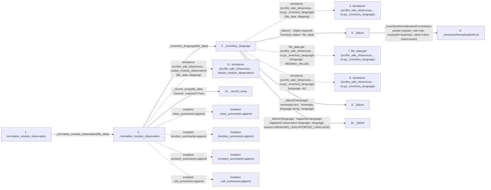

# normalize_module_observation

**Entry point:** `normalize_module_observation` (`api`)
**Source:** [knowledge_evidence](../modules/knowledge_evidence.md)
**Modules touched:** [knowledge_evidence](../modules/knowledge_evidence.md), [validation](../modules/validation.md)

## Call sequence

> Static overview in presentation order, not runtime execution order. Arrows retain captured callers; representative internal continuations and boundary examples precede repeated helper detail.

<!-- Auto-generated from static call edges. Dashed arrows are external or unresolved calls. Reviewed runtime conditions and side effects belong in Behavior. -->

```mermaid
sequenceDiagram
    participant p0 as normalize_module_observation
    participant p1 as _normalize_module_observation
    participant p2 as _inventory_language
    participant p3 as _record_array
    participant p4 as _validate_import_record
    participant p5 as _record_name
    participant p6 as _validate_module_entity_record
    participant p7 as _copy_selected_fields
    participant p8 as _validate_callable_record
    participant p9 as _json_array
    participant p10 as _validate_constant_record
    participant p11 as _validate_module_call_record
    participant p12 as _structural_copy
    participant p13 as _failure
    participant p14 as require_nonempty_text
    participant p15 as _optional_record_array
    participant p16 as _validate_optional_strings
    participant p17 as _validate_optional_string_array
    participant p18 as _validate_optional_booleans
    participant p19 as _validate_string_array
    participant p20 as _record_object
    participant p21 as _pointer
    participant p22 as require_list
    participant p23 as is_valid_sha256
    participant p24 as sha256_bytes
    participant p25 as _InventoryNormalizationError
    participant p26 as require_string
    participant p27 as require_bool
    participant p28 as contains_control_character
    participant p29 as isinstance (src/llm_wiki_cli/services…malize_module_observation)
    participant p30 as seen_names.get
    p0->>p1: _normalize_module_observation
    p1->>p2: _inventory_language
    p1->>p3: _record_array
    p1->>p4: _validate_import_record
    p1->>p5: _record_name
    p1->>p6: _validate_module_entity_record
    p1->>p7: _copy_selected_fields
    p1->>p8: _validate_callable_record
    p1->>p9: _json_array
    p1->>p10: _validate_constant_record
    p1->>p11: _validate_module_call_record
    p7->>p12: _structural_copy
    p2->>p13: _failure
    p5->>p14: require_nonempty_text
    p3->>p15: _optional_record_array
    p4->>p16: _validate_optional_strings
    p6->>p17: _validate_optional_string_array
    p4->>p18: _validate_optional_booleans
    p17->>p19: _validate_string_array
    p15->>p20: _record_object
    p3->>p21: _pointer
    p9->>p22: require_list
    p6->>p23: is_valid_sha256
    p6->>p24: sha256_bytes
    p13->>p25: _InventoryNormalizationError
    p16->>p26: require_string
    p18->>p27: require_bool
    p14->>p28: contains_control_character
    p1-->>p29: isinstance (src/llm_wiki_cli/services…malize_module_observation)(file_data, Mapping)
    p1-->>p30: seen_names.get(name, 0)
```

> Call sequence diagram shows 30 of 232 interactions; 202 omitted to keep the visualization within the 30-interaction and generated-diagram limits, with uncertain identities omitted rather than inferred.

> Captured boundary calls: external 1 of 45 (44 omitted); unresolved 1 of 58 (57 omitted). These counts cover the captured static trace.

Omitted captured detail, grouped by actual caller occurrence and target module:

| Caller | Parent step | Target module | Kind | Omitted interactions |
| --- | --- | --- | --- | --- |
| `src/llm_wiki_cli/services/knowledge_evidence.py:_inventory_language` | 3 | - | external | 2 |
| `src/llm_wiki_cli/services/knowledge_evidence.py:_inventory_language` | 3 | - | unresolved | 1 |
| `src/llm_wiki_cli/services/knowledge_evidence.py:_inventory_language` | 3 | [src/llm_wiki_cli/services/knowledge_evidence.py](../modules/knowledge_evidence.md) | internal | 2 |
| `src/llm_wiki_cli/services/knowledge_evidence.py:_record_array` | 12 | [src/llm_wiki_cli/services/knowledge_evidence.py](../modules/knowledge_evidence.md) | internal | 1 |
| `src/llm_wiki_cli/services/knowledge_evidence.py:_pointer` | 14 | - | unresolved | 2 |
| `src/llm_wiki_cli/services/knowledge_evidence.py:_pointer` | 14 | - | external | 1 |
| `src/llm_wiki_cli/services/knowledge_evidence.py:_optional_record_array` | 18 | [src/llm_wiki_cli/services/knowledge_evidence.py](../modules/knowledge_evidence.md) | internal | 3 |
| `src/llm_wiki_cli/services/knowledge_evidence.py:_optional_record_array` | 18 | [src/llm_wiki_cli/services/validation.py](../modules/validation.md) | internal | 1 |
> Omission summary shows 8 of 56 groups; 48 further groups are not expanded here. Counts above include all omitted interactions.
> Detailed flow queries retain their own coverage and limits; omitted paths may execute at runtime.

## Data flow

<!-- Auto-generated static analysis. Treat values and boundaries as best-effort hints, not runtime proof. -->

```mermaid
flowchart LR
    s1["1. normalize_module_observation"]
    s2["2. _normalize_module_observation"]
    s3["3. _inventory_language"]
    s4["4. isinstance (src/llm_wiki_cli/services…ce.py:_inventory_language)"]
    s5["5. _failure"]
    s6["6. _InventoryNormalizationError"]
    s7["7. file_data.get (src/llm_wiki_cli/services…ce.py:_inventory_language)"]
    s8["8. isinstance (src/llm_wiki_cli/services…ce.py:_inventory_language)"]
    s9["9. _failure"]
    s10["10. _failure"]
    s11["11. isinstance (src/llm_wiki_cli/services…malize_module_observation)"]
    s12["12. _record_array"]
    s1 -->|"_normalize_module_observation(file_data)"| s2
    s2 -->|"_inventory_language(file_data)"| s3
    s3 -. "isinstance (src/llm_wiki_cli/services…ce.py:_inventory_language)(file_data, Mapping)" .-> s4
    s3 -->|"_failure('', 'object-required', 'inventory object', file_data)"| s5
    s5 -->|"_InventoryNormalizationError(reason, pointer=pointer, rule=rule, expected=expected, value=value, exact=exact)"| s6
    s3 -. "file_data.get (src/llm_wiki_cli/services…ce.py:_inventory_language)('language', MISSING_VALUE)" .-> s7
    s3 -. "isinstance (src/llm_wiki_cli/services…ce.py:_inventory_language)(language, str)" .-> s8
    s3 -->|"_failure('/language', 'nonempty-text', 'nonempty language string', language)"| s9
    s3 -->|"_failure('/language', 'supported-language', 'registered observation language', language, reason=UNKNOWN_UNSUPPORTED_LANGUAGE)"| s10
    s2 -. "isinstance (src/llm_wiki_cli/services…malize_module_observation)(file_data, Mapping)" .-> s11
    s2 -->|"_record_array(file_data, 'classes', required=True)"| s12
    b0["mutation class_summaries.append"]
    s2 -. "mutation class_summaries.append" .-> b0
    b1["mutation function_summaries.append"]
    s2 -. "mutation function_summaries.append" .-> b1
    b2["mutation constant_summaries.append"]
    s2 -. "mutation constant_summaries.append" .-> b2
    b3["mutation call_summaries.append"]
    s2 -. "mutation call_summaries.append" .-> b3
    click s1 "../modules/knowledge_evidence.md"
    click s2 "../modules/knowledge_evidence.md"
    click s3 "../modules/knowledge_evidence.md"
    click s5 "../modules/knowledge_evidence.md"
    click s6 "../modules/knowledge_evidence.md"
    click s9 "../modules/knowledge_evidence.md"
    click s10 "../modules/knowledge_evidence.md"
    click s12 "../modules/knowledge_evidence.md"
    classDef boundary stroke:#b45309,stroke-dasharray: 4 2
    class b0 boundary
    class b1 boundary
    class b2 boundary
    class b3 boundary
```

### Step data

| Step | Inputs | Reads | Writes | Returns |
|---|---|---|---|---|
| `normalize_module_observation` | `file_data: Mapping[str, Any]` | `_InventoryNormalizationError` | - | `_normalize_module_observation(...)`, `None` |
| `_normalize_module_observation` | `file_data: Mapping[str, Any] \| None` | `Mapping`, `_MODULE_ENTITY_FIELDS`, `_MODULE_NONSTRUCTURAL_KEYS`, `_MODULE_FUNCTION_FIELDS`, `_MODULE_NONSTRUCTURAL_KEYS`, `MODULE_OBSERVATION_SCOPE`, `_MODULE_NONSTRUCTURAL_KEYS`, `_MODULE_CONSTANT_FIELDS` | `seen_names[...]`, `summary[...]`, `payload[...]`, `payload[...]`, `payload[...]`, `payload[...]` | `payload` |
| `_inventory_language` | `file_data: Mapping[str, Any] \| None` | `Mapping`, `MISSING_VALUE`, `_SUPPORTED_OBSERVATION_LANGUAGES`, `UNKNOWN_UNSUPPORTED_LANGUAGE` | - | `language` |
| `isinstance (src/llm_wiki_cli/services…ce.py:_inventory_language)` | - | - | - | - |
| `_failure` | `pointer`, `rule`, `expected`, `value`, `reason`, `exact` | - | - | `_InventoryNormalizationError(...)` |
| `_InventoryNormalizationError` | - | - | - | - |
| `file_data.get (src/llm_wiki_cli/services…ce.py:_inventory_language)` | - | - | - | - |
| `isinstance (src/llm_wiki_cli/services…ce.py:_inventory_language)` | - | - | - | - |
| `_failure` | `pointer`, `rule`, `expected`, `value`, `reason`, `exact` | - | - | `_InventoryNormalizationError(...)` |
| `_failure` | `pointer`, `rule`, `expected`, `value`, `reason`, `exact` | - | - | `_InventoryNormalizationError(...)` |
| `isinstance (src/llm_wiki_cli/services…malize_module_observation)` | - | - | - | - |
| `_record_array` | `file_data: Mapping[str, Any]`, `field: str`, `required: bool`, `pointer` | `MISSING_VALUE` | - | `_optional_record_array(...)` |

### Call data

| From | To | Line | Call |
|---|---|---:|---|
| normalize_module_observation | _normalize_module_observation | 242 | `_normalize_module_observation(file_data)` |
| _normalize_module_observation | _inventory_language | 457 | `_inventory_language(file_data)` |
| _inventory_language | isinstance (src/llm_wiki_cli/services…ce.py:_inventory_language) | 540 | `isinstance(file_data, Mapping)` |
| _inventory_language | _failure | 541 | `_failure('', 'object-required', 'inventory object', file_data)` |
| _failure | _InventoryNormalizationError | 166 | `_InventoryNormalizationError(reason, pointer=pointer, rule=rule, expected=expected, value=value, exact=exact)` |
| _inventory_language | file_data.get (src/llm_wiki_cli/services…ce.py:_inventory_language) | 542 | `file_data.get('language', MISSING_VALUE)` |
| _inventory_language | isinstance (src/llm_wiki_cli/services…ce.py:_inventory_language) | 543 | `isinstance(language, str)` |
| _inventory_language | _failure | 544 | `_failure('/language', 'nonempty-text', 'nonempty language string', language)` |
| _inventory_language | _failure | 546 | `_failure('/language', 'supported-language', 'registered observation language', language, reason=UNKNOWN_UNSUPPORTED_LANGUAGE)` |
| _normalize_module_observation | isinstance (src/llm_wiki_cli/services…malize_module_observation) | 458 | `isinstance(file_data, Mapping)` |
| _normalize_module_observation | _record_array | 459 | `_record_array(file_data, 'classes', required=True)` |

### Boundary effects

| Kind | Target | Step | Line |
|---|---|---|---:|
| mutation | `class_summaries.append` | `_normalize_module_observation` | 474 |
| mutation | `function_summaries.append` | `_normalize_module_observation` | 480 |
| mutation | `constant_summaries.append` | `_normalize_module_observation` | 502 |
| mutation | `call_summaries.append` | `_normalize_module_observation` | 509 |

### Static analysis gaps

| Kind | Step | Target | Line |
|---|---|---|---:|
| external_call | `_inventory_language` | `isinstance` | 540 |
| unresolved_call | `_inventory_language` | `file_data.get` | 542 |
| external_call | `_inventory_language` | `isinstance` | 543 |
| external_call | `_normalize_module_observation` | `isinstance` | 458 |
| step_limit | `normalize_module_observation` | `first 12 steps` | 0 |

## Behavior

This flow starts at `normalize_module_observation` and is classified as `api`. The generated call and data-flow sections are bounded static projections; runtime conditions and side effects require source-level confirmation.
