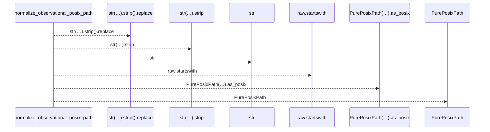
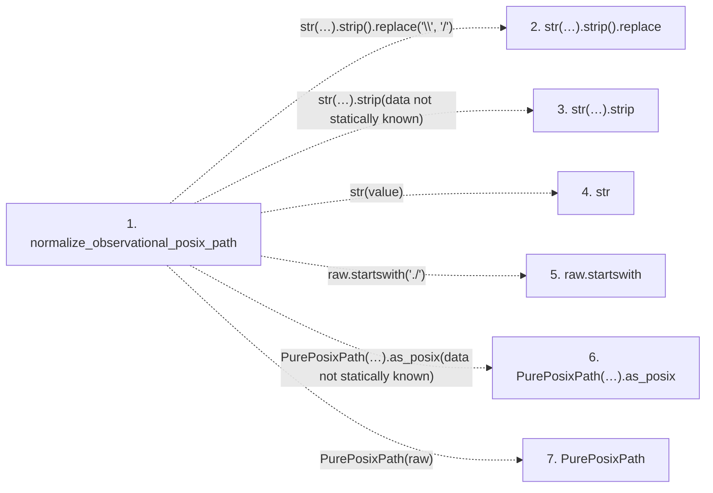

# normalize_observational_posix_path

**Entry point:** `normalize_observational_posix_path` (`api`)
**Source:** [validation](../modules/validation.md)
**Modules touched:** [validation](../modules/validation.md)

## Call sequence

<!-- Auto-generated from static call edges. Dashed arrows are external or unresolved calls. Reviewed runtime conditions and side effects belong in Behavior. -->

## Data flow

<!-- Auto-generated static analysis. Treat values and boundaries as best-effort hints, not runtime proof. -->

### Step data

| Step | Inputs | Reads | Writes | Returns |
|---|---|---|---|---|
| `normalize_observational_posix_path` | `value: object` | - | - | `...` |
| `str(…).strip().replace` | - | - | - | - |
| `str(…).strip` | - | - | - | - |
| `str` | - | - | - | - |
| `raw.startswith` | - | - | - | - |
| `PurePosixPath(…).as_posix` | - | - | - | - |
| `PurePosixPath` | - | - | - | - |

### Call data

| From | To | Line | Call |
|---|---|---:|---|
| normalize_observational_posix_path | str(…).strip().replace | 403 | `str(value).strip().replace('\\', '/')` |
| normalize_observational_posix_path | str(…).strip | 403 | `str(value).strip(data not statically known)` |
| normalize_observational_posix_path | str | 403 | `str(value)` |
| normalize_observational_posix_path | raw.startswith | 404 | `raw.startswith('./')` |
| normalize_observational_posix_path | PurePosixPath(…).as_posix | 406 | `PurePosixPath(raw).as_posix(data not statically known)` |
| normalize_observational_posix_path | PurePosixPath | 406 | `PurePosixPath(raw)` |

### Boundary effects

*No boundary effects detected.*

### Static analysis gaps

| Kind | Step | Target | Line |
|---|---|---|---:|
| unresolved_call | `normalize_observational_posix_path` | `str(value).strip().replace` | 403 |
| unresolved_call | `normalize_observational_posix_path` | `str(value).strip` | 403 |
| unresolved_call | `normalize_observational_posix_path` | `raw.startswith` | 404 |
| unresolved_call | `normalize_observational_posix_path` | `PurePosixPath(raw).as_posix` | 406 |
| external_call | `normalize_observational_posix_path` | `PurePosixPath` | 406 |

## Behavior

This flow starts at `normalize_observational_posix_path` and is classified as `api`. The generated call and data-flow sections are bounded static projections; runtime conditions and side effects require source-level confirmation.
