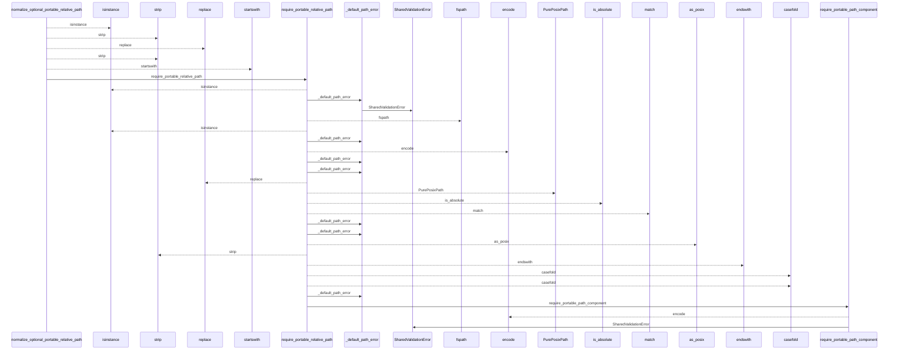
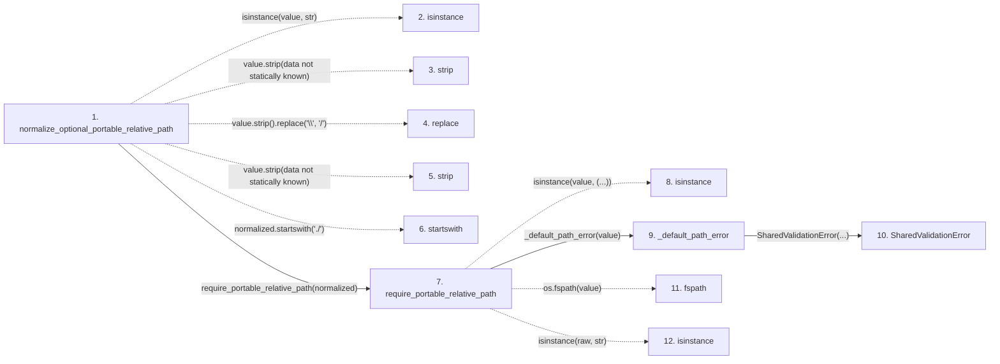

# normalize_optional_portable_relative_path

**Entry point:** `normalize_optional_portable_relative_path` (`api`)
**Source:** [validation](../modules/validation.md)
**Modules touched:** [validation](../modules/validation.md)

## Call sequence

<!-- Auto-generated from static call edges. Dashed arrows are external or unresolved calls. Reviewed runtime conditions and side effects belong in Behavior. -->

> Call sequence diagram shows 30 of 48 interactions; 18 omitted to keep the visualization within the 30-interaction and generated-diagram limits.

## Data flow

<!-- Auto-generated static analysis. Treat values and boundaries as best-effort hints, not runtime proof. -->

### Step data

| Step | Inputs | Reads | Writes | Returns |
|---|---|---|---|---|
| `normalize_optional_portable_relative_path` | `value: object` | `SharedValidationError` | - | `None`, `require_portable_relative_path(...)`, `None` |
| `isinstance` | - | - | - | - |
| `strip` | - | - | - | - |
| `replace` | - | - | - | - |
| `strip` | - | - | - | - |
| `startswith` | - | - | - | - |
| `require_portable_relative_path` | `value: object`, `normalize_backslashes: bool`, `normalize_posix_spelling: bool`, `required_suffix: str \| None`, `defer_non_nfc_error: bool`, `reject_delete_character: bool`, `text_error: Exception \| None`, `relative_error: Exception \| None` | `os` | - | `canonical` |
| `isinstance` | - | - | - | - |
| `_default_path_error` | `value: object` | - | - | `SharedValidationError(...)` |
| `SharedValidationError` | - | - | - | - |
| `fspath` | - | - | - | - |
| `isinstance` | - | - | - | - |

### Call data

| From | To | Line | Call |
|---|---|---:|---|
| normalize_optional_portable_relative_path | isinstance | 382 | `isinstance(value, str)` |
| normalize_optional_portable_relative_path | strip | 382 | `value.strip(data not statically known)` |
| normalize_optional_portable_relative_path | replace | 384 | `value.strip().replace('\\', '/')` |
| normalize_optional_portable_relative_path | strip | 384 | `value.strip(data not statically known)` |
| normalize_optional_portable_relative_path | startswith | 385 | `normalized.startswith('./')` |
| normalize_optional_portable_relative_path | require_portable_relative_path | 388 | `require_portable_relative_path(normalized)` |
| require_portable_relative_path | isinstance | 170 | `isinstance(value, (...))` |
| require_portable_relative_path | _default_path_error | 171 | `_default_path_error(value)` |
| _default_path_error | SharedValidationError | 67 | `SharedValidationError(...)` |
| require_portable_relative_path | fspath | 172 | `os.fspath(value)` |
| require_portable_relative_path | isinstance | 173 | `isinstance(raw, str)` |

### Boundary effects

*No boundary effects detected.*

### Static analysis gaps

| Kind | Step | Target | Line |
|---|---|---|---:|
| unresolved_call | `normalize_optional_portable_relative_path` | `isinstance` | 382 |
| unresolved_call | `normalize_optional_portable_relative_path` | `value.strip` | 382 |
| unresolved_call | `normalize_optional_portable_relative_path` | `value.strip().replace` | 384 |
| unresolved_call | `normalize_optional_portable_relative_path` | `value.strip` | 384 |
| unresolved_call | `normalize_optional_portable_relative_path` | `normalized.startswith` | 385 |
| unresolved_call | `require_portable_relative_path` | `isinstance` | 170 |
| external_call | `require_portable_relative_path` | `os.fspath` | 172 |
| unresolved_call | `require_portable_relative_path` | `isinstance` | 173 |
| step_limit | `normalize_optional_portable_relative_path` | `first 12 steps` | 0 |

## Behavior

This flow starts at `normalize_optional_portable_relative_path` and is classified as `api`. The generated call and data-flow sections are bounded static projections; runtime conditions and side effects require source-level confirmation.
