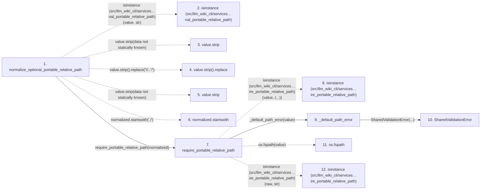

# normalize_optional_portable_relative_path

**Entry point:** `normalize_optional_portable_relative_path` (`api`)
**Source:** [validation](../modules/validation.md)
**Modules touched:** [validation](../modules/validation.md)

## Call sequence

```mermaid
sequenceDiagram
    participant p0 as normalize_optional_portable_relative_path
    participant p1 as isinstance (src/llm_wiki_cli/services…nal_portable_relative_path)
    participant p2 as value.strip
    participant p3 as value.strip().replace
    participant p4 as normalized.startswith
    participant p5 as require_portable_relative_path
    participant p6 as isinstance (src/llm_wiki_cli/services…ire_portable_relative_path)
    participant p7 as _default_path_error
    participant p8 as SharedValidationError
    participant p9 as os.fspath
    participant p10 as _syntax_key
    participant p11 as type
    participant p12 as len (src/llm_wiki_cli/services/validation.py:_syntax_key)
    participant p13 as any (src/llm_wiki_cli/services/validation.py:_syntax_key)
    participant p14 as _known_syntax
    participant p15 as _PATH_SYNTAX.get
    participant p16 as _PATH_SYNTAX.move_to_end (src/llm_wiki_cli/services…alidation.py:_known_syntax)
    participant p17 as _check_path_collision
    participant p18 as portable_path_key
    participant p19 as unicodedata.normalize(…).casefold
    participant p20 as unicodedata.normalize (src/llm_wiki_cli/services…ation.py:portable_path_key)
    participant p21 as collision_seen.setdefault
    participant p22 as collision_error
    participant p23 as raw.encode
    p0-->>p1: isinstance (src/llm_wiki_cli/services…nal_portable_relative_path)
    p0-->>p2: value.strip
    p0-->>p3: value.strip().replace
    p0-->>p2: value.strip
    p0-->>p4: normalized.startswith
    p0->>p5: require_portable_relative_path
    p5-->>p6: isinstance (src/llm_wiki_cli/services…ire_portable_relative_path)
    p5->>p7: _default_path_error
    p7->>p8: SharedValidationError
    p5-->>p9: os.fspath
    p5-->>p6: isinstance (src/llm_wiki_cli/services…ire_portable_relative_path)
    p5->>p7: _default_path_error
    p5->>p10: _syntax_key
    p10-->>p11: type
    p10-->>p12: len (src/llm_wiki_cli/services/validation.py:_syntax_key)
    p10-->>p13: any (src/llm_wiki_cli/services/validation.py:_syntax_key)
    p10-->>p11: type
    p10-->>p11: type
    p10-->>p12: len (src/llm_wiki_cli/services/validation.py:_syntax_key)
    p5->>p14: _known_syntax
    p14-->>p15: _PATH_SYNTAX.get
    p14-->>p16: _PATH_SYNTAX.move_to_end (src/llm_wiki_cli/services…alidation.py:_known_syntax)
    p5->>p17: _check_path_collision
    p17->>p18: portable_path_key
    p18-->>p19: unicodedata.normalize(…).casefold
    p18-->>p20: unicodedata.normalize (src/llm_wiki_cli/services…ation.py:portable_path_key)
    p17-->>p21: collision_seen.setdefault
    p17->>p8: SharedValidationError
    p17-->>p22: collision_error
    p5-->>p23: raw.encode
```

<!-- Auto-generated from static call edges. Dashed arrows are external or unresolved calls. Reviewed runtime conditions and side effects belong in Behavior. -->

> Call sequence diagram shows 30 of 64 interactions; 34 omitted to keep the visualization within the 30-interaction and generated-diagram limits.

## Data flow

<!-- Auto-generated static analysis. Treat values and boundaries as best-effort hints, not runtime proof. -->

### Step data

| Step | Inputs | Reads | Writes | Returns |
|---|---|---|---|---|
| `normalize_optional_portable_relative_path` | `value: object` | `SharedValidationError` | - | `None`, `require_portable_relative_path(...)`, `None` |
| `isinstance (src/llm_wiki_cli/services…nal_portable_relative_path)` | - | - | - | - |
| `value.strip` | - | - | - | - |
| `value.strip().replace` | - | - | - | - |
| `value.strip` | - | - | - | - |
| `normalized.startswith` | - | - | - | - |
| `require_portable_relative_path` | `value: object`, `normalize_backslashes: bool`, `normalize_posix_spelling: bool`, `required_suffix: str \| None`, `defer_non_nfc_error: bool`, `reject_delete_character: bool`, `text_error: Exception \| None`, `relative_error: Exception \| None` | `os` | - | `cached`, `_remember_syntax(...)` |
| `isinstance (src/llm_wiki_cli/services…ire_portable_relative_path)` | - | - | - | - |
| `_default_path_error` | `value: object` | - | - | `SharedValidationError(...)` |
| `SharedValidationError` | - | - | - | - |
| `os.fspath` | - | - | - | - |
| `isinstance (src/llm_wiki_cli/services…ire_portable_relative_path)` | - | - | - | - |

### Call data

| From | To | Line | Call |
|---|---|---:|---|
| normalize_optional_portable_relative_path | isinstance (src/llm_wiki_cli/services…nal_portable_relative_path) | 431 | `isinstance(value, str)` |
| normalize_optional_portable_relative_path | value.strip | 431 | `value.strip(data not statically known)` |
| normalize_optional_portable_relative_path | value.strip().replace | 433 | `value.strip().replace('\\', '/')` |
| normalize_optional_portable_relative_path | value.strip | 433 | `value.strip(data not statically known)` |
| normalize_optional_portable_relative_path | normalized.startswith | 434 | `normalized.startswith('./')` |
| normalize_optional_portable_relative_path | require_portable_relative_path | 437 | `require_portable_relative_path(normalized)` |
| require_portable_relative_path | isinstance (src/llm_wiki_cli/services…ire_portable_relative_path) | 216 | `isinstance(value, (...))` |
| require_portable_relative_path | _default_path_error | 217 | `_default_path_error(value)` |
| _default_path_error | SharedValidationError | 113 | `SharedValidationError(...)` |
| require_portable_relative_path | os.fspath | 218 | `os.fspath(value)` |
| require_portable_relative_path | isinstance (src/llm_wiki_cli/services…ire_portable_relative_path) | 219 | `isinstance(raw, str)` |

### Boundary effects

*No boundary effects detected.*

### Static analysis gaps

| Kind | Step | Target | Line |
|---|---|---|---:|
| external_call | `normalize_optional_portable_relative_path` | `isinstance` | 431 |
| unresolved_call | `normalize_optional_portable_relative_path` | `value.strip` | 431 |
| unresolved_call | `normalize_optional_portable_relative_path` | `value.strip().replace` | 433 |
| unresolved_call | `normalize_optional_portable_relative_path` | `value.strip` | 433 |
| unresolved_call | `normalize_optional_portable_relative_path` | `normalized.startswith` | 434 |
| external_call | `require_portable_relative_path` | `isinstance` | 216 |
| external_call | `require_portable_relative_path` | `os.fspath` | 218 |
| external_call | `require_portable_relative_path` | `isinstance` | 219 |
| step_limit | `normalize_optional_portable_relative_path` | `first 12 steps` | 0 |

## Behavior

This flow starts at `normalize_optional_portable_relative_path` and is classified as `api`. The generated call and data-flow sections are bounded static projections; runtime conditions and side effects require source-level confirmation.
