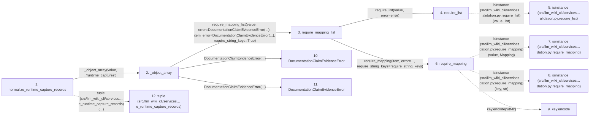

# normalize_runtime_capture_records

**Entry point:** `normalize_runtime_capture_records` (`api`)
**Source:** [documentation_claim_evidence](../modules/documentation_claim_evidence.md)
**Modules touched:** [documentation_claim_evidence](../modules/documentation_claim_evidence.md), [knowledge_evidence](../modules/knowledge_evidence.md), [validation](../modules/validation.md)

## Call sequence

```mermaid
sequenceDiagram
    participant p0 as normalize_runtime_capture_records
    participant p1 as _object_array
    participant p2 as require_mapping_list
    participant p3 as require_list
    participant p4 as isinstance (src/llm_wiki_cli/services…alidation.py:require_list)
    participant p5 as require_mapping
    participant p6 as isinstance (src/llm_wiki_cli/services…dation.py:require_mapping)
    participant p7 as key.encode
    participant p8 as DocumentationClaimEvidenceError
    participant p9 as tuple (src/llm_wiki_cli/services…e_runtime_capture_records)
    participant p10 as _normalize_capture_record
    participant p11 as _mapping
    participant p12 as _exact_fields
    participant p13 as require_exact_fields
    participant p14 as isinstance (src/llm_wiki_cli/services…n.py:require_exact_fields)
    participant p15 as str (src/llm_wiki_cli/services…n.py:require_exact_fields)
    participant p16 as set (src/llm_wiki_cli/services…n.py:require_exact_fields)
    participant p17 as tuple (src/llm_wiki_cli/services…n.py:require_exact_fields)
    participant p18 as sorted (src/llm_wiki_cli/services…n.py:require_exact_fields)
    participant p19 as invalid_error
    participant p20 as error_factory
    p0->>p1: _object_array
    p1->>p2: require_mapping_list
    p2->>p3: require_list
    p3-->>p4: isinstance (src/llm_wiki_cli/services…alidation.py:require_list)
    p2->>p5: require_mapping
    p5-->>p6: isinstance (src/llm_wiki_cli/services…dation.py:require_mapping)
    p5-->>p6: isinstance (src/llm_wiki_cli/services…dation.py:require_mapping)
    p5-->>p7: key.encode
    p1->>p8: DocumentationClaimEvidenceError
    p1->>p8: DocumentationClaimEvidenceError
    p0-->>p9: tuple (src/llm_wiki_cli/services…e_runtime_capture_records)
    p0->>p10: _normalize_capture_record
    p10->>p11: _mapping
    p11->>p5: require_mapping
    p11->>p8: DocumentationClaimEvidenceError
    p10->>p12: _exact_fields
    p12->>p13: require_exact_fields
    p13-->>p14: isinstance (src/llm_wiki_cli/services…n.py:require_exact_fields)
    p13-->>p15: str (src/llm_wiki_cli/services…n.py:require_exact_fields)
    p13-->>p16: set (src/llm_wiki_cli/services…n.py:require_exact_fields)
    p13-->>p16: set (src/llm_wiki_cli/services…n.py:require_exact_fields)
    p13-->>p16: set (src/llm_wiki_cli/services…n.py:require_exact_fields)
    p13-->>p17: tuple (src/llm_wiki_cli/services…n.py:require_exact_fields)
    p13-->>p18: sorted (src/llm_wiki_cli/services…n.py:require_exact_fields)
    p13-->>p17: tuple (src/llm_wiki_cli/services…n.py:require_exact_fields)
    p13-->>p18: sorted (src/llm_wiki_cli/services…n.py:require_exact_fields)
    p13-->>p19: invalid_error
    p13-->>p20: error_factory
    p12->>p8: DocumentationClaimEvidenceError
    p12->>p8: DocumentationClaimEvidenceError
```

<!-- Auto-generated from static call edges. Dashed arrows are external or unresolved calls. Reviewed runtime conditions and side effects belong in Behavior. -->

> Call sequence diagram shows 30 of 212 interactions; 182 omitted to keep the visualization within the 30-interaction and generated-diagram limits.

> Trace truncated at the depth limit; deeper calls are omitted.

## Data flow

<!-- Auto-generated static analysis. Treat values and boundaries as best-effort hints, not runtime proof. -->

### Step data

| Step | Inputs | Reads | Writes | Returns |
|---|---|---|---|---|
| `normalize_runtime_capture_records` | `value: object` | - | - | `tuple(...)` |
| `_object_array` | `value: object`, `field_name: str` | - | - | `require_mapping_list(...)` |
| `require_mapping_list` | `value: object`, `error: Exception`, `item_error: Exception \| None`, `require_string_keys: bool` | - | - | `items` |
| `require_list` | `value: object`, `error: Exception` | - | - | `value` |
| `isinstance (src/llm_wiki_cli/services…alidation.py:require_list)` | - | - | - | - |
| `require_mapping` | `value: object`, `error: Exception`, `require_string_keys: bool`, `key_error: Exception \| None`, `require_utf8_keys: bool`, `utf8_key_error: Exception \| None` | `Mapping` | - | `value` |
| `isinstance (src/llm_wiki_cli/services…dation.py:require_mapping)` | - | - | - | - |
| `isinstance (src/llm_wiki_cli/services…dation.py:require_mapping)` | - | - | - | - |
| `key.encode` | - | - | - | - |
| `DocumentationClaimEvidenceError` | - | - | - | - |
| `DocumentationClaimEvidenceError` | - | - | - | - |
| `tuple (src/llm_wiki_cli/services…e_runtime_capture_records)` | - | - | - | - |

### Call data

| From | To | Line | Call |
|---|---|---:|---|
| normalize_runtime_capture_records | _object_array | 208 | `_object_array(value, 'runtime_captures')` |
| _object_array | require_mapping_list | 1431 | `require_mapping_list(value, error=DocumentationClaimEvidenceError(...), item_error=DocumentationClaimEvidenceError(...), require_string_keys=True)` |
| require_mapping_list | require_list | 1015 | `require_list(value, error=error)` |
| require_list | isinstance (src/llm_wiki_cli/services…alidation.py:require_list) | 764 | `isinstance(value, list)` |
| require_mapping_list | require_mapping | 1017 | `require_mapping(item, error=..., require_string_keys=require_string_keys)` |
| require_mapping | isinstance (src/llm_wiki_cli/services…dation.py:require_mapping) | 727 | `isinstance(value, Mapping)` |
| require_mapping | isinstance (src/llm_wiki_cli/services…dation.py:require_mapping) | 731 | `isinstance(key, str)` |
| require_mapping | key.encode | 736 | `key.encode('utf-8')` |
| _object_array | DocumentationClaimEvidenceError | 1433 | `DocumentationClaimEvidenceError(...)` |
| _object_array | DocumentationClaimEvidenceError | 1434 | `DocumentationClaimEvidenceError(...)` |
| normalize_runtime_capture_records | tuple (src/llm_wiki_cli/services…e_runtime_capture_records) | 209 | `tuple(...)` |

### Boundary effects

*No boundary effects detected.*

### Static analysis gaps

| Kind | Step | Target | Line |
|---|---|---|---:|
| external_call | `require_list` | `isinstance` | 764 |
| external_call | `require_mapping` | `isinstance` | 727 |
| external_call | `require_mapping` | `isinstance` | 731 |
| unresolved_call | `require_mapping` | `key.encode` | 736 |
| step_limit | `normalize_runtime_capture_records` | `first 12 steps` | 0 |
| truncated_flow | `normalize_runtime_capture_records` | `depth limit` | 0 |

## Behavior

This flow starts at `normalize_runtime_capture_records` and is classified as `api`. The generated call and data-flow sections are bounded static projections; runtime conditions and side effects require source-level confirmation.
