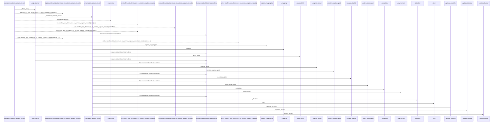
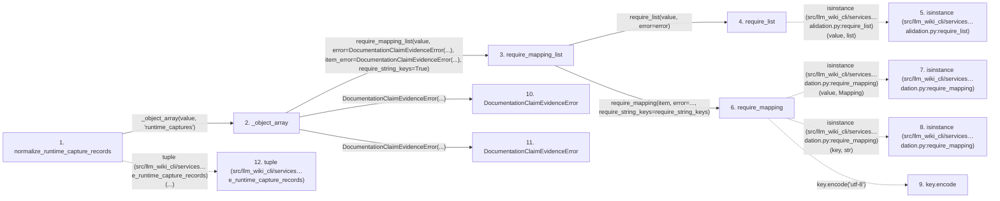

# normalize_runtime_capture_records

**Entry point:** `normalize_runtime_capture_records` (`api`)
**Source:** [documentation_claim_evidence](../modules/documentation_claim_evidence.md)
**Modules touched:** [documentation_claim_evidence](../modules/documentation_claim_evidence.md), [knowledge_evidence](../modules/knowledge_evidence.md), [validation](../modules/validation.md)

## Call sequence

> Static overview in presentation order, not runtime execution order. Arrows retain captured callers; siblings are shown before deeper helper detail.

<!-- Auto-generated from static call edges. Dashed arrows are external or unresolved calls. Reviewed runtime conditions and side effects belong in Behavior. -->

```mermaid
sequenceDiagram
    participant p0 as normalize_runtime_capture_records
    participant p1 as _object_array
    participant p2 as tuple (src/llm_wiki_cli/services…e_runtime_capture_records)
    participant p3 as _normalize_capture_record
    participant p4 as enumerate
    participant p5 as len (src/llm_wiki_cli/services…e_runtime_capture_records)
    participant p6 as set (src/llm_wiki_cli/services…e_runtime_capture_records)
    participant p7 as DocumentationClaimEvidenceError
    participant p8 as sorted (src/llm_wiki_cli/services…e_runtime_capture_records)
    participant p9 as require_mapping_list
    participant p10 as _mapping
    participant p11 as _exact_fields
    participant p12 as _capture_result
    participant p13 as _runtime_capture_path
    participant p14 as is_valid_sha256
    participant p15 as _native_observation
    participant p16 as _redaction
    participant p17 as _environment
    participant p18 as _identifier
    participant p19 as _text
    participant p20 as _optional_identifier
    participant p21 as _optional_locator
    participant p22 as _section_locator
    p0->>p1: _object_array
    p0-->>p2: tuple (src/llm_wiki_cli/services…e_runtime_capture_records)(...)
    p0->>p3: _normalize_capture_record
    p0-->>p4: enumerate(records)
    p0-->>p5: len (src/llm_wiki_cli/services…e_runtime_capture_records)(set(...))
    p0-->>p6: set (src/llm_wiki_cli/services…e_runtime_capture_records)(identifiers)
    p0-->>p5: len (src/llm_wiki_cli/services…e_runtime_capture_records)(identifiers)
    p0->>p7: DocumentationClaimEvidenceError
    p0-->>p2: tuple (src/llm_wiki_cli/services…e_runtime_capture_records)(sorted(...))
    p0-->>p8: sorted (src/llm_wiki_cli/services…e_runtime_capture_records)(normalized, key=...)
    p1->>p9: require_mapping_list
    p3->>p10: _mapping
    p1->>p7: DocumentationClaimEvidenceError
    p3->>p11: _exact_fields
    p1->>p7: DocumentationClaimEvidenceError
    p3->>p7: DocumentationClaimEvidenceError
    p3->>p12: _capture_result
    p3->>p13: _runtime_capture_path
    p3->>p7: DocumentationClaimEvidenceError
    p3->>p14: is_valid_sha256
    p3->>p7: DocumentationClaimEvidenceError
    p3->>p15: _native_observation
    p3->>p16: _redaction
    p3->>p17: _environment
    p3->>p7: DocumentationClaimEvidenceError
    p3->>p18: _identifier
    p3->>p19: _text
    p3->>p20: _optional_identifier
    p3->>p21: _optional_locator
    p3->>p22: _section_locator
```

> Call sequence diagram shows 30 of 226 interactions; 196 omitted to keep the visualization within the 30-interaction and generated-diagram limits, with uncertain identities omitted rather than inferred.

> Captured boundary calls: external 7 of 71 (64 omitted); unresolved 0 of 40 (40 omitted). These counts cover the captured static trace.

Omitted captured detail, grouped by actual caller occurrence and target module:

| Caller | Parent step | Target module | Kind | Omitted interactions |
| --- | --- | --- | --- | --- |
| `src/llm_wiki_cli/services/validation.py:require_mapping_list` | 3 | [src/llm_wiki_cli/services/validation.py](../modules/validation.md) | internal | 2 |
| `src/llm_wiki_cli/services/validation.py:require_list` | 4 | - | external | 1 |
| `src/llm_wiki_cli/services/validation.py:require_mapping` | 6 | - | external | 2 |
| `src/llm_wiki_cli/services/validation.py:require_mapping` | 6 | - | unresolved | 1 |
| `src/llm_wiki_cli/services/documentation_claim_evidence.py:_mapping` | 14 | [src/llm_wiki_cli/services/validation.py](../modules/validation.md) | internal | 1 |
| `src/llm_wiki_cli/services/documentation_claim_evidence.py:_mapping` | 14 | [src/llm_wiki_cli/services/documentation_claim_evidence.py](../modules/documentation_claim_evidence.md) | internal | 1 |
| `src/llm_wiki_cli/services/documentation_claim_evidence.py:_exact_fields` | 17 | [src/llm_wiki_cli/services/validation.py](../modules/validation.md) | internal | 1 |
| `src/llm_wiki_cli/services/validation.py:require_exact_fields` | 18 | - | external | 9 |
> Omission summary shows 8 of 69 groups; 61 further groups are not expanded here. Counts above include all omitted interactions.
> Detailed flow queries retain their own coverage and limits; omitted paths may execute at runtime.

> Trace truncated at the depth limit; deeper calls are omitted.

## Data flow

<!-- Auto-generated static analysis. Treat values and boundaries as best-effort hints, not runtime proof. -->

```mermaid
flowchart LR
    s1["1. normalize_runtime_capture_records"]
    s2["2. _object_array"]
    s3["3. require_mapping_list"]
    s4["4. require_list"]
    s5["5. isinstance (src/llm_wiki_cli/services…alidation.py:require_list)"]
    s6["6. require_mapping"]
    s7["7. isinstance (src/llm_wiki_cli/services…dation.py:require_mapping)"]
    s8["8. isinstance (src/llm_wiki_cli/services…dation.py:require_mapping)"]
    s9["9. key.encode"]
    s10["10. DocumentationClaimEvidenceError"]
    s11["11. DocumentationClaimEvidenceError"]
    s12["12. tuple (src/llm_wiki_cli/services…e_runtime_capture_records)"]
    s1 -->|"_object_array(value, 'runtime_captures')"| s2
    s2 -->|"require_mapping_list(value, error=DocumentationClaimEvidenceError(...), item_error=DocumentationClaimEvidenceError(...), require_string_keys=True)"| s3
    s3 -->|"require_list(value, error=error)"| s4
    s4 -. "isinstance (src/llm_wiki_cli/services…alidation.py:require_list)(value, list)" .-> s5
    s3 -->|"require_mapping(item, error=..., require_string_keys=require_string_keys)"| s6
    s6 -. "isinstance (src/llm_wiki_cli/services…dation.py:require_mapping)(value, Mapping)" .-> s7
    s6 -. "isinstance (src/llm_wiki_cli/services…dation.py:require_mapping)(key, str)" .-> s8
    s6 -. "key.encode('utf-8')" .-> s9
    s2 -->|"DocumentationClaimEvidenceError(...)"| s10
    s2 -->|"DocumentationClaimEvidenceError(...)"| s11
    s1 -. "tuple (src/llm_wiki_cli/services…e_runtime_capture_records)(...)" .-> s12
    click s1 "../modules/documentation_claim_evidence.md"
    click s2 "../modules/documentation_claim_evidence.md"
    click s3 "../modules/validation.md"
    click s4 "../modules/validation.md"
    click s6 "../modules/validation.md"
    click s10 "../modules/documentation_claim_evidence.md"
    click s11 "../modules/documentation_claim_evidence.md"
```

### Step data

| Step | Inputs | Reads | Writes | Returns |
|---|---|---|---|---|
| `normalize_runtime_capture_records` | `value: object` | - | - | `tuple(...)` |
| `_object_array` | `value: object`, `field_name: str` | - | - | `require_mapping_list(...)` |
| `require_mapping_list` | `value: object`, `error: Exception`, `item_error: Exception \| None`, `require_string_keys: bool` | - | - | `items` |
| `require_list` | `value: object`, `error: Exception` | - | - | `value` |
| `isinstance (src/llm_wiki_cli/services…alidation.py:require_list)` | - | - | - | - |
| `require_mapping` | `value: object`, `error: Exception`, `require_string_keys: bool`, `key_error: Exception \| None`, `require_utf8_keys: bool`, `utf8_key_error: Exception \| None` | `Mapping` | - | `value` |
| `isinstance (src/llm_wiki_cli/services…dation.py:require_mapping)` | - | - | - | - |
| `isinstance (src/llm_wiki_cli/services…dation.py:require_mapping)` | - | - | - | - |
| `key.encode` | - | - | - | - |
| `DocumentationClaimEvidenceError` | - | - | - | - |
| `DocumentationClaimEvidenceError` | - | - | - | - |
| `tuple (src/llm_wiki_cli/services…e_runtime_capture_records)` | - | - | - | - |

### Call data

| From | To | Line | Call |
|---|---|---:|---|
| normalize_runtime_capture_records | _object_array | 208 | `_object_array(value, 'runtime_captures')` |
| _object_array | require_mapping_list | 1431 | `require_mapping_list(value, error=DocumentationClaimEvidenceError(...), item_error=DocumentationClaimEvidenceError(...), require_string_keys=True)` |
| require_mapping_list | require_list | 1053 | `require_list(value, error=error)` |
| require_list | isinstance (src/llm_wiki_cli/services…alidation.py:require_list) | 802 | `isinstance(value, list)` |
| require_mapping_list | require_mapping | 1055 | `require_mapping(item, error=..., require_string_keys=require_string_keys)` |
| require_mapping | isinstance (src/llm_wiki_cli/services…dation.py:require_mapping) | 765 | `isinstance(value, Mapping)` |
| require_mapping | isinstance (src/llm_wiki_cli/services…dation.py:require_mapping) | 769 | `isinstance(key, str)` |
| require_mapping | key.encode | 774 | `key.encode('utf-8')` |
| _object_array | DocumentationClaimEvidenceError | 1433 | `DocumentationClaimEvidenceError(...)` |
| _object_array | DocumentationClaimEvidenceError | 1434 | `DocumentationClaimEvidenceError(...)` |
| normalize_runtime_capture_records | tuple (src/llm_wiki_cli/services…e_runtime_capture_records) | 209 | `tuple(...)` |

### Boundary effects

*No boundary effects detected.*

### Static analysis gaps

| Kind | Step | Target | Line |
|---|---|---|---:|
| external_call | `require_list` | `isinstance` | 802 |
| external_call | `require_mapping` | `isinstance` | 765 |
| external_call | `require_mapping` | `isinstance` | 769 |
| unresolved_call | `require_mapping` | `key.encode` | 774 |
| step_limit | `normalize_runtime_capture_records` | `first 12 steps` | 0 |
| truncated_flow | `normalize_runtime_capture_records` | `depth limit` | 0 |

## Behavior

This flow starts at `normalize_runtime_capture_records` and is classified as `api`. The generated call and data-flow sections are bounded static projections; runtime conditions and side effects require source-level confirmation.
