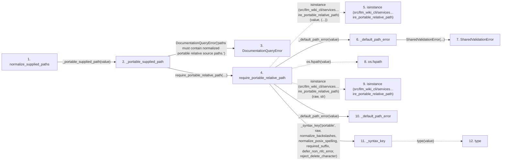

# normalize_supplied_paths

**Entry point:** `normalize_supplied_paths` (`api`)
**Source:** [documentation_query_builder](../modules/documentation_query_builder.md)
**Modules touched:** [documentation_queries](../modules/documentation_queries.md), [documentation_query_builder](../modules/documentation_query_builder.md), [validation](../modules/validation.md)

## Call sequence

```mermaid
sequenceDiagram
    participant p0 as normalize_supplied_paths
    participant p1 as _portable_supplied_path
    participant p2 as DocumentationQueryError
    participant p3 as require_portable_relative_path
    participant p4 as isinstance (src/llm_wiki_cli/services…ire_portable_relative_path)
    participant p5 as _default_path_error
    participant p6 as SharedValidationError
    participant p7 as os.fspath
    participant p8 as _syntax_key
    participant p9 as type
    participant p10 as len (src/llm_wiki_cli/services/validation.py:_syntax_key)
    participant p11 as any (src/llm_wiki_cli/services/validation.py:_syntax_key)
    participant p12 as _known_syntax
    participant p13 as _PATH_SYNTAX.get
    participant p14 as _PATH_SYNTAX.move_to_end (src/llm_wiki_cli/services…alidation.py:_known_syntax)
    participant p15 as _check_path_collision
    participant p16 as portable_path_key
    participant p17 as unicodedata.normalize(…).casefold
    participant p18 as unicodedata.normalize (src/llm_wiki_cli/services…ation.py:portable_path_key)
    participant p19 as collision_seen.setdefault
    participant p20 as collision_error
    participant p21 as raw.encode
    participant p22 as raw.replace
    p0->>p1: _portable_supplied_path
    p1->>p2: DocumentationQueryError
    p1->>p3: require_portable_relative_path
    p3-->>p4: isinstance (src/llm_wiki_cli/services…ire_portable_relative_path)
    p3->>p5: _default_path_error
    p5->>p6: SharedValidationError
    p3-->>p7: os.fspath
    p3-->>p4: isinstance (src/llm_wiki_cli/services…ire_portable_relative_path)
    p3->>p5: _default_path_error
    p3->>p8: _syntax_key
    p8-->>p9: type
    p8-->>p10: len (src/llm_wiki_cli/services/validation.py:_syntax_key)
    p8-->>p11: any (src/llm_wiki_cli/services/validation.py:_syntax_key)
    p8-->>p9: type
    p8-->>p9: type
    p8-->>p10: len (src/llm_wiki_cli/services/validation.py:_syntax_key)
    p3->>p12: _known_syntax
    p12-->>p13: _PATH_SYNTAX.get
    p12-->>p14: _PATH_SYNTAX.move_to_end (src/llm_wiki_cli/services…alidation.py:_known_syntax)
    p3->>p15: _check_path_collision
    p15->>p16: portable_path_key
    p16-->>p17: unicodedata.normalize(…).casefold
    p16-->>p18: unicodedata.normalize (src/llm_wiki_cli/services…ation.py:portable_path_key)
    p15-->>p19: collision_seen.setdefault
    p15->>p6: SharedValidationError
    p15-->>p20: collision_error
    p3-->>p21: raw.encode
    p3->>p5: _default_path_error
    p3->>p5: _default_path_error
    p3-->>p22: raw.replace
```

<!-- Auto-generated from static call edges. Dashed arrows are external or unresolved calls. Reviewed runtime conditions and side effects belong in Behavior. -->

> Call sequence diagram shows 30 of 74 interactions; 44 omitted to keep the visualization within the 30-interaction and generated-diagram limits.

## Data flow

<!-- Auto-generated static analysis. Treat values and boundaries as best-effort hints, not runtime proof. -->

### Step data

| Step | Inputs | Reads | Writes | Returns |
|---|---|---|---|---|
| `normalize_supplied_paths` | `values: object` | - | - | `tuple(...)` |
| `_portable_supplied_path` | `value: object` | - | - | `require_portable_relative_path(...)` |
| `DocumentationQueryError` | - | - | - | - |
| `require_portable_relative_path` | `value: object`, `normalize_backslashes: bool`, `normalize_posix_spelling: bool`, `required_suffix: str \| None`, `defer_non_nfc_error: bool`, `reject_delete_character: bool`, `text_error: Exception \| None`, `relative_error: Exception \| None` | `os` | - | `cached`, `_remember_syntax(...)` |
| `isinstance (src/llm_wiki_cli/services…ire_portable_relative_path)` | - | - | - | - |
| `_default_path_error` | `value: object` | - | - | `SharedValidationError(...)` |
| `SharedValidationError` | - | - | - | - |
| `os.fspath` | - | - | - | - |
| `isinstance (src/llm_wiki_cli/services…ire_portable_relative_path)` | - | - | - | - |
| `_default_path_error` | `value: object` | - | - | `SharedValidationError(...)` |
| `_syntax_key` | `kind`, `value`, `options` | - | - | `None`, `(...)` |
| `type` | - | - | - | - |

### Call data

| From | To | Line | Call |
|---|---|---:|---|
| normalize_supplied_paths | _portable_supplied_path | 135 | `_portable_supplied_path(value)` |
| _portable_supplied_path | DocumentationQueryError | 113 | `DocumentationQueryError('paths must contain normalized portable relative source paths.')` |
| _portable_supplied_path | require_portable_relative_path | 116 | `require_portable_relative_path(value, text_error=error, relative_error=error, escape_error=error, traversal_error=error, separator_error=error, utf8_error=error, control_error=error, non_nfc_error=error, nonportable_error=error, reserved_error=error)` |
| require_portable_relative_path | isinstance (src/llm_wiki_cli/services…ire_portable_relative_path) | 216 | `isinstance(value, (...))` |
| require_portable_relative_path | _default_path_error | 217 | `_default_path_error(value)` |
| _default_path_error | SharedValidationError | 113 | `SharedValidationError(...)` |
| require_portable_relative_path | os.fspath | 218 | `os.fspath(value)` |
| require_portable_relative_path | isinstance (src/llm_wiki_cli/services…ire_portable_relative_path) | 219 | `isinstance(raw, str)` |
| require_portable_relative_path | _default_path_error | 220 | `_default_path_error(value)` |
| require_portable_relative_path | _syntax_key | 221 | `_syntax_key('portable', raw, normalize_backslashes, normalize_posix_spelling, required_suffix, defer_non_nfc_error, reject_delete_character)` |
| _syntax_key | type | 54 | `type(value)` |

### Boundary effects

*No boundary effects detected.*

### Static analysis gaps

| Kind | Step | Target | Line |
|---|---|---|---:|
| external_call | `require_portable_relative_path` | `isinstance` | 216 |
| external_call | `require_portable_relative_path` | `os.fspath` | 218 |
| external_call | `require_portable_relative_path` | `isinstance` | 219 |
| external_call | `_syntax_key` | `type` | 54 |
| step_limit | `normalize_supplied_paths` | `first 12 steps` | 0 |

## Behavior

This flow starts at `normalize_supplied_paths` and is classified as `api`. The generated call and data-flow sections are bounded static projections; runtime conditions and side effects require source-level confirmation.
