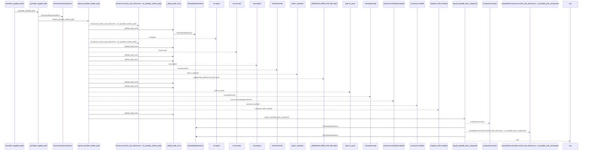
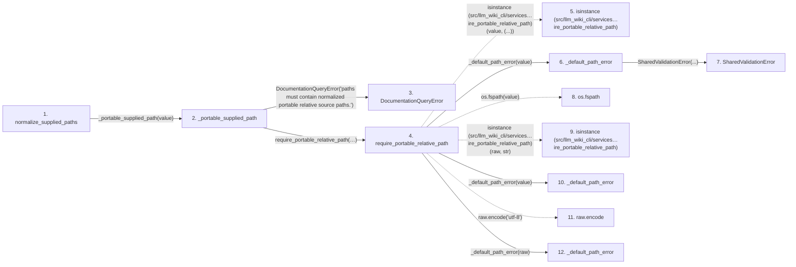

# normalize_supplied_paths

**Entry point:** `normalize_supplied_paths` (`api`)
**Source:** [documentation_query_builder](../modules/documentation_query_builder.md)
**Modules touched:** [documentation_queries](../modules/documentation_queries.md), [documentation_query_builder](../modules/documentation_query_builder.md), [validation](../modules/validation.md)

## Call sequence

<!-- Auto-generated from static call edges. Dashed arrows are external or unresolved calls. Reviewed runtime conditions and side effects belong in Behavior. -->

> Call sequence diagram shows 30 of 58 interactions; 28 omitted to keep the visualization within the 30-interaction and generated-diagram limits.

## Data flow

<!-- Auto-generated static analysis. Treat values and boundaries as best-effort hints, not runtime proof. -->

### Step data

| Step | Inputs | Reads | Writes | Returns |
|---|---|---|---|---|
| `normalize_supplied_paths` | `values: object` | - | - | `tuple(...)` |
| `_portable_supplied_path` | `value: object` | - | - | `require_portable_relative_path(...)` |
| `DocumentationQueryError` | - | - | - | - |
| `require_portable_relative_path` | `value: object`, `normalize_backslashes: bool`, `normalize_posix_spelling: bool`, `required_suffix: str \| None`, `defer_non_nfc_error: bool`, `reject_delete_character: bool`, `text_error: Exception \| None`, `relative_error: Exception \| None` | `os` | - | `canonical` |
| `isinstance (src/llm_wiki_cli/services…ire_portable_relative_path)` | - | - | - | - |
| `_default_path_error` | `value: object` | - | - | `SharedValidationError(...)` |
| `SharedValidationError` | - | - | - | - |
| `os.fspath` | - | - | - | - |
| `isinstance (src/llm_wiki_cli/services…ire_portable_relative_path)` | - | - | - | - |
| `_default_path_error` | `value: object` | - | - | `SharedValidationError(...)` |
| `raw.encode` | - | - | - | - |
| `_default_path_error` | `value: object` | - | - | `SharedValidationError(...)` |

### Call data

| From | To | Line | Call |
|---|---|---:|---|
| normalize_supplied_paths | _portable_supplied_path | 135 | `_portable_supplied_path(value)` |
| _portable_supplied_path | DocumentationQueryError | 113 | `DocumentationQueryError('paths must contain normalized portable relative source paths.')` |
| _portable_supplied_path | require_portable_relative_path | 116 | `require_portable_relative_path(value, text_error=error, relative_error=error, escape_error=error, traversal_error=error, separator_error=error, utf8_error=error, control_error=error, non_nfc_error=error, nonportable_error=error, reserved_error=error)` |
| require_portable_relative_path | isinstance (src/llm_wiki_cli/services…ire_portable_relative_path) | 170 | `isinstance(value, (...))` |
| require_portable_relative_path | _default_path_error | 171 | `_default_path_error(value)` |
| _default_path_error | SharedValidationError | 67 | `SharedValidationError(...)` |
| require_portable_relative_path | os.fspath | 172 | `os.fspath(value)` |
| require_portable_relative_path | isinstance (src/llm_wiki_cli/services…ire_portable_relative_path) | 173 | `isinstance(raw, str)` |
| require_portable_relative_path | _default_path_error | 174 | `_default_path_error(value)` |
| require_portable_relative_path | raw.encode | 176 | `raw.encode('utf-8')` |
| require_portable_relative_path | _default_path_error | 179 | `_default_path_error(raw)` |

### Boundary effects

*No boundary effects detected.*

### Static analysis gaps

| Kind | Step | Target | Line |
|---|---|---|---:|
| external_call | `require_portable_relative_path` | `isinstance` | 170 |
| external_call | `require_portable_relative_path` | `os.fspath` | 172 |
| external_call | `require_portable_relative_path` | `isinstance` | 173 |
| unresolved_call | `require_portable_relative_path` | `raw.encode` | 176 |
| step_limit | `normalize_supplied_paths` | `first 12 steps` | 0 |

## Behavior

This flow starts at `normalize_supplied_paths` and is classified as `api`. The generated call and data-flow sections are bounded static projections; runtime conditions and side effects require source-level confirmation.
