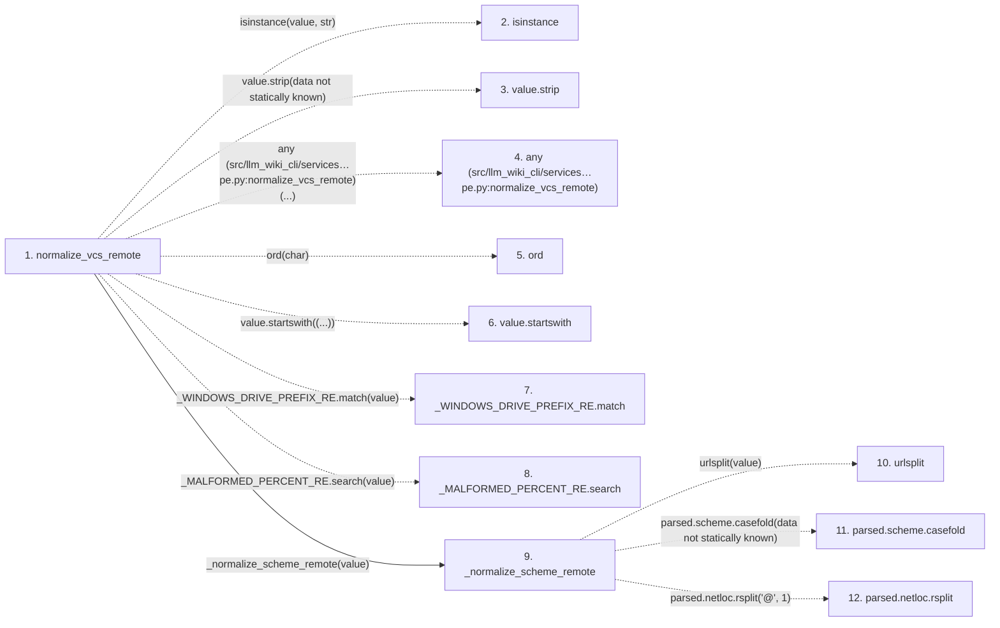

# normalize_vcs_remote

**Entry point:** `normalize_vcs_remote` (`api`)
**Source:** [knowledge_envelope](../modules/knowledge_envelope.md)
**Modules touched:** [knowledge_envelope](../modules/knowledge_envelope.md)

## Call sequence

```mermaid
sequenceDiagram
    participant p0 as normalize_vcs_remote
    participant p1 as isinstance
    participant p2 as value.strip
    participant p3 as any (src/llm_wiki_cli/services…pe.py:normalize_vcs_remote)
    participant p4 as ord
    participant p5 as value.startswith
    participant p6 as _WINDOWS_DRIVE_PREFIX_RE.match
    participant p7 as _MALFORMED_PERCENT_RE.search
    participant p8 as _normalize_scheme_remote
    participant p9 as urlsplit
    participant p10 as parsed.scheme.casefold
    participant p11 as parsed.netloc.rsplit
    participant p12 as authority.endswith
    participant p13 as host.casefold
    participant p14 as _normalize_scp_remote
    participant p15 as _SCP_REMOTE_RE.fullmatch
    participant p16 as match.group(…).split(…)[…].split
    participant p17 as match.group(…).split
    participant p18 as match.group
    participant p19 as match.group(…).casefold
    participant p20 as _normalized_remote_identity
    participant p21 as unquote
    participant p22 as decoded_path.removeprefix
    participant p23 as path.removesuffix
    participant p24 as path.casefold().endswith
    participant p25 as path.casefold
    participant p26 as path.split
    participant p27 as any (src/llm_wiki_cli/services…normalized_remote_identity)
    participant p28 as '/'.join
    participant p29 as _REPOSITORY_IDENTITY_RE.fullmatch
    p0-->>p1: isinstance
    p0-->>p2: value.strip
    p0-->>p3: any (src/llm_wiki_cli/services…pe.py:normalize_vcs_remote)
    p0-->>p4: ord
    p0-->>p5: value.startswith
    p0-->>p6: _WINDOWS_DRIVE_PREFIX_RE.match
    p0-->>p7: _MALFORMED_PERCENT_RE.search
    p0->>p8: _normalize_scheme_remote
    p8-->>p9: urlsplit
    p8-->>p10: parsed.scheme.casefold
    p8-->>p11: parsed.netloc.rsplit
    p8-->>p12: authority.endswith
    p8-->>p13: host.casefold
    p0->>p14: _normalize_scp_remote
    p14-->>p15: _SCP_REMOTE_RE.fullmatch
    p14-->>p16: match.group(…).split(…)[…].split
    p14-->>p17: match.group(…).split
    p14-->>p18: match.group
    p14-->>p19: match.group(…).casefold
    p14-->>p18: match.group
    p0->>p20: _normalized_remote_identity
    p20-->>p21: unquote
    p20-->>p22: decoded_path.removeprefix
    p20-->>p23: path.removesuffix
    p20-->>p24: path.casefold().endswith
    p20-->>p25: path.casefold
    p20-->>p26: path.split
    p20-->>p27: any (src/llm_wiki_cli/services…normalized_remote_identity)
    p20-->>p28: '/'.join
    p20-->>p29: _REPOSITORY_IDENTITY_RE.fullmatch
```

<!-- Auto-generated from static call edges. Dashed arrows are external or unresolved calls. Reviewed runtime conditions and side effects belong in Behavior. -->

> Call sequence diagram shows 30 of 32 interactions; 2 omitted to keep the visualization within the 30-interaction and generated-diagram limits.

## Data flow

<!-- Auto-generated static analysis. Treat values and boundaries as best-effort hints, not runtime proof. -->

### Step data

| Step | Inputs | Reads | Writes | Returns |
|---|---|---|---|---|
| `normalize_vcs_remote` | `value: object` | - | - | `None`, `None`, `_normalized_remote_identity(...)` |
| `isinstance` | - | - | - | - |
| `value.strip` | - | - | - | - |
| `any (src/llm_wiki_cli/services…pe.py:normalize_vcs_remote)` | - | - | - | - |
| `ord` | - | - | - | - |
| `value.startswith` | - | - | - | - |
| `_WINDOWS_DRIVE_PREFIX_RE.match` | - | - | - | - |
| `_MALFORMED_PERCENT_RE.search` | - | - | - | - |
| `_normalize_scheme_remote` | `value: str` | - | - | `None`, `None`, `None`, `None`, `None`, `(...)` |
| `urlsplit` | - | - | - | - |
| `parsed.scheme.casefold` | - | - | - | - |
| `parsed.netloc.rsplit` | - | - | - | - |

### Call data

| From | To | Line | Call |
|---|---|---:|---|
| normalize_vcs_remote | isinstance | 709 | `isinstance(value, str)` |
| normalize_vcs_remote | value.strip | 711 | `value.strip(data not statically known)` |
| normalize_vcs_remote | any (src/llm_wiki_cli/services…pe.py:normalize_vcs_remote) | 712 | `any(...)` |
| normalize_vcs_remote | ord | 712 | `ord(char)` |
| normalize_vcs_remote | value.startswith | 714 | `value.startswith((...))` |
| normalize_vcs_remote | _WINDOWS_DRIVE_PREFIX_RE.match | 715 | `_WINDOWS_DRIVE_PREFIX_RE.match(value)` |
| normalize_vcs_remote | _MALFORMED_PERCENT_RE.search | 716 | `_MALFORMED_PERCENT_RE.search(value)` |
| normalize_vcs_remote | _normalize_scheme_remote | 721 | `_normalize_scheme_remote(value)` |
| _normalize_scheme_remote | urlsplit | 1449 | `urlsplit(value)` |
| _normalize_scheme_remote | parsed.scheme.casefold | 1454 | `parsed.scheme.casefold(data not statically known)` |
| _normalize_scheme_remote | parsed.netloc.rsplit | 1457 | `parsed.netloc.rsplit('@', 1)` |

### Boundary effects

*No boundary effects detected.*

### Static analysis gaps

| Kind | Step | Target | Line |
|---|---|---|---:|
| external_call | `normalize_vcs_remote` | `isinstance` | 709 |
| unresolved_call | `normalize_vcs_remote` | `value.strip` | 711 |
| external_call | `normalize_vcs_remote` | `any` | 712 |
| external_call | `normalize_vcs_remote` | `ord` | 712 |
| unresolved_call | `normalize_vcs_remote` | `value.startswith` | 714 |
| unresolved_call | `normalize_vcs_remote` | `_WINDOWS_DRIVE_PREFIX_RE.match` | 715 |
| unresolved_call | `normalize_vcs_remote` | `_MALFORMED_PERCENT_RE.search` | 716 |
| external_call | `_normalize_scheme_remote` | `urlsplit` | 1449 |
| unresolved_call | `_normalize_scheme_remote` | `parsed.scheme.casefold` | 1454 |
| unresolved_call | `_normalize_scheme_remote` | `parsed.netloc.rsplit` | 1457 |
| step_limit | `normalize_vcs_remote` | `first 12 steps` | 0 |

## Behavior

This flow starts at `normalize_vcs_remote` and is classified as `api`. The generated call and data-flow sections are bounded static projections; runtime conditions and side effects require source-level confirmation.
