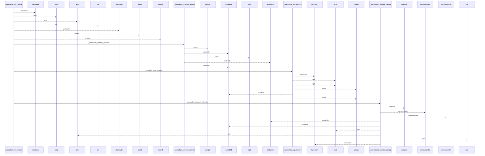
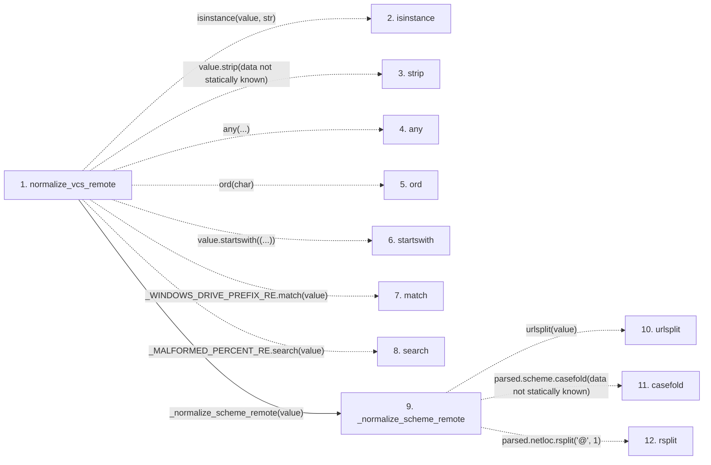

# normalize_vcs_remote

**Entry point:** `normalize_vcs_remote` (`api`)
**Source:** [knowledge_envelope](../modules/knowledge_envelope.md)
**Modules touched:** [knowledge_envelope](../modules/knowledge_envelope.md)

## Call sequence

<!-- Auto-generated from static call edges. Dashed arrows are external or unresolved calls. Reviewed runtime conditions and side effects belong in Behavior. -->

> Call sequence diagram shows 30 of 32 interactions; 2 omitted to keep the visualization within the 30-interaction and generated-diagram limits.

## Data flow

<!-- Auto-generated static analysis. Treat values and boundaries as best-effort hints, not runtime proof. -->

### Step data

| Step | Inputs | Reads | Writes | Returns |
|---|---|---|---|---|
| `normalize_vcs_remote` | `value: object` | - | - | `None`, `None`, `_normalized_remote_identity(...)` |
| `isinstance` | - | - | - | - |
| `strip` | - | - | - | - |
| `any` | - | - | - | - |
| `ord` | - | - | - | - |
| `startswith` | - | - | - | - |
| `match` | - | - | - | - |
| `search` | - | - | - | - |
| `_normalize_scheme_remote` | `value: str` | - | - | `None`, `None`, `None`, `None`, `None`, `(...)` |
| `urlsplit` | - | - | - | - |
| `casefold` | - | - | - | - |
| `rsplit` | - | - | - | - |

### Call data

| From | To | Line | Call |
|---|---|---:|---|
| normalize_vcs_remote | isinstance | 700 | `isinstance(value, str)` |
| normalize_vcs_remote | strip | 702 | `value.strip(data not statically known)` |
| normalize_vcs_remote | any | 703 | `any(...)` |
| normalize_vcs_remote | ord | 703 | `ord(char)` |
| normalize_vcs_remote | startswith | 705 | `value.startswith((...))` |
| normalize_vcs_remote | match | 706 | `_WINDOWS_DRIVE_PREFIX_RE.match(value)` |
| normalize_vcs_remote | search | 707 | `_MALFORMED_PERCENT_RE.search(value)` |
| normalize_vcs_remote | _normalize_scheme_remote | 712 | `_normalize_scheme_remote(value)` |
| _normalize_scheme_remote | urlsplit | 1329 | `urlsplit(value)` |
| _normalize_scheme_remote | casefold | 1334 | `parsed.scheme.casefold(data not statically known)` |
| _normalize_scheme_remote | rsplit | 1337 | `parsed.netloc.rsplit('@', 1)` |

### Boundary effects

*No boundary effects detected.*

### Static analysis gaps

| Kind | Step | Target | Line |
|---|---|---|---:|
| unresolved_call | `normalize_vcs_remote` | `isinstance` | 700 |
| unresolved_call | `normalize_vcs_remote` | `value.strip` | 702 |
| unresolved_call | `normalize_vcs_remote` | `any` | 703 |
| unresolved_call | `normalize_vcs_remote` | `ord` | 703 |
| unresolved_call | `normalize_vcs_remote` | `value.startswith` | 705 |
| unresolved_call | `normalize_vcs_remote` | `_WINDOWS_DRIVE_PREFIX_RE.match` | 706 |
| unresolved_call | `normalize_vcs_remote` | `_MALFORMED_PERCENT_RE.search` | 707 |
| external_call | `_normalize_scheme_remote` | `urlsplit` | 1329 |
| unresolved_call | `_normalize_scheme_remote` | `parsed.scheme.casefold` | 1334 |
| unresolved_call | `_normalize_scheme_remote` | `parsed.netloc.rsplit` | 1337 |
| step_limit | `normalize_vcs_remote` | `first 12 steps` | 0 |

## Behavior

This flow starts at `normalize_vcs_remote` and is classified as `api`. The generated call and data-flow sections are bounded static projections; runtime conditions and side effects require source-level confirmation.
