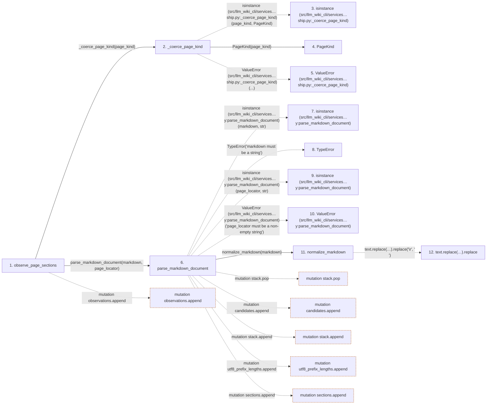

# observe_page_sections

**Entry point:** `observe_page_sections` (`api`)
**Source:** [section_ownership](../modules/section_ownership.md)
**Modules touched:** [knowledge_evidence](../modules/knowledge_evidence.md), [markdown_sections](../modules/markdown_sections.md), [section_ownership](../modules/section_ownership.md), [wiki_surface](../modules/wiki_surface.md)

## Call sequence

```mermaid
sequenceDiagram
    participant p0 as observe_page_sections
    participant p1 as _coerce_page_kind
    participant p2 as isinstance (src/llm_wiki_cli/services…ship.py:_coerce_page_kind)
    participant p3 as PageKind
    participant p4 as ValueError (src/llm_wiki_cli/services…ship.py:_coerce_page_kind)
    participant p5 as parse_markdown_document
    participant p6 as isinstance (src/llm_wiki_cli/services…y:parse_markdown_document)
    participant p7 as TypeError
    participant p8 as ValueError (src/llm_wiki_cli/services…y:parse_markdown_document)
    participant p9 as normalize_markdown
    participant p10 as text.replace(…).replace
    participant p11 as text.replace
    participant p12 as list (src/llm_wiki_cli/services…y:parse_markdown_document)
    participant p13 as _iter_structural_headings
    participant p14 as markdown.splitlines
    participant p15 as _frontmatter_extent
    participant p16 as _line_content(…).removeprefix(…).strip
    participant p17 as _line_content(…).removeprefix
    participant p18 as _line_content
    participant p19 as line.endswith
    participant p20 as enumerate (src/llm_wiki_cli/services…ns.py:_frontmatter_extent)
    participant p21 as _line_content(…).strip
    participant p22 as len (src/llm_wiki_cli/services…ns.py:_frontmatter_extent)
    participant p23 as enumerate (src/llm_wiki_cli/services…_iter_structural_headings)
    participant p24 as len (src/llm_wiki_cli/services…_iter_structural_headings)
    participant p25 as re.fullmatch (src/llm_wiki_cli/services…_iter_structural_headings)
    participant p26 as re.escape
    participant p27 as _FENCE_OPEN_RE.fullmatch
    p0->>p1: _coerce_page_kind
    p1-->>p2: isinstance (src/llm_wiki_cli/services…ship.py:_coerce_page_kind)
    p1->>p3: PageKind
    p1-->>p4: ValueError (src/llm_wiki_cli/services…ship.py:_coerce_page_kind)
    p0->>p5: parse_markdown_document
    p5-->>p6: isinstance (src/llm_wiki_cli/services…y:parse_markdown_document)
    p5-->>p7: TypeError
    p5-->>p6: isinstance (src/llm_wiki_cli/services…y:parse_markdown_document)
    p5-->>p8: ValueError (src/llm_wiki_cli/services…y:parse_markdown_document)
    p5->>p9: normalize_markdown
    p9-->>p10: text.replace(…).replace
    p9-->>p11: text.replace
    p5-->>p12: list (src/llm_wiki_cli/services…y:parse_markdown_document)
    p5->>p13: _iter_structural_headings
    p13-->>p14: markdown.splitlines
    p13->>p15: _frontmatter_extent
    p15-->>p16: _line_content(…).removeprefix(…).strip
    p15-->>p17: _line_content(…).removeprefix
    p15->>p18: _line_content
    p18-->>p19: line.endswith
    p15-->>p20: enumerate (src/llm_wiki_cli/services…ns.py:_frontmatter_extent)
    p15-->>p21: _line_content(…).strip
    p15->>p18: _line_content
    p15-->>p22: len (src/llm_wiki_cli/services…ns.py:_frontmatter_extent)
    p13-->>p23: enumerate (src/llm_wiki_cli/services…_iter_structural_headings)
    p13->>p18: _line_content
    p13-->>p24: len (src/llm_wiki_cli/services…_iter_structural_headings)
    p13-->>p25: re.fullmatch (src/llm_wiki_cli/services…_iter_structural_headings)
    p13-->>p26: re.escape
    p13-->>p27: _FENCE_OPEN_RE.fullmatch
```

<!-- Auto-generated from static call edges. Dashed arrows are external or unresolved calls. Reviewed runtime conditions and side effects belong in Behavior. -->

> Call sequence diagram shows 30 of 174 interactions; 144 omitted to keep the visualization within the 30-interaction and generated-diagram limits.

## Data flow

<!-- Auto-generated static analysis. Treat values and boundaries as best-effort hints, not runtime proof. -->

### Step data

| Step | Inputs | Reads | Writes | Returns |
|---|---|---|---|---|
| `observe_page_sections` | `markdown: str`, `page_locator: str`, `page_kind: PageKind \| str`, `index_preserved: bool` | - | `canonical_occurrences[...]`, `ownership_by_locator[...]` | `PageSectionObservations(...)` |
| `_coerce_page_kind` | `page_kind: PageKind \| str` | `PageKind` | - | `page_kind`, `PageKind(...)` |
| `isinstance (src/llm_wiki_cli/services…ship.py:_coerce_page_kind)` | - | - | - | - |
| `PageKind` | - | - | - | - |
| `ValueError (src/llm_wiki_cli/services…ship.py:_coerce_page_kind)` | - | - | - | - |
| `parse_markdown_document` | `markdown: str`, `page_locator: str` | `SECTION_ORDER_DOMAIN` | `occurrences[...]` | `MarkdownSectionDocument(...)` |
| `isinstance (src/llm_wiki_cli/services…y:parse_markdown_document)` | - | - | - | - |
| `TypeError` | - | - | - | - |
| `isinstance (src/llm_wiki_cli/services…y:parse_markdown_document)` | - | - | - | - |
| `ValueError (src/llm_wiki_cli/services…y:parse_markdown_document)` | - | - | - | - |
| `normalize_markdown` | `text: str` | - | - | `...` |
| `text.replace(…).replace` | - | - | - | - |

### Call data

| From | To | Line | Call |
|---|---|---:|---|
| observe_page_sections | _coerce_page_kind | 543 | `_coerce_page_kind(page_kind)` |
| _coerce_page_kind | isinstance (src/llm_wiki_cli/services…ship.py:_coerce_page_kind) | 266 | `isinstance(page_kind, PageKind)` |
| _coerce_page_kind | PageKind | 269 | `PageKind(page_kind)` |
| _coerce_page_kind | ValueError (src/llm_wiki_cli/services…ship.py:_coerce_page_kind) | 271 | `ValueError(...)` |
| observe_page_sections | parse_markdown_document | 544 | `parse_markdown_document(markdown, page_locator)` |
| parse_markdown_document | isinstance (src/llm_wiki_cli/services…y:parse_markdown_document) | 325 | `isinstance(markdown, str)` |
| parse_markdown_document | TypeError | 326 | `TypeError('markdown must be a string')` |
| parse_markdown_document | isinstance (src/llm_wiki_cli/services…y:parse_markdown_document) | 327 | `isinstance(page_locator, str)` |
| parse_markdown_document | ValueError (src/llm_wiki_cli/services…y:parse_markdown_document) | 328 | `ValueError('page_locator must be a non-empty string')` |
| parse_markdown_document | normalize_markdown | 330 | `normalize_markdown(markdown)` |
| normalize_markdown | text.replace(…).replace | 81 | `text.replace('\r\n', '\n').replace('\r', '\n')` |

### Boundary effects

| Kind | Target | Step | Line |
|---|---|---|---:|
| mutation | `observations.append` | `observe_page_sections` | 575 |
| mutation | `stack.pop` | `parse_markdown_document` | 338 |
| mutation | `candidates.append` | `parse_markdown_document` | 350 |
| mutation | `stack.append` | `parse_markdown_document` | 362 |
| mutation | `utf8_prefix_lengths.append` | `parse_markdown_document` | 366 |
| mutation | `sections.append` | `parse_markdown_document` | 393 |

### Static analysis gaps

| Kind | Step | Target | Line |
|---|---|---|---:|
| external_call | `_coerce_page_kind` | `isinstance` | 266 |
| external_call | `_coerce_page_kind` | `ValueError` | 271 |
| external_call | `parse_markdown_document` | `isinstance` | 325 |
| external_call | `parse_markdown_document` | `TypeError` | 326 |
| external_call | `parse_markdown_document` | `isinstance` | 327 |
| external_call | `parse_markdown_document` | `ValueError` | 328 |
| unresolved_call | `normalize_markdown` | `text.replace('\r\n', '\n').replace` | 81 |
| step_limit | `observe_page_sections` | `first 12 steps` | 0 |

## Behavior

This flow starts at `observe_page_sections` and is classified as `api`. The generated call and data-flow sections are bounded static projections; runtime conditions and side effects require source-level confirmation.
