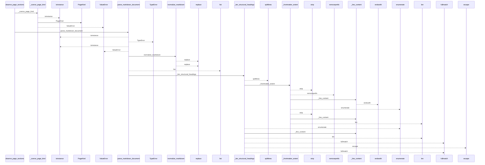
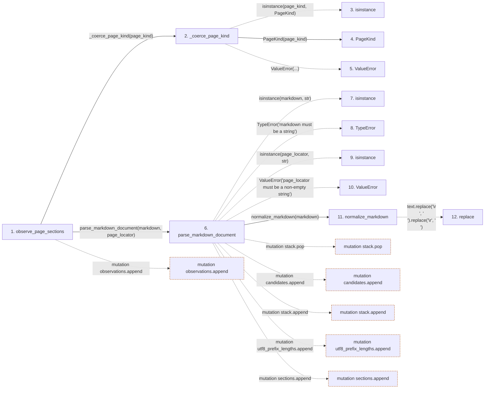

# observe_page_sections

**Entry point:** `observe_page_sections` (`api`)
**Source:** [section_ownership](../modules/section_ownership.md)
**Modules touched:** [knowledge_evidence](../modules/knowledge_evidence.md), [markdown_sections](../modules/markdown_sections.md), [section_ownership](../modules/section_ownership.md), [wiki_surface](../modules/wiki_surface.md)

## Call sequence

<!-- Auto-generated from static call edges. Dashed arrows are external or unresolved calls. Reviewed runtime conditions and side effects belong in Behavior. -->

> Call sequence diagram shows 30 of 174 interactions; 144 omitted to keep the visualization within the 30-interaction and generated-diagram limits.

## Data flow

<!-- Auto-generated static analysis. Treat values and boundaries as best-effort hints, not runtime proof. -->

### Step data

| Step | Inputs | Reads | Writes | Returns |
|---|---|---|---|---|
| `observe_page_sections` | `markdown: str`, `page_locator: str`, `page_kind: PageKind \| str`, `index_preserved: bool` | - | `canonical_occurrences[...]`, `ownership_by_locator[...]` | `PageSectionObservations(...)` |
| `_coerce_page_kind` | `page_kind: PageKind \| str` | `PageKind` | - | `page_kind`, `PageKind(...)` |
| `isinstance` | - | - | - | - |
| `PageKind` | - | - | - | - |
| `ValueError` | - | - | - | - |
| `parse_markdown_document` | `markdown: str`, `page_locator: str` | `SECTION_ORDER_DOMAIN` | `occurrences[...]` | `MarkdownSectionDocument(...)` |
| `isinstance` | - | - | - | - |
| `TypeError` | - | - | - | - |
| `isinstance` | - | - | - | - |
| `ValueError` | - | - | - | - |
| `normalize_markdown` | `text: str` | - | - | `...` |
| `replace` | - | - | - | - |

### Call data

| From | To | Line | Call |
|---|---|---:|---|
| observe_page_sections | _coerce_page_kind | 543 | `_coerce_page_kind(page_kind)` |
| _coerce_page_kind | isinstance | 266 | `isinstance(page_kind, PageKind)` |
| _coerce_page_kind | PageKind | 269 | `PageKind(page_kind)` |
| _coerce_page_kind | ValueError | 271 | `ValueError(...)` |
| observe_page_sections | parse_markdown_document | 544 | `parse_markdown_document(markdown, page_locator)` |
| parse_markdown_document | isinstance | 325 | `isinstance(markdown, str)` |
| parse_markdown_document | TypeError | 326 | `TypeError('markdown must be a string')` |
| parse_markdown_document | isinstance | 327 | `isinstance(page_locator, str)` |
| parse_markdown_document | ValueError | 328 | `ValueError('page_locator must be a non-empty string')` |
| parse_markdown_document | normalize_markdown | 330 | `normalize_markdown(markdown)` |
| normalize_markdown | replace | 81 | `text.replace('\r\n', '\n').replace('\r', '\n')` |

### Boundary effects

| Kind | Target | Step | Line |
|---|---|---|---:|
| mutation | `observations.append` | `observe_page_sections` | 575 |
| mutation | `stack.pop` | `parse_markdown_document` | 338 |
| mutation | `candidates.append` | `parse_markdown_document` | 350 |
| mutation | `stack.append` | `parse_markdown_document` | 362 |
| mutation | `utf8_prefix_lengths.append` | `parse_markdown_document` | 366 |
| mutation | `sections.append` | `parse_markdown_document` | 393 |

### Static analysis gaps

| Kind | Step | Target | Line |
|---|---|---|---:|
| unresolved_call | `_coerce_page_kind` | `isinstance` | 266 |
| unresolved_call | `_coerce_page_kind` | `ValueError` | 271 |
| unresolved_call | `parse_markdown_document` | `isinstance` | 325 |
| unresolved_call | `parse_markdown_document` | `TypeError` | 326 |
| unresolved_call | `parse_markdown_document` | `isinstance` | 327 |
| unresolved_call | `parse_markdown_document` | `ValueError` | 328 |
| external_call | `normalize_markdown` | `text.replace('\r\n', '\n').replace` | 81 |
| step_limit | `observe_page_sections` | `first 12 steps` | 0 |

## Behavior

This flow starts at `observe_page_sections` and is classified as `api`. The generated call and data-flow sections are bounded static projections; runtime conditions and side effects require source-level confirmation.
