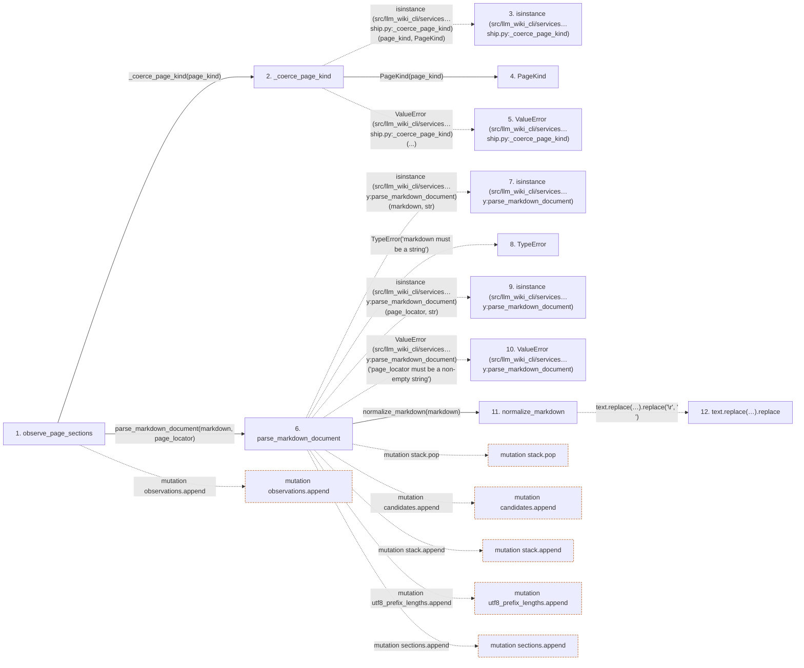

# observe_page_sections

**Entry point:** `observe_page_sections` (`api`)
**Source:** [section_ownership](../modules/section_ownership.md)
**Modules touched:** [knowledge_evidence](../modules/knowledge_evidence.md), [markdown_sections](../modules/markdown_sections.md), [section_ownership](../modules/section_ownership.md), [wiki_surface](../modules/wiki_surface.md)

## Call sequence

> Static overview in presentation order, not runtime execution order. Arrows retain captured callers; representative internal continuations and boundary examples precede repeated helper detail.

<!-- Auto-generated from static call edges. Dashed arrows are external or unresolved calls. Reviewed runtime conditions and side effects belong in Behavior. -->

```mermaid
sequenceDiagram
    participant p0 as observe_page_sections
    participant p1 as _coerce_page_kind
    participant p2 as parse_markdown_document
    participant p3 as _preamble_observation
    participant p4 as classify_section_ownership
    participant p5 as _scoped_hashes
    participant p6 as SectionObservation
    participant p7 as PageSectionObservations
    participant p8 as sha256_bytes
    participant p9 as mixed_table_projection
    participant p10 as _iter_structural_headings
    participant p11 as hash_json
    participant p12 as _markdown_lines
    participant p13 as _frontmatter_extent
    participant p14 as canonical_json_bytes
    participant p15 as description_table_cells
    participant p16 as PageKind
    participant p17 as _top_level_policy
    participant p18 as normalize_markdown
    participant p19 as _HeadingCandidate
    participant p20 as section_locator
    participant p21 as MarkdownSection
    participant p22 as MarkdownSectionDocument
    participant p23 as _line_content
    participant p24 as format_table_row
    participant p25 as is_placeholder_description
    participant p26 as _atx_heading
    participant p27 as MixedTableProjection
    participant p28 as canonical_json_text
    participant p29 as len (src/llm_wiki_cli/services….py:observe_page_sections)
    participant p30 as section.title.casefold
    p0->>p1: _coerce_page_kind
    p0->>p2: parse_markdown_document
    p0->>p3: _preamble_observation
    p0->>p4: classify_section_ownership
    p0->>p5: _scoped_hashes
    p0->>p6: SectionObservation
    p0->>p7: PageSectionObservations
    p0->>p8: sha256_bytes
    p5->>p9: mixed_table_projection
    p2->>p10: _iter_structural_headings
    p2->>p11: hash_json
    p10->>p12: _markdown_lines
    p10->>p13: _frontmatter_extent
    p11->>p14: canonical_json_bytes
    p9->>p15: description_table_cells
    p1->>p16: PageKind
    p4->>p17: _top_level_policy
    p2->>p18: normalize_markdown
    p2->>p19: _HeadingCandidate
    p2->>p20: section_locator
    p2->>p21: MarkdownSection
    p2->>p22: MarkdownSectionDocument
    p10->>p23: _line_content
    p9->>p24: format_table_row
    p9->>p25: is_placeholder_description
    p10->>p26: _atx_heading
    p9->>p27: MixedTableProjection
    p14->>p28: canonical_json_text
    p0-->>p29: len (src/llm_wiki_cli/services….py:observe_page_sections)(document.normalized_markdown)
    p0-->>p30: section.title.casefold
```

> Call sequence diagram shows 30 of 176 interactions; 146 omitted to keep the visualization within the 30-interaction and generated-diagram limits, with uncertain identities omitted rather than inferred.

> Captured boundary calls: external 1 of 68 (67 omitted); unresolved 1 of 58 (57 omitted). These counts cover the captured static trace.

Omitted captured detail, grouped by actual caller occurrence and target module:

| Caller | Parent step | Target module | Kind | Omitted interactions |
| --- | --- | --- | --- | --- |
| `src/llm_wiki_cli/services/section_ownership.py:_coerce_page_kind` | 2 | - | external | 2 |
| `src/llm_wiki_cli/services/markdown_sections.py:parse_markdown_document` | 6 | - | external | 15 |
| `src/llm_wiki_cli/services/markdown_sections.py:normalize_markdown` | 11 | - | unresolved | 2 |
| `src/llm_wiki_cli/services/markdown_sections.py:_markdown_lines` | 16 | - | external | 1 |
| `src/llm_wiki_cli/services/markdown_sections.py:_markdown_lines` | 16 | [src/llm_wiki_cli/services/markdown_sections.py](../modules/markdown_sections.md) | internal | 2 |
| `src/llm_wiki_cli/services/markdown_sections.py:_line_content` | 19 | - | unresolved | 1 |
| `src/llm_wiki_cli/services/markdown_sections.py:_frontmatter_extent` | 21 | - | unresolved | 3 |
| `src/llm_wiki_cli/services/markdown_sections.py:_frontmatter_extent` | 21 | [src/llm_wiki_cli/services/markdown_sections.py](../modules/markdown_sections.md) | internal | 2 |
> Omission summary shows 8 of 45 groups; 37 further groups are not expanded here. Counts above include all omitted interactions.
> Detailed flow queries retain their own coverage and limits; omitted paths may execute at runtime.

## Data flow

<!-- Auto-generated static analysis. Treat values and boundaries as best-effort hints, not runtime proof. -->

```mermaid
flowchart LR
    s1["1. observe_page_sections"]
    s2["2. _coerce_page_kind"]
    s3["3. isinstance (src/llm_wiki_cli/services…ship.py:_coerce_page_kind)"]
    s4["4. PageKind"]
    s5["5. ValueError (src/llm_wiki_cli/services…ship.py:_coerce_page_kind)"]
    s6["6. parse_markdown_document"]
    s7["7. isinstance (src/llm_wiki_cli/services…y:parse_markdown_document)"]
    s8["8. TypeError"]
    s9["9. isinstance (src/llm_wiki_cli/services…y:parse_markdown_document)"]
    s10["10. ValueError (src/llm_wiki_cli/services…y:parse_markdown_document)"]
    s11["11. normalize_markdown"]
    s12["12. text.replace(…).replace"]
    s1 -->|"_coerce_page_kind(page_kind)"| s2
    s2 -. "isinstance (src/llm_wiki_cli/services…ship.py:_coerce_page_kind)(page_kind, PageKind)" .-> s3
    s2 -->|"PageKind(page_kind)"| s4
    s2 -. "ValueError (src/llm_wiki_cli/services…ship.py:_coerce_page_kind)(...)" .-> s5
    s1 -->|"parse_markdown_document(markdown, page_locator)"| s6
    s6 -. "isinstance (src/llm_wiki_cli/services…y:parse_markdown_document)(markdown, str)" .-> s7
    s6 -. "TypeError('markdown must be a string')" .-> s8
    s6 -. "isinstance (src/llm_wiki_cli/services…y:parse_markdown_document)(page_locator, str)" .-> s9
    s6 -. "ValueError (src/llm_wiki_cli/services…y:parse_markdown_document)('page_locator must be a non-empty string')" .-> s10
    s6 -->|"normalize_markdown(markdown)"| s11
    s11 -. "text.replace(…).replace('\r', '\n')" .-> s12
    b0["mutation observations.append"]
    s1 -. "mutation observations.append" .-> b0
    b1["mutation stack.pop"]
    s6 -. "mutation stack.pop" .-> b1
    b2["mutation candidates.append"]
    s6 -. "mutation candidates.append" .-> b2
    b3["mutation stack.append"]
    s6 -. "mutation stack.append" .-> b3
    b4["mutation utf8_prefix_lengths.append"]
    s6 -. "mutation utf8_prefix_lengths.append" .-> b4
    b5["mutation sections.append"]
    s6 -. "mutation sections.append" .-> b5
    click s1 "../modules/section_ownership.md"
    click s2 "../modules/section_ownership.md"
    click s4 "../modules/wiki_surface.md"
    click s6 "../modules/markdown_sections.md"
    click s11 "../modules/markdown_sections.md"
    classDef boundary stroke:#b45309,stroke-dasharray: 4 2
    class b0 boundary
    class b1 boundary
    class b2 boundary
    class b3 boundary
    class b4 boundary
    class b5 boundary
```

### Step data

| Step | Inputs | Reads | Writes | Returns |
|---|---|---|---|---|
| `observe_page_sections` | `markdown: str`, `page_locator: str`, `page_kind: PageKind \| str`, `index_preserved: bool` | - | `canonical_occurrences[...]`, `ownership_by_locator[...]` | `PageSectionObservations(...)` |
| `_coerce_page_kind` | `page_kind: PageKind \| str` | `PageKind` | - | `page_kind`, `PageKind(...)` |
| `isinstance (src/llm_wiki_cli/services…ship.py:_coerce_page_kind)` | - | - | - | - |
| `PageKind` | - | - | - | - |
| `ValueError (src/llm_wiki_cli/services…ship.py:_coerce_page_kind)` | - | - | - | - |
| `parse_markdown_document` | `markdown: str`, `page_locator: str` | `SECTION_ORDER_DOMAIN` | `occurrences[...]` | `MarkdownSectionDocument(...)` |
| `isinstance (src/llm_wiki_cli/services…y:parse_markdown_document)` | - | - | - | - |
| `TypeError` | - | - | - | - |
| `isinstance (src/llm_wiki_cli/services…y:parse_markdown_document)` | - | - | - | - |
| `ValueError (src/llm_wiki_cli/services…y:parse_markdown_document)` | - | - | - | - |
| `normalize_markdown` | `text: str` | - | - | `...` |
| `text.replace(…).replace` | - | - | - | - |

### Call data

| From | To | Line | Call |
|---|---|---:|---|
| observe_page_sections | _coerce_page_kind | 546 | `_coerce_page_kind(page_kind)` |
| _coerce_page_kind | isinstance (src/llm_wiki_cli/services…ship.py:_coerce_page_kind) | 269 | `isinstance(page_kind, PageKind)` |
| _coerce_page_kind | PageKind | 272 | `PageKind(page_kind)` |
| _coerce_page_kind | ValueError (src/llm_wiki_cli/services…ship.py:_coerce_page_kind) | 274 | `ValueError(...)` |
| observe_page_sections | parse_markdown_document | 547 | `parse_markdown_document(markdown, page_locator)` |
| parse_markdown_document | isinstance (src/llm_wiki_cli/services…y:parse_markdown_document) | 333 | `isinstance(markdown, str)` |
| parse_markdown_document | TypeError | 334 | `TypeError('markdown must be a string')` |
| parse_markdown_document | isinstance (src/llm_wiki_cli/services…y:parse_markdown_document) | 335 | `isinstance(page_locator, str)` |
| parse_markdown_document | ValueError (src/llm_wiki_cli/services…y:parse_markdown_document) | 336 | `ValueError('page_locator must be a non-empty string')` |
| parse_markdown_document | normalize_markdown | 338 | `normalize_markdown(markdown)` |
| normalize_markdown | text.replace(…).replace | 82 | `text.replace('\r\n', '\n').replace('\r', '\n')` |

### Boundary effects

| Kind | Target | Step | Line |
|---|---|---|---:|
| mutation | `observations.append` | `observe_page_sections` | 578 |
| mutation | `stack.pop` | `parse_markdown_document` | 346 |
| mutation | `candidates.append` | `parse_markdown_document` | 358 |
| mutation | `stack.append` | `parse_markdown_document` | 370 |
| mutation | `utf8_prefix_lengths.append` | `parse_markdown_document` | 374 |
| mutation | `sections.append` | `parse_markdown_document` | 401 |

### Static analysis gaps

| Kind | Step | Target | Line |
|---|---|---|---:|
| external_call | `_coerce_page_kind` | `isinstance` | 269 |
| external_call | `_coerce_page_kind` | `ValueError` | 274 |
| external_call | `parse_markdown_document` | `isinstance` | 333 |
| external_call | `parse_markdown_document` | `TypeError` | 334 |
| external_call | `parse_markdown_document` | `isinstance` | 335 |
| external_call | `parse_markdown_document` | `ValueError` | 336 |
| unresolved_call | `normalize_markdown` | `text.replace('\r\n', '\n').replace` | 82 |
| step_limit | `observe_page_sections` | `first 12 steps` | 0 |

## Behavior

This flow starts at `observe_page_sections` and is classified as `api`. The generated call and data-flow sections are bounded static projections; runtime conditions and side effects require source-level confirmation.
