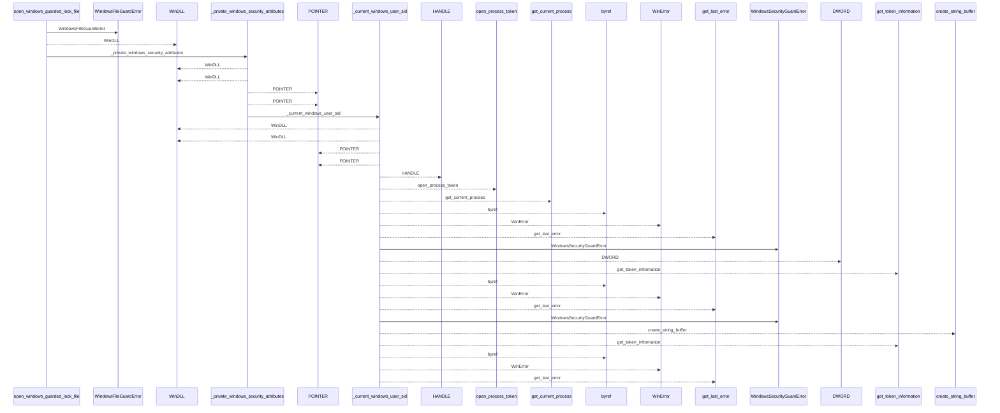
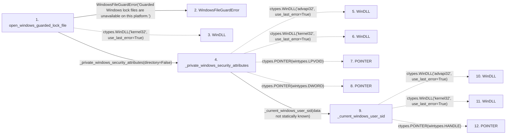

# open_windows_guarded_lock_file

**Entry point:** `open_windows_guarded_lock_file` (`api`)
**Source:** [filesystem_guard](../modules/filesystem_guard.md)
**Modules touched:** [filesystem_guard](../modules/filesystem_guard.md)

## Call sequence

<!-- Auto-generated from static call edges. Dashed arrows are external or unresolved calls. Reviewed runtime conditions and side effects belong in Behavior. -->

> Call sequence diagram shows 30 of 169 interactions; 139 omitted to keep the visualization within the 30-interaction and generated-diagram limits.

## Data flow

<!-- Auto-generated static analysis. Treat values and boundaries as best-effort hints, not runtime proof. -->

### Step data

| Step | Inputs | Reads | Writes | Returns |
|---|---|---|---|---|
| `open_windows_guarded_lock_file` | `path: Path` | `os`, `os` | `create_file.argtypes`, `create_file.restype` | `(...)` |
| `WindowsFileGuardError` | - | - | - | - |
| `WinDLL` | - | - | - | - |
| `_private_windows_security_attributes` | `directory: bool` | - | `convert.argtypes`, `convert.restype`, `local_free.argtypes`, `local_free.restype` | - |
| `WinDLL` | - | - | - | - |
| `WinDLL` | - | - | - | - |
| `POINTER` | - | - | - | - |
| `POINTER` | - | - | - | - |
| `_current_windows_user_sid` | - | `ctypes` | `open_process_token.argtypes`, `open_process_token.restype`, `get_token_information.argtypes`, `get_token_information.restype`, `get_current_process.argtypes`, `get_current_process.restype` | `_windows_sid_string(...)` |
| `WinDLL` | - | - | - | - |
| `WinDLL` | - | - | - | - |
| `POINTER` | - | - | - | - |

### Call data

| From | To | Line | Call |
|---|---|---:|---|
| open_windows_guarded_lock_file | WindowsFileGuardError | 600 | `WindowsFileGuardError('Guarded Windows lock files are unavailable on this platform.')` |
| open_windows_guarded_lock_file | WinDLL | 605 | `ctypes.WinDLL('kernel32', use_last_error=True)` |
| open_windows_guarded_lock_file | _private_windows_security_attributes | 619 | `_private_windows_security_attributes(directory=False)` |
| _private_windows_security_attributes | WinDLL | 930 | `ctypes.WinDLL('advapi32', use_last_error=True)` |
| _private_windows_security_attributes | WinDLL | 931 | `ctypes.WinDLL('kernel32', use_last_error=True)` |
| _private_windows_security_attributes | POINTER | 936 | `ctypes.POINTER(wintypes.LPVOID)` |
| _private_windows_security_attributes | POINTER | 937 | `ctypes.POINTER(wintypes.DWORD)` |
| _private_windows_security_attributes | _current_windows_user_sid | 951 | `_current_windows_user_sid(data not statically known)` |
| _current_windows_user_sid | WinDLL | 979 | `ctypes.WinDLL('advapi32', use_last_error=True)` |
| _current_windows_user_sid | WinDLL | 980 | `ctypes.WinDLL('kernel32', use_last_error=True)` |
| _current_windows_user_sid | POINTER | 985 | `ctypes.POINTER(wintypes.HANDLE)` |

### Boundary effects

*No boundary effects detected.*

### Static analysis gaps

| Kind | Step | Target | Line |
|---|---|---|---:|
| external_call | `open_windows_guarded_lock_file` | `ctypes.WinDLL` | 605 |
| external_call | `_private_windows_security_attributes` | `ctypes.WinDLL` | 930 |
| external_call | `_private_windows_security_attributes` | `ctypes.WinDLL` | 931 |
| external_call | `_private_windows_security_attributes` | `ctypes.POINTER` | 936 |
| external_call | `_private_windows_security_attributes` | `ctypes.POINTER` | 937 |
| external_call | `_current_windows_user_sid` | `ctypes.WinDLL` | 979 |
| external_call | `_current_windows_user_sid` | `ctypes.WinDLL` | 980 |
| external_call | `_current_windows_user_sid` | `ctypes.POINTER` | 985 |
| step_limit | `open_windows_guarded_lock_file` | `first 12 steps` | 0 |

## Behavior

This flow starts at `open_windows_guarded_lock_file` and is classified as `api`. The generated call and data-flow sections are bounded static projections; runtime conditions and side effects require source-level confirmation.
