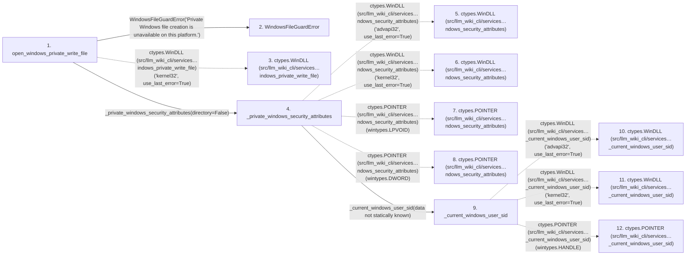

# open_windows_private_write_file

**Entry point:** `open_windows_private_write_file` (`api`)
**Source:** [filesystem_guard](../modules/filesystem_guard.md)
**Modules touched:** [filesystem_guard](../modules/filesystem_guard.md)

## Call sequence

```mermaid
sequenceDiagram
    participant p0 as open_windows_private_write_file
    participant p1 as WindowsFileGuardError
    participant p2 as ctypes.WinDLL (src/llm_wiki_cli/services…indows_private_write_file)
    participant p3 as _private_windows_security_attributes
    participant p4 as ctypes.WinDLL (src/llm_wiki_cli/services…ndows_security_attributes)
    participant p5 as ctypes.POINTER (src/llm_wiki_cli/services…ndows_security_attributes)
    participant p6 as _current_windows_user_sid
    participant p7 as ctypes.WinDLL (src/llm_wiki_cli/services…_current_windows_user_sid)
    participant p8 as ctypes.POINTER (src/llm_wiki_cli/services…_current_windows_user_sid)
    participant p9 as wintypes.HANDLE (src/llm_wiki_cli/services…_current_windows_user_sid)
    participant p10 as open_process_token
    participant p11 as get_current_process
    participant p12 as ctypes.byref (src/llm_wiki_cli/services…_current_windows_user_sid)
    participant p13 as ctypes.WinError (src/llm_wiki_cli/services…_current_windows_user_sid)
    participant p14 as ctypes.get_last_error (src/llm_wiki_cli/services…_current_windows_user_sid)
    participant p15 as WindowsSecurityGuardError
    participant p16 as wintypes.DWORD (src/llm_wiki_cli/services…_current_windows_user_sid)
    participant p17 as get_token_information
    participant p18 as ctypes.create_string_buffer
    p0->>p1: WindowsFileGuardError
    p0-->>p2: ctypes.WinDLL (src/llm_wiki_cli/services…indows_private_write_file)
    p0->>p3: _private_windows_security_attributes
    p3-->>p4: ctypes.WinDLL (src/llm_wiki_cli/services…ndows_security_attributes)
    p3-->>p4: ctypes.WinDLL (src/llm_wiki_cli/services…ndows_security_attributes)
    p3-->>p5: ctypes.POINTER (src/llm_wiki_cli/services…ndows_security_attributes)
    p3-->>p5: ctypes.POINTER (src/llm_wiki_cli/services…ndows_security_attributes)
    p3->>p6: _current_windows_user_sid
    p6-->>p7: ctypes.WinDLL (src/llm_wiki_cli/services…_current_windows_user_sid)
    p6-->>p7: ctypes.WinDLL (src/llm_wiki_cli/services…_current_windows_user_sid)
    p6-->>p8: ctypes.POINTER (src/llm_wiki_cli/services…_current_windows_user_sid)
    p6-->>p8: ctypes.POINTER (src/llm_wiki_cli/services…_current_windows_user_sid)
    p6-->>p9: wintypes.HANDLE (src/llm_wiki_cli/services…_current_windows_user_sid)
    p6-->>p10: open_process_token
    p6-->>p11: get_current_process
    p6-->>p12: ctypes.byref (src/llm_wiki_cli/services…_current_windows_user_sid)
    p6-->>p13: ctypes.WinError (src/llm_wiki_cli/services…_current_windows_user_sid)
    p6-->>p14: ctypes.get_last_error (src/llm_wiki_cli/services…_current_windows_user_sid)
    p6->>p15: WindowsSecurityGuardError
    p6-->>p16: wintypes.DWORD (src/llm_wiki_cli/services…_current_windows_user_sid)
    p6-->>p17: get_token_information
    p6-->>p12: ctypes.byref (src/llm_wiki_cli/services…_current_windows_user_sid)
    p6-->>p13: ctypes.WinError (src/llm_wiki_cli/services…_current_windows_user_sid)
    p6-->>p14: ctypes.get_last_error (src/llm_wiki_cli/services…_current_windows_user_sid)
    p6->>p15: WindowsSecurityGuardError
    p6-->>p18: ctypes.create_string_buffer
    p6-->>p17: get_token_information
    p6-->>p12: ctypes.byref (src/llm_wiki_cli/services…_current_windows_user_sid)
    p6-->>p13: ctypes.WinError (src/llm_wiki_cli/services…_current_windows_user_sid)
    p6-->>p14: ctypes.get_last_error (src/llm_wiki_cli/services…_current_windows_user_sid)
```

<!-- Auto-generated from static call edges. Dashed arrows are external or unresolved calls. Reviewed runtime conditions and side effects belong in Behavior. -->

> Call sequence diagram shows 30 of 168 interactions; 138 omitted to keep the visualization within the 30-interaction and generated-diagram limits.

## Data flow

<!-- Auto-generated static analysis. Treat values and boundaries as best-effort hints, not runtime proof. -->

### Step data

| Step | Inputs | Reads | Writes | Returns |
|---|---|---|---|---|
| `open_windows_private_write_file` | `path: Path` | `os`, `os` | `create_file.argtypes`, `create_file.restype` | `descriptor` |
| `WindowsFileGuardError` | - | - | - | - |
| `ctypes.WinDLL (src/llm_wiki_cli/services…indows_private_write_file)` | - | - | - | - |
| `_private_windows_security_attributes` | `directory: bool` | - | `convert.argtypes`, `convert.restype`, `local_free.argtypes`, `local_free.restype` | - |
| `ctypes.WinDLL (src/llm_wiki_cli/services…ndows_security_attributes)` | - | - | - | - |
| `ctypes.WinDLL (src/llm_wiki_cli/services…ndows_security_attributes)` | - | - | - | - |
| `ctypes.POINTER (src/llm_wiki_cli/services…ndows_security_attributes)` | - | - | - | - |
| `ctypes.POINTER (src/llm_wiki_cli/services…ndows_security_attributes)` | - | - | - | - |
| `_current_windows_user_sid` | - | `ctypes` | `open_process_token.argtypes`, `open_process_token.restype`, `get_token_information.argtypes`, `get_token_information.restype`, `get_current_process.argtypes`, `get_current_process.restype` | `_windows_sid_string(...)` |
| `ctypes.WinDLL (src/llm_wiki_cli/services…_current_windows_user_sid)` | - | - | - | - |
| `ctypes.WinDLL (src/llm_wiki_cli/services…_current_windows_user_sid)` | - | - | - | - |
| `ctypes.POINTER (src/llm_wiki_cli/services…_current_windows_user_sid)` | - | - | - | - |

### Call data

| From | To | Line | Call |
|---|---|---:|---|
| open_windows_private_write_file | WindowsFileGuardError | 555 | `WindowsFileGuardError('Private Windows file creation is unavailable on this platform.')` |
| open_windows_private_write_file | ctypes.WinDLL (src/llm_wiki_cli/services…indows_private_write_file) | 560 | `ctypes.WinDLL('kernel32', use_last_error=True)` |
| open_windows_private_write_file | _private_windows_security_attributes | 574 | `_private_windows_security_attributes(directory=False)` |
| _private_windows_security_attributes | ctypes.WinDLL (src/llm_wiki_cli/services…ndows_security_attributes) | 943 | `ctypes.WinDLL('advapi32', use_last_error=True)` |
| _private_windows_security_attributes | ctypes.WinDLL (src/llm_wiki_cli/services…ndows_security_attributes) | 944 | `ctypes.WinDLL('kernel32', use_last_error=True)` |
| _private_windows_security_attributes | ctypes.POINTER (src/llm_wiki_cli/services…ndows_security_attributes) | 949 | `ctypes.POINTER(wintypes.LPVOID)` |
| _private_windows_security_attributes | ctypes.POINTER (src/llm_wiki_cli/services…ndows_security_attributes) | 950 | `ctypes.POINTER(wintypes.DWORD)` |
| _private_windows_security_attributes | _current_windows_user_sid | 964 | `_current_windows_user_sid(data not statically known)` |
| _current_windows_user_sid | ctypes.WinDLL (src/llm_wiki_cli/services…_current_windows_user_sid) | 992 | `ctypes.WinDLL('advapi32', use_last_error=True)` |
| _current_windows_user_sid | ctypes.WinDLL (src/llm_wiki_cli/services…_current_windows_user_sid) | 993 | `ctypes.WinDLL('kernel32', use_last_error=True)` |
| _current_windows_user_sid | ctypes.POINTER (src/llm_wiki_cli/services…_current_windows_user_sid) | 998 | `ctypes.POINTER(wintypes.HANDLE)` |

### Boundary effects

*No boundary effects detected.*

### Static analysis gaps

| Kind | Step | Target | Line |
|---|---|---|---:|
| external_call | `open_windows_private_write_file` | `ctypes.WinDLL` | 560 |
| external_call | `_private_windows_security_attributes` | `ctypes.WinDLL` | 943 |
| external_call | `_private_windows_security_attributes` | `ctypes.WinDLL` | 944 |
| external_call | `_private_windows_security_attributes` | `ctypes.POINTER` | 949 |
| external_call | `_private_windows_security_attributes` | `ctypes.POINTER` | 950 |
| external_call | `_current_windows_user_sid` | `ctypes.WinDLL` | 992 |
| external_call | `_current_windows_user_sid` | `ctypes.WinDLL` | 993 |
| external_call | `_current_windows_user_sid` | `ctypes.POINTER` | 998 |
| step_limit | `open_windows_private_write_file` | `first 12 steps` | 0 |

## Behavior

This flow starts at `open_windows_private_write_file` and is classified as `api`. The generated call and data-flow sections are bounded static projections; runtime conditions and side effects require source-level confirmation.
