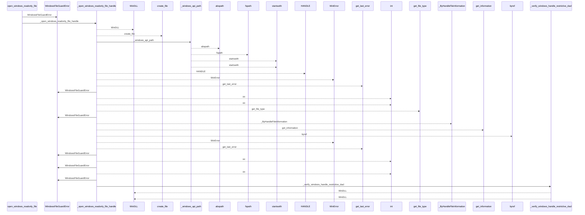
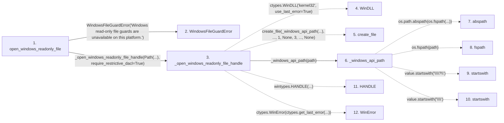

# open_windows_readonly_file

**Entry point:** `open_windows_readonly_file` (`api`)
**Source:** [filesystem_guard](../modules/filesystem_guard.md)
**Modules touched:** [filesystem_guard](../modules/filesystem_guard.md)

## Call sequence

<!-- Auto-generated from static call edges. Dashed arrows are external or unresolved calls. Reviewed runtime conditions and side effects belong in Behavior. -->

> Call sequence diagram shows 30 of 168 interactions; 138 omitted to keep the visualization within the 30-interaction and generated-diagram limits.

## Data flow

<!-- Auto-generated static analysis. Treat values and boundaries as best-effort hints, not runtime proof. -->

### Step data

| Step | Inputs | Reads | Writes | Returns |
|---|---|---|---|---|
| `open_windows_readonly_file` | `path: Path`, `require_restrictive_dacl: bool` | `os`, `os`, `os`, `os`, `WindowsIdentityUnavailableError`, `WindowsFileGuardError` | - | - |
| `WindowsFileGuardError` | - | - | - | - |
| `_open_windows_readonly_file_handle` | `path: Path`, `require_restrictive_dacl: bool` | - | `create_file.argtypes`, `create_file.restype`, `get_file_type.argtypes`, `get_file_type.restype`, `get_information.argtypes`, `get_information.restype` | `native_handle` |
| `WinDLL` | - | - | - | - |
| `create_file` | - | - | - | - |
| `_windows_api_path` | `path: Path` | - | - | `value`, `...`, `...` |
| `abspath` | - | - | - | - |
| `fspath` | - | - | - | - |
| `startswith` | - | - | - | - |
| `startswith` | - | - | - | - |
| `HANDLE` | - | - | - | - |
| `WinError` | - | - | - | - |

### Call data

| From | To | Line | Call |
|---|---|---:|---|
| open_windows_readonly_file | WindowsFileGuardError | 333 | `WindowsFileGuardError('Windows read-only file guards are unavailable on this platform.')` |
| open_windows_readonly_file | _open_windows_readonly_file_handle | 338 | `_open_windows_readonly_file_handle(Path(...), require_restrictive_dacl=True)` |
| _open_windows_readonly_file_handle | WinDLL | 394 | `ctypes.WinDLL('kernel32', use_last_error=True)` |
| _open_windows_readonly_file_handle | create_file | 409 | `create_file(_windows_api_path(...), ..., 1, None, 3, ..., None)` |
| _open_windows_readonly_file_handle | _windows_api_path | 410 | `_windows_api_path(path)` |
| _windows_api_path | abspath | 1285 | `os.path.abspath(os.fspath(...))` |
| _windows_api_path | fspath | 1285 | `os.fspath(path)` |
| _windows_api_path | startswith | 1286 | `value.startswith('\\\\?\\')` |
| _windows_api_path | startswith | 1288 | `value.startswith('\\\\')` |
| _open_windows_readonly_file_handle | HANDLE | 418 | `wintypes.HANDLE(...)` |
| _open_windows_readonly_file_handle | WinError | 420 | `ctypes.WinError(ctypes.get_last_error(...))` |

### Boundary effects

*No boundary effects detected.*

### Static analysis gaps

| Kind | Step | Target | Line |
|---|---|---|---:|
| external_call | `_open_windows_readonly_file_handle` | `ctypes.WinDLL` | 394 |
| unresolved_call | `_open_windows_readonly_file_handle` | `create_file` | 409 |
| external_call | `_windows_api_path` | `os.path.abspath` | 1285 |
| external_call | `_windows_api_path` | `os.fspath` | 1285 |
| unresolved_call | `_windows_api_path` | `value.startswith` | 1286 |
| unresolved_call | `_windows_api_path` | `value.startswith` | 1288 |
| external_call | `_open_windows_readonly_file_handle` | `wintypes.HANDLE` | 418 |
| external_call | `_open_windows_readonly_file_handle` | `ctypes.WinError` | 420 |
| step_limit | `open_windows_readonly_file` | `first 12 steps` | 0 |

## Behavior

This flow starts at `open_windows_readonly_file` and is classified as `api`. The generated call and data-flow sections are bounded static projections; runtime conditions and side effects require source-level confirmation.
