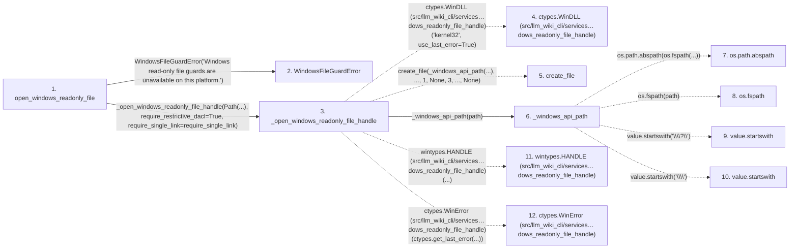

# open_windows_readonly_file

**Entry point:** `open_windows_readonly_file` (`api`)
**Source:** [filesystem_guard](../modules/filesystem_guard.md)
**Modules touched:** [filesystem_guard](../modules/filesystem_guard.md)

## Call sequence

```mermaid
sequenceDiagram
    participant p0 as open_windows_readonly_file
    participant p1 as WindowsFileGuardError
    participant p2 as _open_windows_readonly_file_handle
    participant p3 as ctypes.WinDLL (src/llm_wiki_cli/services…dows_readonly_file_handle)
    participant p4 as create_file
    participant p5 as _windows_api_path
    participant p6 as os.path.abspath
    participant p7 as os.fspath
    participant p8 as value.startswith
    participant p9 as wintypes.HANDLE (src/llm_wiki_cli/services…dows_readonly_file_handle)
    participant p10 as ctypes.WinError (src/llm_wiki_cli/services…dows_readonly_file_handle)
    participant p11 as ctypes.get_last_error (src/llm_wiki_cli/services…dows_readonly_file_handle)
    participant p12 as int (src/llm_wiki_cli/services…dows_readonly_file_handle)
    participant p13 as get_file_type
    participant p14 as _ByHandleFileInformation
    participant p15 as get_information
    participant p16 as ctypes.byref (src/llm_wiki_cli/services…dows_readonly_file_handle)
    participant p17 as _verify_windows_handle_restrictive_dacl
    participant p18 as ctypes.WinDLL (src/llm_wiki_cli/services…s_handle_restrictive_dacl)
    p0->>p1: WindowsFileGuardError
    p0->>p2: _open_windows_readonly_file_handle
    p2-->>p3: ctypes.WinDLL (src/llm_wiki_cli/services…dows_readonly_file_handle)
    p2-->>p4: create_file
    p2->>p5: _windows_api_path
    p5-->>p6: os.path.abspath
    p5-->>p7: os.fspath
    p5-->>p8: value.startswith
    p5-->>p8: value.startswith
    p2-->>p9: wintypes.HANDLE (src/llm_wiki_cli/services…dows_readonly_file_handle)
    p2-->>p10: ctypes.WinError (src/llm_wiki_cli/services…dows_readonly_file_handle)
    p2-->>p11: ctypes.get_last_error (src/llm_wiki_cli/services…dows_readonly_file_handle)
    p2->>p1: WindowsFileGuardError
    p2-->>p12: int (src/llm_wiki_cli/services…dows_readonly_file_handle)
    p2-->>p12: int (src/llm_wiki_cli/services…dows_readonly_file_handle)
    p2-->>p13: get_file_type
    p2->>p1: WindowsFileGuardError
    p2-->>p14: _ByHandleFileInformation
    p2-->>p15: get_information
    p2-->>p16: ctypes.byref (src/llm_wiki_cli/services…dows_readonly_file_handle)
    p2-->>p10: ctypes.WinError (src/llm_wiki_cli/services…dows_readonly_file_handle)
    p2-->>p11: ctypes.get_last_error (src/llm_wiki_cli/services…dows_readonly_file_handle)
    p2->>p1: WindowsFileGuardError
    p2-->>p12: int (src/llm_wiki_cli/services…dows_readonly_file_handle)
    p2->>p1: WindowsFileGuardError
    p2-->>p12: int (src/llm_wiki_cli/services…dows_readonly_file_handle)
    p2->>p1: WindowsFileGuardError
    p2->>p17: _verify_windows_handle_restrictive_dacl
    p17-->>p18: ctypes.WinDLL (src/llm_wiki_cli/services…s_handle_restrictive_dacl)
    p17-->>p18: ctypes.WinDLL (src/llm_wiki_cli/services…s_handle_restrictive_dacl)
```

<!-- Auto-generated from static call edges. Dashed arrows are external or unresolved calls. Reviewed runtime conditions and side effects belong in Behavior. -->

> Call sequence diagram shows 30 of 170 interactions; 140 omitted to keep the visualization within the 30-interaction and generated-diagram limits.

## Data flow

<!-- Auto-generated static analysis. Treat values and boundaries as best-effort hints, not runtime proof. -->

### Step data

| Step | Inputs | Reads | Writes | Returns |
|---|---|---|---|---|
| `open_windows_readonly_file` | `path: Path`, `require_restrictive_dacl: bool`, `require_single_link: bool` | `os`, `os`, `os`, `os`, `WindowsIdentityUnavailableError`, `WindowsFileGuardError` | - | - |
| `WindowsFileGuardError` | - | - | - | - |
| `_open_windows_readonly_file_handle` | `path: Path`, `require_restrictive_dacl: bool`, `require_single_link: bool` | - | `create_file.argtypes`, `create_file.restype`, `get_file_type.argtypes`, `get_file_type.restype`, `get_information.argtypes`, `get_information.restype` | `native_handle` |
| `ctypes.WinDLL (src/llm_wiki_cli/services…dows_readonly_file_handle)` | - | - | - | - |
| `create_file` | - | - | - | - |
| `_windows_api_path` | `path: Path` | - | - | `value`, `...`, `...` |
| `os.path.abspath` | - | - | - | - |
| `os.fspath` | - | - | - | - |
| `value.startswith` | - | - | - | - |
| `value.startswith` | - | - | - | - |
| `wintypes.HANDLE (src/llm_wiki_cli/services…dows_readonly_file_handle)` | - | - | - | - |
| `ctypes.WinError (src/llm_wiki_cli/services…dows_readonly_file_handle)` | - | - | - | - |

### Call data

| From | To | Line | Call |
|---|---|---:|---|
| open_windows_readonly_file | WindowsFileGuardError | 339 | `WindowsFileGuardError('Windows read-only file guards are unavailable on this platform.')` |
| open_windows_readonly_file | _open_windows_readonly_file_handle | 344 | `_open_windows_readonly_file_handle(Path(...), require_restrictive_dacl=True, require_single_link=require_single_link)` |
| _open_windows_readonly_file_handle | ctypes.WinDLL (src/llm_wiki_cli/services…dows_readonly_file_handle) | 407 | `ctypes.WinDLL('kernel32', use_last_error=True)` |
| _open_windows_readonly_file_handle | create_file | 422 | `create_file(_windows_api_path(...), ..., 1, None, 3, ..., None)` |
| _open_windows_readonly_file_handle | _windows_api_path | 423 | `_windows_api_path(path)` |
| _windows_api_path | os.path.abspath | 1298 | `os.path.abspath(os.fspath(...))` |
| _windows_api_path | os.fspath | 1298 | `os.fspath(path)` |
| _windows_api_path | value.startswith | 1299 | `value.startswith('\\\\?\\')` |
| _windows_api_path | value.startswith | 1301 | `value.startswith('\\\\')` |
| _open_windows_readonly_file_handle | wintypes.HANDLE (src/llm_wiki_cli/services…dows_readonly_file_handle) | 431 | `wintypes.HANDLE(...)` |
| _open_windows_readonly_file_handle | ctypes.WinError (src/llm_wiki_cli/services…dows_readonly_file_handle) | 433 | `ctypes.WinError(ctypes.get_last_error(...))` |

### Boundary effects

*No boundary effects detected.*

### Static analysis gaps

| Kind | Step | Target | Line |
|---|---|---|---:|
| external_call | `_open_windows_readonly_file_handle` | `ctypes.WinDLL` | 407 |
| unresolved_call | `_open_windows_readonly_file_handle` | `create_file` | 422 |
| external_call | `_windows_api_path` | `os.path.abspath` | 1298 |
| external_call | `_windows_api_path` | `os.fspath` | 1298 |
| unresolved_call | `_windows_api_path` | `value.startswith` | 1299 |
| unresolved_call | `_windows_api_path` | `value.startswith` | 1301 |
| external_call | `_open_windows_readonly_file_handle` | `wintypes.HANDLE` | 431 |
| external_call | `_open_windows_readonly_file_handle` | `ctypes.WinError` | 433 |
| step_limit | `open_windows_readonly_file` | `first 12 steps` | 0 |

## Behavior

This flow starts at `open_windows_readonly_file` and is classified as `api`. The generated call and data-flow sections are bounded static projections; runtime conditions and side effects require source-level confirmation.
