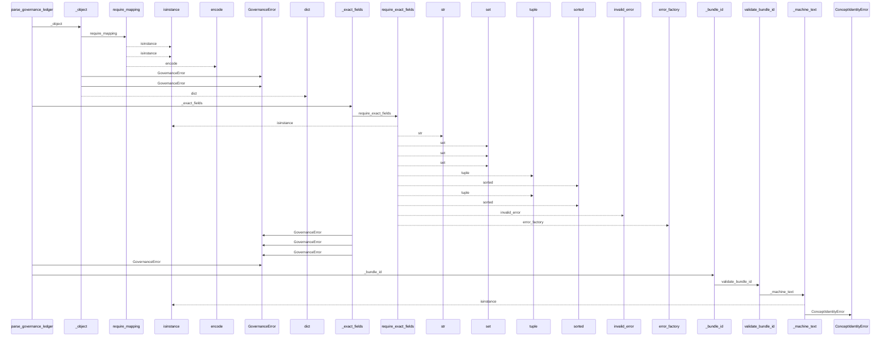
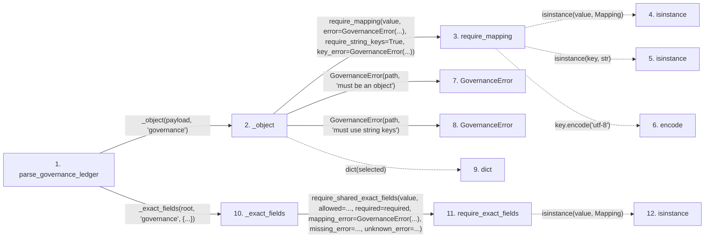

# parse_governance_ledger

**Entry point:** `parse_governance_ledger` (`api`)
**Source:** [knowledge_governance](../modules/knowledge_governance.md)
**Modules touched:** [concept_identity](../modules/concept_identity.md), [knowledge_evidence](../modules/knowledge_evidence.md), [knowledge_governance](../modules/knowledge_governance.md), and 4 more

**Complete modules touched:**

- [concept_identity](../modules/concept_identity.md)
- [knowledge_evidence](../modules/knowledge_evidence.md)
- [knowledge_governance](../modules/knowledge_governance.md)
- [knowledge_model](../modules/knowledge_model.md)
- [validation](../modules/validation.md)
- [wiki_media](../modules/wiki_media.md)
- [wiki_surface](../modules/wiki_surface.md)

## Call sequence

<!-- Auto-generated from static call edges. Dashed arrows are external or unresolved calls. Reviewed runtime conditions and side effects belong in Behavior. -->

> Call sequence diagram shows 30 of 436 interactions; 406 omitted to keep the visualization within the 30-interaction and generated-diagram limits.

> Trace truncated at the depth limit; deeper calls are omitted.

## Data flow

<!-- Auto-generated static analysis. Treat values and boundaries as best-effort hints, not runtime proof. -->

### Step data

| Step | Inputs | Reads | Writes | Returns |
|---|---|---|---|---|
| `parse_governance_ledger` | `payload: object`, `expected_bundle_id: str \| None` | `GOVERNANCE_SCHEMA_VERSION`, `GOVERNANCE_SCHEMA_VERSION`, `ALIAS_NATURAL_KEY`, `ALIAS_LOCATOR` | `concepts[...]`, `aliases[...]` | `validate_governance_ledger(...)` |
| `_object` | `value: object`, `path: str` | - | - | `dict(...)` |
| `require_mapping` | `value: object`, `error: Exception`, `require_string_keys: bool`, `key_error: Exception \| None`, `require_utf8_keys: bool`, `utf8_key_error: Exception \| None` | `Mapping` | - | `value` |
| `isinstance` | - | - | - | - |
| `isinstance` | - | - | - | - |
| `encode` | - | - | - | - |
| `GovernanceError` | - | - | - | - |
| `GovernanceError` | - | - | - | - |
| `dict` | - | - | - | - |
| `_exact_fields` | `value: Mapping[str, object]`, `path: str`, `required: set[str]`, `optional: set[str] \| frozenset[str]` | - | - | `require_shared_exact_fields(...)` |
| `require_exact_fields` | `value: object`, `allowed: Iterable[str]`, `required: Iterable[str]`, `mapping_error: Exception`, `missing_error: _ErrorFactory`, `unknown_error: _ErrorFactory`, `invalid_error: Callable[[tuple[str, ...], tuple[str, ...]], Exception] \| None`, `stringify_keys: bool` | `Mapping` | - | - |
| `isinstance` | - | - | - | - |

### Call data

| From | To | Line | Call |
|---|---|---:|---|
| parse_governance_ledger | _object | 419 | `_object(payload, 'governance')` |
| _object | require_mapping | 3136 | `require_mapping(value, error=GovernanceError(...), require_string_keys=True, key_error=GovernanceError(...))` |
| require_mapping | isinstance | 727 | `isinstance(value, Mapping)` |
| require_mapping | isinstance | 731 | `isinstance(key, str)` |
| require_mapping | encode | 736 | `key.encode('utf-8')` |
| _object | GovernanceError | 3138 | `GovernanceError(path, 'must be an object')` |
| _object | GovernanceError | 3140 | `GovernanceError(path, 'must use string keys')` |
| _object | dict | 3142 | `dict(selected)` |
| parse_governance_ledger | _exact_fields | 420 | `_exact_fields(root, 'governance', {...})` |
| _exact_fields | require_exact_fields | 3159 | `require_shared_exact_fields(value, allowed=..., required=required, mapping_error=GovernanceError(...), missing_error=..., unknown_error=...)` |
| require_exact_fields | isinstance | 1205 | `isinstance(value, Mapping)` |

### Boundary effects

*No boundary effects detected.*

### Static analysis gaps

| Kind | Step | Target | Line |
|---|---|---|---:|
| unresolved_call | `require_mapping` | `isinstance` | 727 |
| unresolved_call | `require_mapping` | `isinstance` | 731 |
| unresolved_call | `require_mapping` | `key.encode` | 736 |
| unresolved_call | `require_exact_fields` | `isinstance` | 1205 |
| step_limit | `parse_governance_ledger` | `first 12 steps` | 0 |
| truncated_flow | `parse_governance_ledger` | `depth limit` | 0 |

## Behavior

This flow starts at `parse_governance_ledger` and is classified as `api`. The generated call and data-flow sections are bounded static projections; runtime conditions and side effects require source-level confirmation.
