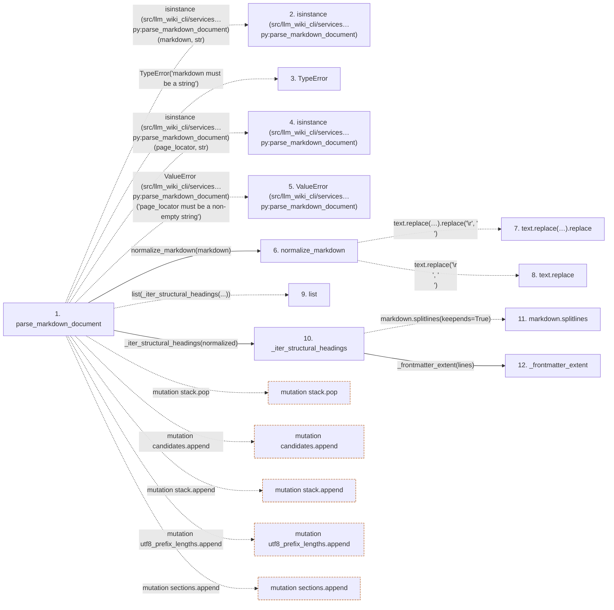

# parse_markdown_document

**Entry point:** `parse_markdown_document` (`api`)
**Source:** [markdown_sections](../modules/markdown_sections.md)
**Modules touched:** [knowledge_evidence](../modules/knowledge_evidence.md), [markdown_sections](../modules/markdown_sections.md)

## Call sequence

```mermaid
sequenceDiagram
    participant p0 as parse_markdown_document
    participant p1 as isinstance (src/llm_wiki_cli/services…py:parse_markdown_document)
    participant p2 as TypeError
    participant p3 as ValueError (src/llm_wiki_cli/services…py:parse_markdown_document)
    participant p4 as normalize_markdown
    participant p5 as text.replace(…).replace
    participant p6 as text.replace
    participant p7 as list
    participant p8 as _iter_structural_headings
    participant p9 as markdown.splitlines
    participant p10 as _frontmatter_extent
    participant p11 as _line_content(…).removeprefix(…).strip
    participant p12 as _line_content(…).removeprefix
    participant p13 as _line_content
    participant p14 as line.endswith
    participant p15 as enumerate (src/llm_wiki_cli/services…ons.py:_frontmatter_extent)
    participant p16 as _line_content(…).strip
    participant p17 as len (src/llm_wiki_cli/services…ons.py:_frontmatter_extent)
    participant p18 as enumerate (src/llm_wiki_cli/services…:_iter_structural_headings)
    participant p19 as len (src/llm_wiki_cli/services…:_iter_structural_headings)
    participant p20 as re.fullmatch
    participant p21 as re.escape
    participant p22 as _FENCE_OPEN_RE.fullmatch
    participant p23 as opening.groups
    participant p24 as _atx_heading
    participant p25 as _ATX_HEADING_RE.fullmatch
    participant p26 as match.groups
    p0-->>p1: isinstance (src/llm_wiki_cli/services…py:parse_markdown_document)
    p0-->>p2: TypeError
    p0-->>p1: isinstance (src/llm_wiki_cli/services…py:parse_markdown_document)
    p0-->>p3: ValueError (src/llm_wiki_cli/services…py:parse_markdown_document)
    p0->>p4: normalize_markdown
    p4-->>p5: text.replace(…).replace
    p4-->>p6: text.replace
    p0-->>p7: list
    p0->>p8: _iter_structural_headings
    p8-->>p9: markdown.splitlines
    p8->>p10: _frontmatter_extent
    p10-->>p11: _line_content(…).removeprefix(…).strip
    p10-->>p12: _line_content(…).removeprefix
    p10->>p13: _line_content
    p13-->>p14: line.endswith
    p10-->>p15: enumerate (src/llm_wiki_cli/services…ons.py:_frontmatter_extent)
    p10-->>p16: _line_content(…).strip
    p10->>p13: _line_content
    p10-->>p17: len (src/llm_wiki_cli/services…ons.py:_frontmatter_extent)
    p8-->>p18: enumerate (src/llm_wiki_cli/services…:_iter_structural_headings)
    p8->>p13: _line_content
    p8-->>p19: len (src/llm_wiki_cli/services…:_iter_structural_headings)
    p8-->>p20: re.fullmatch
    p8-->>p21: re.escape
    p8-->>p22: _FENCE_OPEN_RE.fullmatch
    p8-->>p23: opening.groups
    p8-->>p19: len (src/llm_wiki_cli/services…:_iter_structural_headings)
    p8->>p24: _atx_heading
    p24-->>p25: _ATX_HEADING_RE.fullmatch
    p24-->>p26: match.groups
```

<!-- Auto-generated from static call edges. Dashed arrows are external or unresolved calls. Reviewed runtime conditions and side effects belong in Behavior. -->

> Call sequence diagram shows 30 of 85 interactions; 55 omitted to keep the visualization within the 30-interaction and generated-diagram limits.

## Data flow

<!-- Auto-generated static analysis. Treat values and boundaries as best-effort hints, not runtime proof. -->

### Step data

| Step | Inputs | Reads | Writes | Returns |
|---|---|---|---|---|
| `parse_markdown_document` | `markdown: str`, `page_locator: str` | `SECTION_ORDER_DOMAIN` | `occurrences[...]` | `MarkdownSectionDocument(...)` |
| `isinstance (src/llm_wiki_cli/services…py:parse_markdown_document)` | - | - | - | - |
| `TypeError` | - | - | - | - |
| `isinstance (src/llm_wiki_cli/services…py:parse_markdown_document)` | - | - | - | - |
| `ValueError (src/llm_wiki_cli/services…py:parse_markdown_document)` | - | - | - | - |
| `normalize_markdown` | `text: str` | - | - | `...` |
| `text.replace(…).replace` | - | - | - | - |
| `text.replace` | - | - | - | - |
| `list` | - | - | - | - |
| `_iter_structural_headings` | `markdown: str` | - | - | - |
| `markdown.splitlines` | - | - | - | - |
| `_frontmatter_extent` | `lines: list[str]` | - | - | `0`, `0`, `...`, `len(...)` |

### Call data

| From | To | Line | Call |
|---|---|---:|---|
| parse_markdown_document | isinstance (src/llm_wiki_cli/services…py:parse_markdown_document) | 325 | `isinstance(markdown, str)` |
| parse_markdown_document | TypeError | 326 | `TypeError('markdown must be a string')` |
| parse_markdown_document | isinstance (src/llm_wiki_cli/services…py:parse_markdown_document) | 327 | `isinstance(page_locator, str)` |
| parse_markdown_document | ValueError (src/llm_wiki_cli/services…py:parse_markdown_document) | 328 | `ValueError('page_locator must be a non-empty string')` |
| parse_markdown_document | normalize_markdown | 330 | `normalize_markdown(markdown)` |
| normalize_markdown | text.replace(…).replace | 81 | `text.replace('\r\n', '\n').replace('\r', '\n')` |
| normalize_markdown | text.replace | 81 | `text.replace('\r\n', '\n')` |
| parse_markdown_document | list | 331 | `list(_iter_structural_headings(...))` |
| parse_markdown_document | _iter_structural_headings | 331 | `_iter_structural_headings(normalized)` |
| _iter_structural_headings | markdown.splitlines | 251 | `markdown.splitlines(keepends=True)` |
| _iter_structural_headings | _frontmatter_extent | 252 | `_frontmatter_extent(lines)` |

### Boundary effects

| Kind | Target | Step | Line |
|---|---|---|---:|
| mutation | `stack.pop` | `parse_markdown_document` | 338 |
| mutation | `candidates.append` | `parse_markdown_document` | 350 |
| mutation | `stack.append` | `parse_markdown_document` | 362 |
| mutation | `utf8_prefix_lengths.append` | `parse_markdown_document` | 366 |
| mutation | `sections.append` | `parse_markdown_document` | 393 |

### Static analysis gaps

| Kind | Step | Target | Line |
|---|---|---|---:|
| external_call | `parse_markdown_document` | `isinstance` | 325 |
| external_call | `parse_markdown_document` | `TypeError` | 326 |
| external_call | `parse_markdown_document` | `isinstance` | 327 |
| external_call | `parse_markdown_document` | `ValueError` | 328 |
| unresolved_call | `normalize_markdown` | `text.replace('\r\n', '\n').replace` | 81 |
| unresolved_call | `normalize_markdown` | `text.replace` | 81 |
| unresolved_call | `_iter_structural_headings` | `markdown.splitlines` | 251 |
| step_limit | `parse_markdown_document` | `first 12 steps` | 0 |

## Behavior

This flow starts at `parse_markdown_document` and is classified as `api`. The generated call and data-flow sections are bounded static projections; runtime conditions and side effects require source-level confirmation.
