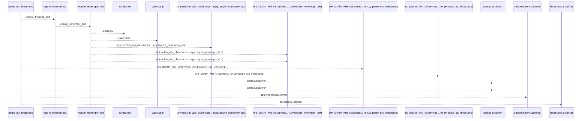
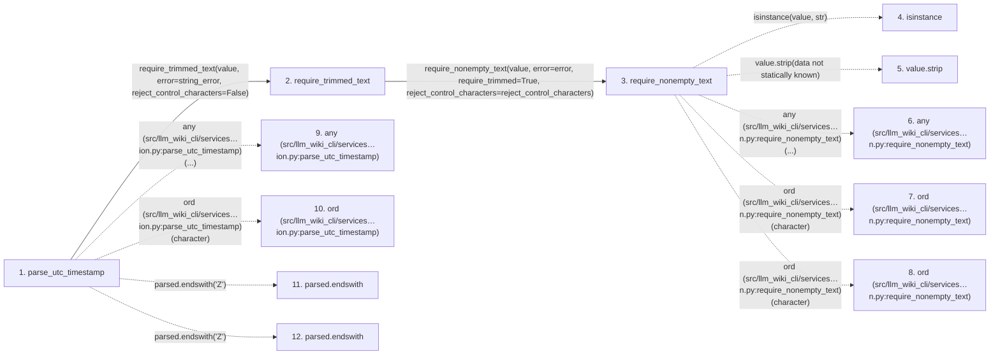

# parse_utc_timestamp

**Entry point:** `parse_utc_timestamp` (`api`)
**Source:** [validation](../modules/validation.md)
**Modules touched:** [validation](../modules/validation.md)

## Call sequence

<!-- Auto-generated from static call edges. Dashed arrows are external or unresolved calls. Reviewed runtime conditions and side effects belong in Behavior. -->

## Data flow

<!-- Auto-generated static analysis. Treat values and boundaries as best-effort hints, not runtime proof. -->

### Step data

| Step | Inputs | Reads | Writes | Returns |
|---|---|---|---|---|
| `parse_utc_timestamp` | `value: object`, `string_error: Exception`, `timestamp_error: Exception`, `require_z: bool`, `reject_control_characters: bool`, `control_error: Exception \| None`, `z_error: Exception \| None`, `utc_error: Exception \| None` | `_ZERO_UTC_OFFSET` | - | `(...)` |
| `require_trimmed_text` | `value: object`, `error: Exception`, `reject_control_characters: bool` | - | - | `require_nonempty_text(...)` |
| `require_nonempty_text` | `value: object`, `error: Exception`, `trim_error: Exception \| None`, `normalize: bool`, `require_trimmed: bool`, `reject_control_characters: bool`, `reject_delete_character: bool` | - | - | `parsed` |
| `isinstance` | - | - | - | - |
| `value.strip` | - | - | - | - |
| `any (src/llm_wiki_cli/services…n.py:require_nonempty_text)` | - | - | - | - |
| `ord (src/llm_wiki_cli/services…n.py:require_nonempty_text)` | - | - | - | - |
| `ord (src/llm_wiki_cli/services…n.py:require_nonempty_text)` | - | - | - | - |
| `any (src/llm_wiki_cli/services…ion.py:parse_utc_timestamp)` | - | - | - | - |
| `ord (src/llm_wiki_cli/services…ion.py:parse_utc_timestamp)` | - | - | - | - |
| `parsed.endswith` | - | - | - | - |
| `parsed.endswith` | - | - | - | - |

### Call data

| From | To | Line | Call |
|---|---|---:|---|
| parse_utc_timestamp | require_trimmed_text | 1169 | `require_trimmed_text(value, error=string_error, reject_control_characters=False)` |
| require_trimmed_text | require_nonempty_text | 658 | `require_nonempty_text(value, error=error, require_trimmed=True, reject_control_characters=reject_control_characters)` |
| require_nonempty_text | isinstance | 574 | `isinstance(value, str)` |
| require_nonempty_text | value.strip | 576 | `value.strip(data not statically known)` |
| require_nonempty_text | any (src/llm_wiki_cli/services…n.py:require_nonempty_text) | 582 | `any(...)` |
| require_nonempty_text | ord (src/llm_wiki_cli/services…n.py:require_nonempty_text) | 583 | `ord(character)` |
| require_nonempty_text | ord (src/llm_wiki_cli/services…n.py:require_nonempty_text) | 584 | `ord(character)` |
| parse_utc_timestamp | any (src/llm_wiki_cli/services…ion.py:parse_utc_timestamp) | 1174 | `any(...)` |
| parse_utc_timestamp | ord (src/llm_wiki_cli/services…ion.py:parse_utc_timestamp) | 1175 | `ord(character)` |
| parse_utc_timestamp | parsed.endswith | 1178 | `parsed.endswith('Z')` |
| parse_utc_timestamp | parsed.endswith | 1180 | `parsed.endswith('Z')` |

### Boundary effects

*No boundary effects detected.*

### Static analysis gaps

| Kind | Step | Target | Line |
|---|---|---|---:|
| external_call | `require_nonempty_text` | `isinstance` | 574 |
| unresolved_call | `require_nonempty_text` | `value.strip` | 576 |
| external_call | `require_nonempty_text` | `any` | 582 |
| external_call | `require_nonempty_text` | `ord` | 583 |
| external_call | `require_nonempty_text` | `ord` | 584 |
| external_call | `parse_utc_timestamp` | `any` | 1174 |
| external_call | `parse_utc_timestamp` | `ord` | 1175 |
| unresolved_call | `parse_utc_timestamp` | `parsed.endswith` | 1178 |
| unresolved_call | `parse_utc_timestamp` | `parsed.endswith` | 1180 |
| step_limit | `parse_utc_timestamp` | `first 12 steps` | 0 |

## Behavior

This flow starts at `parse_utc_timestamp` and is classified as `api`. The generated call and data-flow sections are bounded static projections; runtime conditions and side effects require source-level confirmation.
