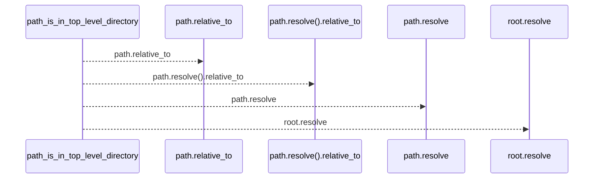
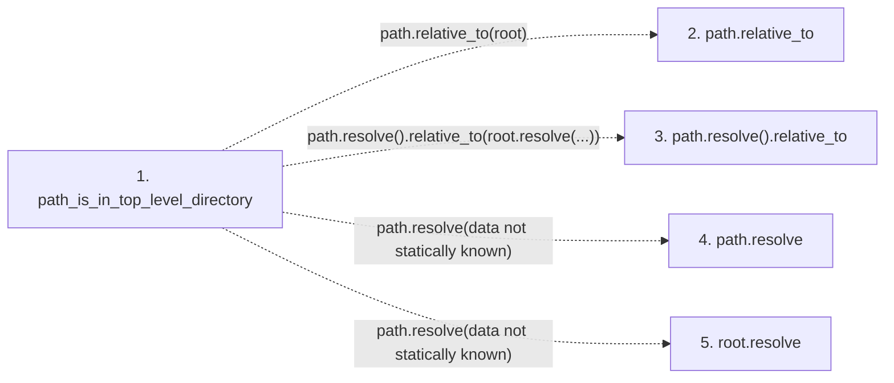

# path_is_in_top_level_directory

**Entry point:** `path_is_in_top_level_directory` (`api`)
**Source:** [validation](../modules/validation.md)
**Modules touched:** [validation](../modules/validation.md)

## Call sequence

<!-- Auto-generated from static call edges. Dashed arrows are external or unresolved calls. Reviewed runtime conditions and side effects belong in Behavior. -->

## Data flow

<!-- Auto-generated static analysis. Treat values and boundaries as best-effort hints, not runtime proof. -->

### Step data

| Step | Inputs | Reads | Writes | Returns |
|---|---|---|---|---|
| `path_is_in_top_level_directory` | `path: Path`, `root: Path`, `directory: str` | - | - | `False`, `...` |
| `path.relative_to` | - | - | - | - |
| `path.resolve().relative_to` | - | - | - | - |
| `path.resolve` | - | - | - | - |
| `root.resolve` | - | - | - | - |

### Call data

| From | To | Line | Call |
|---|---|---:|---|
| path_is_in_top_level_directory | path.relative_to | 461 | `path.relative_to(root)` |
| path_is_in_top_level_directory | path.resolve().relative_to | 464 | `path.resolve().relative_to(root.resolve(...))` |
| path_is_in_top_level_directory | path.resolve | 464 | `path.resolve(data not statically known)` |
| path_is_in_top_level_directory | root.resolve | 464 | `path.resolve(data not statically known)` |

### Boundary effects

*No boundary effects detected.*

### Static analysis gaps

| Kind | Step | Target | Line |
|---|---|---|---:|
| unresolved_call | `path_is_in_top_level_directory` | `path.relative_to` | 461 |
| unresolved_call | `path_is_in_top_level_directory` | `path.resolve().relative_to` | 464 |
| unresolved_call | `path_is_in_top_level_directory` | `path.resolve` | 464 |
| unresolved_call | `path_is_in_top_level_directory` | `root.resolve` | 464 |

## Behavior

This flow starts at `path_is_in_top_level_directory` and is classified as `api`. The generated call and data-flow sections are bounded static projections; runtime conditions and side effects require source-level confirmation.
