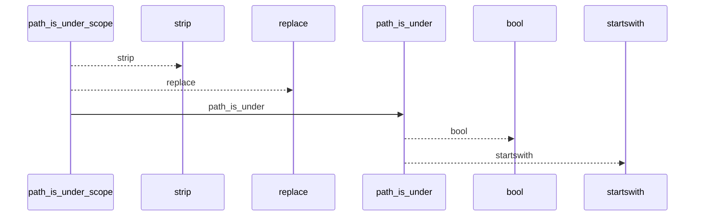
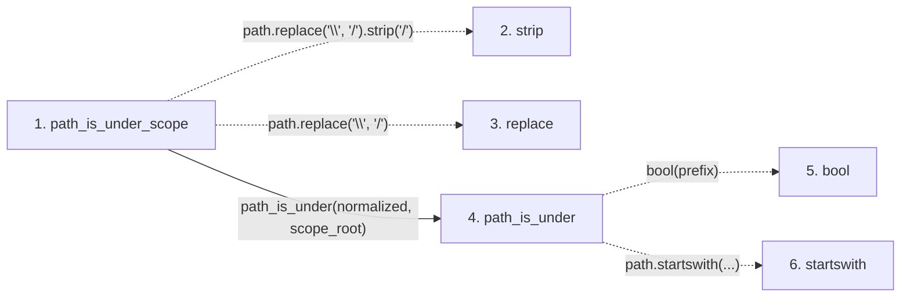

# path_is_under_scope

**Entry point:** `path_is_under_scope` (`api`)
**Source:** [validation](../modules/validation.md)
**Modules touched:** [validation](../modules/validation.md)

## Call sequence

<!-- Auto-generated from static call edges. Dashed arrows are external or unresolved calls. Reviewed runtime conditions and side effects belong in Behavior. -->

## Data flow

<!-- Auto-generated static analysis. Treat values and boundaries as best-effort hints, not runtime proof. -->

### Step data

| Step | Inputs | Reads | Writes | Returns |
|---|---|---|---|---|
| `path_is_under_scope` | `path: str`, `scope_root: str` | - | - | `...` |
| `strip` | - | - | - | - |
| `replace` | - | - | - | - |
| `path_is_under` | `path: str`, `prefix: str` | - | - | `...` |
| `bool` | - | - | - | - |
| `startswith` | - | - | - | - |

### Call data

| From | To | Line | Call |
|---|---|---:|---|
| path_is_under_scope | strip | 424 | `path.replace('\\', '/').strip('/')` |
| path_is_under_scope | replace | 424 | `path.replace('\\', '/')` |
| path_is_under_scope | path_is_under | 425 | `path_is_under(normalized, scope_root)` |
| path_is_under | bool | 418 | `bool(prefix)` |
| path_is_under | startswith | 418 | `path.startswith(...)` |

### Boundary effects

*No boundary effects detected.*

### Static analysis gaps

| Kind | Step | Target | Line |
|---|---|---|---:|
| unresolved_call | `path_is_under_scope` | `path.replace('\\', '/').strip` | 424 |
| unresolved_call | `path_is_under_scope` | `path.replace` | 424 |
| unresolved_call | `path_is_under` | `path.startswith` | 418 |

## Behavior

This flow starts at `path_is_under_scope` and is classified as `api`. The generated call and data-flow sections are bounded static projections; runtime conditions and side effects require source-level confirmation.
