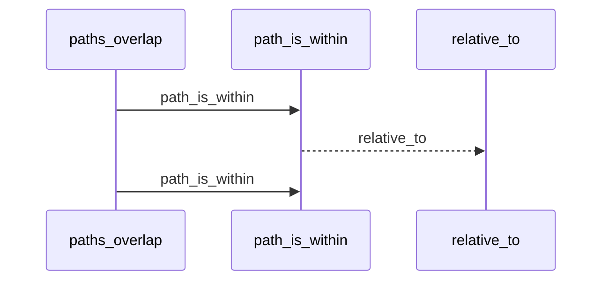
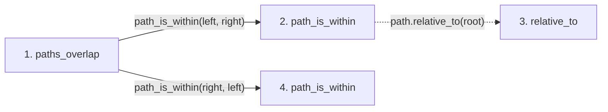

# paths_overlap

**Entry point:** `paths_overlap` (`api`)
**Source:** [validation](../modules/validation.md)
**Modules touched:** [validation](../modules/validation.md)

## Call sequence

<!-- Auto-generated from static call edges. Dashed arrows are external or unresolved calls. Reviewed runtime conditions and side effects belong in Behavior. -->

## Data flow

<!-- Auto-generated static analysis. Treat values and boundaries as best-effort hints, not runtime proof. -->

### Step data

| Step | Inputs | Reads | Writes | Returns |
|---|---|---|---|---|
| `paths_overlap` | `left: Path`, `right: Path` | - | - | `...` |
| `path_is_within` | `path: Path`, `root: Path` | - | - | `False`, `True` |
| `relative_to` | - | - | - | - |
| `path_is_within` | `path: Path`, `root: Path` | - | - | `False`, `True` |

### Call data

| From | To | Line | Call |
|---|---|---:|---|
| paths_overlap | path_is_within | 441 | `path_is_within(left, right)` |
| path_is_within | relative_to | 432 | `path.relative_to(root)` |
| paths_overlap | path_is_within | 441 | `path_is_within(right, left)` |

### Boundary effects

*No boundary effects detected.*

### Static analysis gaps

| Kind | Step | Target | Line |
|---|---|---|---:|
| unresolved_call | `path_is_within` | `path.relative_to` | 432 |

## Behavior

This flow starts at `paths_overlap` and is classified as `api`. The generated call and data-flow sections are bounded static projections; runtime conditions and side effects require source-level confirmation.
