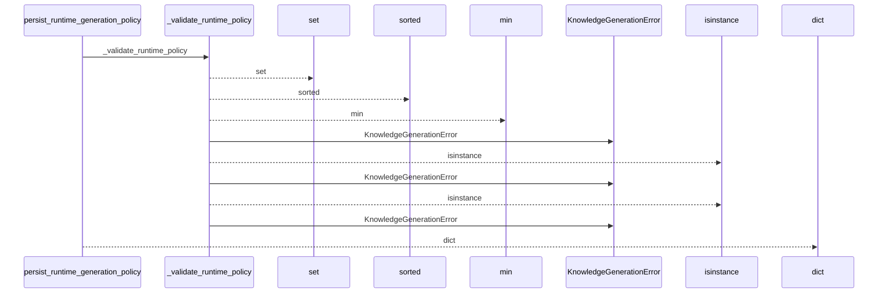
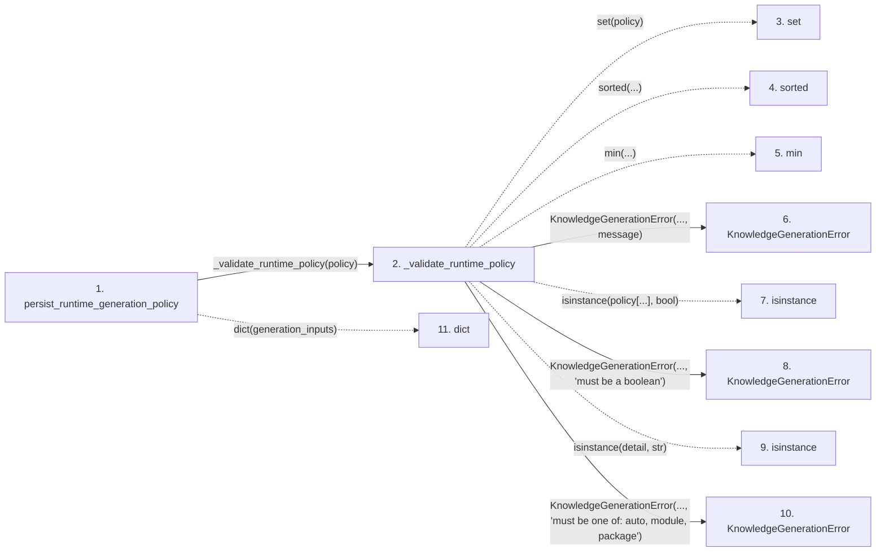

# persist_runtime_generation_policy

**Entry point:** `persist_runtime_generation_policy` (`api`)
**Source:** [knowledge_orchestration](../modules/knowledge_orchestration.md)
**Modules touched:** [knowledge_generation](../modules/knowledge_generation.md), [knowledge_orchestration](../modules/knowledge_orchestration.md)

## Call sequence

<!-- Auto-generated from static call edges. Dashed arrows are external or unresolved calls. Reviewed runtime conditions and side effects belong in Behavior. -->

## Data flow

<!-- Auto-generated static analysis. Treat values and boundaries as best-effort hints, not runtime proof. -->

### Step data

| Step | Inputs | Reads | Writes | Returns |
|---|---|---|---|---|
| `persist_runtime_generation_policy` | `generation_inputs: Mapping[str, object]`, `data_flow_enabled: bool`, `dependency_graph_detail: str`, `workflows_enabled: bool` | - | `persisted[...]` | `persisted` |
| `_validate_runtime_policy` | `policy: Mapping[str, object]` | `_RUNTIME_POLICY_KEYS`, `_RUNTIME_POLICY_KEYS`, `_RUNTIME_POLICY_KEYS`, `RUNTIME_GENERATION_INPUT_KEY`, `RUNTIME_GENERATION_INPUT_KEY`, `_DEPENDENCY_GRAPH_DETAILS`, `RUNTIME_GENERATION_INPUT_KEY` | - | - |
| `set` | - | - | - | - |
| `sorted` | - | - | - | - |
| `min` | - | - | - | - |
| `KnowledgeGenerationError` | - | - | - | - |
| `isinstance` | - | - | - | - |
| `KnowledgeGenerationError` | - | - | - | - |
| `isinstance` | - | - | - | - |
| `KnowledgeGenerationError` | - | - | - | - |
| `dict` | - | - | - | - |

### Call data

| From | To | Line | Call |
|---|---|---:|---|
| persist_runtime_generation_policy | _validate_runtime_policy | 987 | `_validate_runtime_policy(policy)` |
| _validate_runtime_policy | set | 1013 | `set(policy)` |
| _validate_runtime_policy | sorted | 1015 | `sorted(...)` |
| _validate_runtime_policy | min | 1020 | `min(...)` |
| _validate_runtime_policy | KnowledgeGenerationError | 1022 | `KnowledgeGenerationError(..., message)` |
| _validate_runtime_policy | isinstance | 1027 | `isinstance(policy[...], bool)` |
| _validate_runtime_policy | KnowledgeGenerationError | 1028 | `KnowledgeGenerationError(..., 'must be a boolean')` |
| _validate_runtime_policy | isinstance | 1033 | `isinstance(detail, str)` |
| _validate_runtime_policy | KnowledgeGenerationError | 1034 | `KnowledgeGenerationError(..., 'must be one of: auto, module, package')` |
| persist_runtime_generation_policy | dict | 988 | `dict(generation_inputs)` |

### Boundary effects

*No boundary effects detected.*

### Static analysis gaps

| Kind | Step | Target | Line |
|---|---|---|---:|
| unresolved_call | `_validate_runtime_policy` | `sorted` | 1015 |
| unresolved_call | `_validate_runtime_policy` | `min` | 1020 |
| unresolved_call | `_validate_runtime_policy` | `isinstance` | 1027 |
| unresolved_call | `_validate_runtime_policy` | `isinstance` | 1033 |

## Behavior

This flow starts at `persist_runtime_generation_policy` and is classified as `api`. The generated call and data-flow sections are bounded static projections; runtime conditions and side effects require source-level confirmation.
