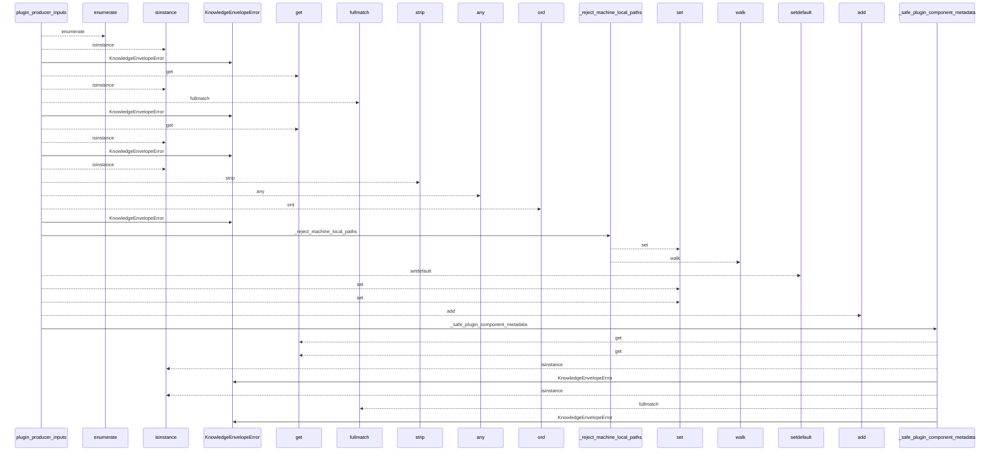
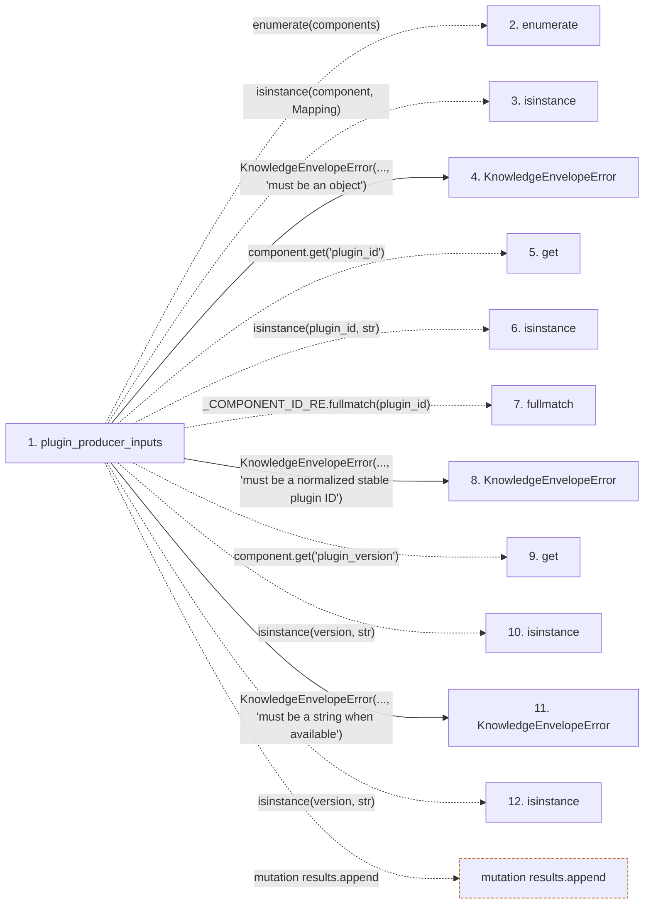

# plugin_producer_inputs

**Entry point:** `plugin_producer_inputs` (`api`)
**Source:** [knowledge_envelope](../modules/knowledge_envelope.md)
**Modules touched:** [knowledge_envelope](../modules/knowledge_envelope.md)

## Call sequence

<!-- Auto-generated from static call edges. Dashed arrows are external or unresolved calls. Reviewed runtime conditions and side effects belong in Behavior. -->

> Call sequence diagram shows 30 of 68 interactions; 38 omitted to keep the visualization within the 30-interaction and generated-diagram limits.

## Data flow

<!-- Auto-generated static analysis. Treat values and boundaries as best-effort hints, not runtime proof. -->

### Step data

| Step | Inputs | Reads | Writes | Returns |
|---|---|---|---|---|
| `plugin_producer_inputs` | `components: Iterable[Mapping[str, Any]]`, `plugin_configurations: Mapping[str, Mapping[str, Any] \| None] \| None`, `plugin_limitations: Mapping[str, Iterable[str]] \| None` | `Mapping`, `Mapping` | - | `tuple(...)` |
| `enumerate` | - | - | - | - |
| `isinstance` | - | - | - | - |
| `KnowledgeEnvelopeError` | - | - | - | - |
| `get` | - | - | - | - |
| `isinstance` | - | - | - | - |
| `fullmatch` | - | - | - | - |
| `KnowledgeEnvelopeError` | - | - | - | - |
| `get` | - | - | - | - |
| `isinstance` | - | - | - | - |
| `KnowledgeEnvelopeError` | - | - | - | - |
| `isinstance` | - | - | - | - |

### Call data

| From | To | Line | Call |
|---|---|---:|---|
| plugin_producer_inputs | enumerate | 1005 | `enumerate(components)` |
| plugin_producer_inputs | isinstance | 1006 | `isinstance(component, Mapping)` |
| plugin_producer_inputs | KnowledgeEnvelopeError | 1007 | `KnowledgeEnvelopeError(..., 'must be an object')` |
| plugin_producer_inputs | get | 1011 | `component.get('plugin_id')` |
| plugin_producer_inputs | isinstance | 1013 | `isinstance(plugin_id, str)` |
| plugin_producer_inputs | fullmatch | 1014 | `_COMPONENT_ID_RE.fullmatch(plugin_id)` |
| plugin_producer_inputs | KnowledgeEnvelopeError | 1016 | `KnowledgeEnvelopeError(..., 'must be a normalized stable plugin ID')` |
| plugin_producer_inputs | get | 1020 | `component.get('plugin_version')` |
| plugin_producer_inputs | isinstance | 1021 | `isinstance(version, str)` |
| plugin_producer_inputs | KnowledgeEnvelopeError | 1022 | `KnowledgeEnvelopeError(..., 'must be a string when available')` |
| plugin_producer_inputs | isinstance | 1026 | `isinstance(version, str)` |

### Boundary effects

| Kind | Target | Step | Line |
|---|---|---|---:|
| mutation | `results.append` | `plugin_producer_inputs` | 1117 |

### Static analysis gaps

| Kind | Step | Target | Line |
|---|---|---|---:|
| unresolved_call | `plugin_producer_inputs` | `enumerate` | 1005 |
| unresolved_call | `plugin_producer_inputs` | `isinstance` | 1006 |
| unresolved_call | `plugin_producer_inputs` | `component.get` | 1011 |
| unresolved_call | `plugin_producer_inputs` | `isinstance` | 1013 |
| unresolved_call | `plugin_producer_inputs` | `_COMPONENT_ID_RE.fullmatch` | 1014 |
| unresolved_call | `plugin_producer_inputs` | `component.get` | 1020 |
| unresolved_call | `plugin_producer_inputs` | `isinstance` | 1021 |
| unresolved_call | `plugin_producer_inputs` | `isinstance` | 1026 |
| step_limit | `plugin_producer_inputs` | `first 12 steps` | 0 |

## Behavior

This flow starts at `plugin_producer_inputs` and is classified as `api`. The generated call and data-flow sections are bounded static projections; runtime conditions and side effects require source-level confirmation.
