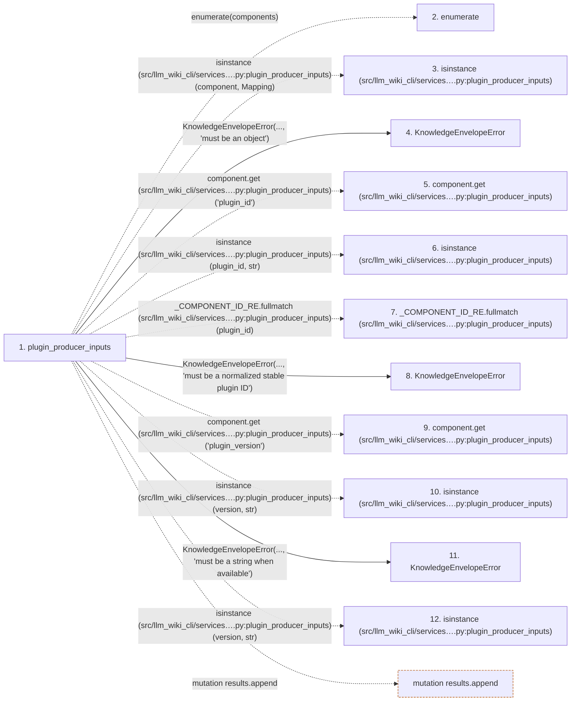

# plugin_producer_inputs

**Entry point:** `plugin_producer_inputs` (`api`)
**Source:** [knowledge_envelope](../modules/knowledge_envelope.md)
**Modules touched:** [knowledge_envelope](../modules/knowledge_envelope.md)

## Call sequence

```mermaid
sequenceDiagram
    participant p0 as plugin_producer_inputs
    participant p1 as enumerate
    participant p2 as isinstance (src/llm_wiki_cli/services….py:plugin_producer_inputs)
    participant p3 as KnowledgeEnvelopeError
    participant p4 as component.get (src/llm_wiki_cli/services….py:plugin_producer_inputs)
    participant p5 as _COMPONENT_ID_RE.fullmatch (src/llm_wiki_cli/services….py:plugin_producer_inputs)
    participant p6 as version.strip
    participant p7 as any (src/llm_wiki_cli/services….py:plugin_producer_inputs)
    participant p8 as ord
    participant p9 as _reject_machine_local_paths
    participant p10 as set (src/llm_wiki_cli/services…reject_machine_local_paths)
    participant p11 as walk
    participant p12 as grouped.setdefault
    participant p13 as set (src/llm_wiki_cli/services….py:plugin_producer_inputs)
    participant p14 as entry[…].add (src/llm_wiki_cli/services…:plugin_producer_inputs, 1)
    participant p15 as _safe_plugin_component_metadata
    participant p16 as component.get (src/llm_wiki_cli/services…_plugin_component_metadata)
    participant p17 as isinstance (src/llm_wiki_cli/services…_plugin_component_metadata)
    participant p18 as _COMPONENT_ID_RE.fullmatch (src/llm_wiki_cli/services…_plugin_component_metadata)
    p0-->>p1: enumerate
    p0-->>p2: isinstance (src/llm_wiki_cli/services….py:plugin_producer_inputs)
    p0->>p3: KnowledgeEnvelopeError
    p0-->>p4: component.get (src/llm_wiki_cli/services….py:plugin_producer_inputs)
    p0-->>p2: isinstance (src/llm_wiki_cli/services….py:plugin_producer_inputs)
    p0-->>p5: _COMPONENT_ID_RE.fullmatch (src/llm_wiki_cli/services….py:plugin_producer_inputs)
    p0->>p3: KnowledgeEnvelopeError
    p0-->>p4: component.get (src/llm_wiki_cli/services….py:plugin_producer_inputs)
    p0-->>p2: isinstance (src/llm_wiki_cli/services….py:plugin_producer_inputs)
    p0->>p3: KnowledgeEnvelopeError
    p0-->>p2: isinstance (src/llm_wiki_cli/services….py:plugin_producer_inputs)
    p0-->>p6: version.strip
    p0-->>p7: any (src/llm_wiki_cli/services….py:plugin_producer_inputs)
    p0-->>p8: ord
    p0->>p3: KnowledgeEnvelopeError
    p0->>p9: _reject_machine_local_paths
    p9-->>p10: set (src/llm_wiki_cli/services…reject_machine_local_paths)
    p9-->>p11: walk
    p0-->>p12: grouped.setdefault
    p0-->>p13: set (src/llm_wiki_cli/services….py:plugin_producer_inputs)
    p0-->>p13: set (src/llm_wiki_cli/services….py:plugin_producer_inputs)
    p0-->>p14: entry[…].add (src/llm_wiki_cli/services…:plugin_producer_inputs, 1)
    p0->>p15: _safe_plugin_component_metadata
    p15-->>p16: component.get (src/llm_wiki_cli/services…_plugin_component_metadata)
    p15-->>p16: component.get (src/llm_wiki_cli/services…_plugin_component_metadata)
    p15-->>p17: isinstance (src/llm_wiki_cli/services…_plugin_component_metadata)
    p15->>p3: KnowledgeEnvelopeError
    p15-->>p17: isinstance (src/llm_wiki_cli/services…_plugin_component_metadata)
    p15-->>p18: _COMPONENT_ID_RE.fullmatch (src/llm_wiki_cli/services…_plugin_component_metadata)
    p15->>p3: KnowledgeEnvelopeError
```

<!-- Auto-generated from static call edges. Dashed arrows are external or unresolved calls. Reviewed runtime conditions and side effects belong in Behavior. -->

> Call sequence diagram shows 30 of 68 interactions; 38 omitted to keep the visualization within the 30-interaction and generated-diagram limits.

## Data flow

<!-- Auto-generated static analysis. Treat values and boundaries as best-effort hints, not runtime proof. -->

### Step data

| Step | Inputs | Reads | Writes | Returns |
|---|---|---|---|---|
| `plugin_producer_inputs` | `components: Iterable[Mapping[str, Any]]`, `plugin_configurations: Mapping[str, Mapping[str, Any] \| None] \| None`, `plugin_limitations: Mapping[str, Iterable[str]] \| None` | `Mapping`, `Mapping` | - | `tuple(...)` |
| `enumerate` | - | - | - | - |
| `isinstance (src/llm_wiki_cli/services….py:plugin_producer_inputs)` | - | - | - | - |
| `KnowledgeEnvelopeError` | - | - | - | - |
| `component.get (src/llm_wiki_cli/services….py:plugin_producer_inputs)` | - | - | - | - |
| `isinstance (src/llm_wiki_cli/services….py:plugin_producer_inputs)` | - | - | - | - |
| `_COMPONENT_ID_RE.fullmatch (src/llm_wiki_cli/services….py:plugin_producer_inputs)` | - | - | - | - |
| `KnowledgeEnvelopeError` | - | - | - | - |
| `component.get (src/llm_wiki_cli/services….py:plugin_producer_inputs)` | - | - | - | - |
| `isinstance (src/llm_wiki_cli/services….py:plugin_producer_inputs)` | - | - | - | - |
| `KnowledgeEnvelopeError` | - | - | - | - |
| `isinstance (src/llm_wiki_cli/services….py:plugin_producer_inputs)` | - | - | - | - |

### Call data

| From | To | Line | Call |
|---|---|---:|---|
| plugin_producer_inputs | enumerate | 1015 | `enumerate(components)` |
| plugin_producer_inputs | isinstance (src/llm_wiki_cli/services….py:plugin_producer_inputs) | 1016 | `isinstance(component, Mapping)` |
| plugin_producer_inputs | KnowledgeEnvelopeError | 1017 | `KnowledgeEnvelopeError(..., 'must be an object')` |
| plugin_producer_inputs | component.get (src/llm_wiki_cli/services….py:plugin_producer_inputs) | 1021 | `component.get('plugin_id')` |
| plugin_producer_inputs | isinstance (src/llm_wiki_cli/services….py:plugin_producer_inputs) | 1023 | `isinstance(plugin_id, str)` |
| plugin_producer_inputs | _COMPONENT_ID_RE.fullmatch (src/llm_wiki_cli/services….py:plugin_producer_inputs) | 1024 | `_COMPONENT_ID_RE.fullmatch(plugin_id)` |
| plugin_producer_inputs | KnowledgeEnvelopeError | 1026 | `KnowledgeEnvelopeError(..., 'must be a normalized stable plugin ID')` |
| plugin_producer_inputs | component.get (src/llm_wiki_cli/services….py:plugin_producer_inputs) | 1030 | `component.get('plugin_version')` |
| plugin_producer_inputs | isinstance (src/llm_wiki_cli/services….py:plugin_producer_inputs) | 1031 | `isinstance(version, str)` |
| plugin_producer_inputs | KnowledgeEnvelopeError | 1032 | `KnowledgeEnvelopeError(..., 'must be a string when available')` |
| plugin_producer_inputs | isinstance (src/llm_wiki_cli/services….py:plugin_producer_inputs) | 1036 | `isinstance(version, str)` |

### Boundary effects

| Kind | Target | Step | Line |
|---|---|---|---:|
| mutation | `results.append` | `plugin_producer_inputs` | 1127 |

### Static analysis gaps

| Kind | Step | Target | Line |
|---|---|---|---:|
| external_call | `plugin_producer_inputs` | `enumerate` | 1015 |
| external_call | `plugin_producer_inputs` | `isinstance` | 1016 |
| unresolved_call | `plugin_producer_inputs` | `component.get` | 1021 |
| external_call | `plugin_producer_inputs` | `isinstance` | 1023 |
| unresolved_call | `plugin_producer_inputs` | `_COMPONENT_ID_RE.fullmatch` | 1024 |
| unresolved_call | `plugin_producer_inputs` | `component.get` | 1030 |
| external_call | `plugin_producer_inputs` | `isinstance` | 1031 |
| external_call | `plugin_producer_inputs` | `isinstance` | 1036 |
| step_limit | `plugin_producer_inputs` | `first 12 steps` | 0 |

## Behavior

This flow starts at `plugin_producer_inputs` and is classified as `api`. The generated call and data-flow sections are bounded static projections; runtime conditions and side effects require source-level confirmation.
