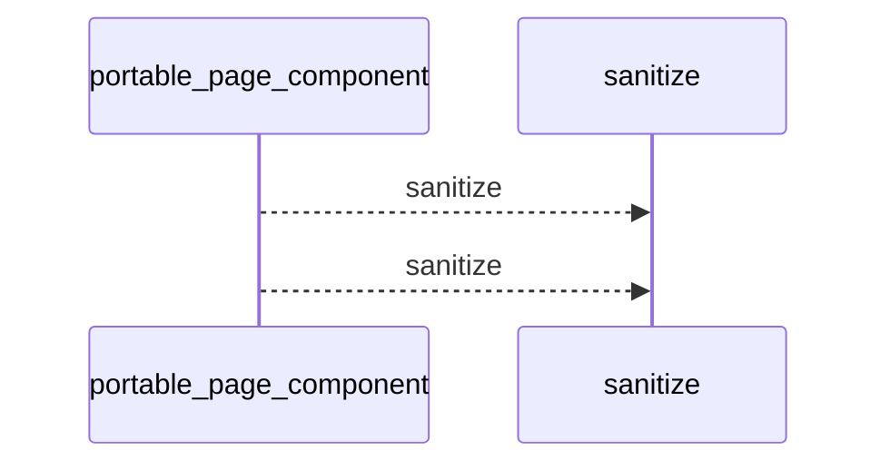
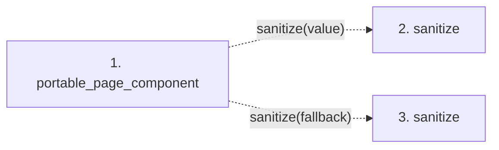

# portable_page_component

**Entry point:** `portable_page_component` (`api`)
**Source:** [validation](../modules/validation.md)
**Modules touched:** [validation](../modules/validation.md)

## Call sequence

<!-- Auto-generated from static call edges. Dashed arrows are external or unresolved calls. Reviewed runtime conditions and side effects belong in Behavior. -->

## Data flow

<!-- Auto-generated static analysis. Treat values and boundaries as best-effort hints, not runtime proof. -->

### Step data

| Step | Inputs | Reads | Writes | Returns |
|---|---|---|---|---|
| `portable_page_component` | `value: object`, `fallback: str` | - | - | `...` |
| `sanitize` | - | - | - | - |
| `sanitize` | - | - | - | - |

### Call data

| From | To | Line | Call |
|---|---|---:|---|
| portable_page_component | sanitize | 559 | `sanitize(value)` |
| portable_page_component | sanitize | 559 | `sanitize(fallback)` |

### Boundary effects

*No boundary effects detected.*

### Static analysis gaps

| Kind | Step | Target | Line |
|---|---|---|---:|
| unresolved_call | `portable_page_component` | `sanitize` | 559 |

## Behavior

This flow starts at `portable_page_component` and is classified as `api`. The generated call and data-flow sections are bounded static projections; runtime conditions and side effects require source-level confirmation.
