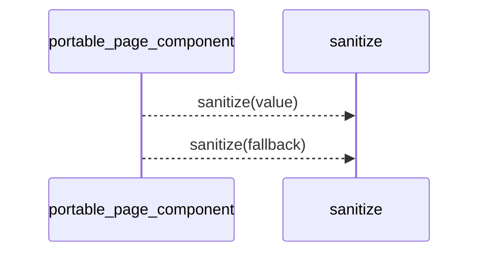
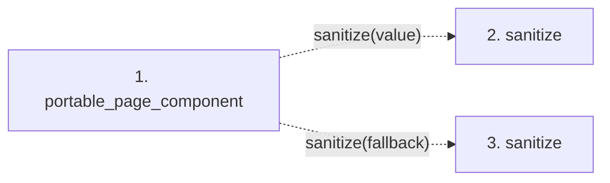

# portable_page_component

**Entry point:** `portable_page_component` (`api`)
**Source:** [validation](../modules/validation.md)
**Modules touched:** [validation](../modules/validation.md)

## Call sequence

> Static overview in presentation order, not runtime execution order. Arrows retain captured callers; representative internal continuations and boundary examples precede repeated helper detail.

<!-- Auto-generated from static call edges. Dashed arrows are external or unresolved calls. Reviewed runtime conditions and side effects belong in Behavior. -->

```mermaid
sequenceDiagram
    participant p0 as portable_page_component
    participant p1 as sanitize
    p0-->>p1: sanitize(value)
    p0-->>p1: sanitize(fallback)
```

> Call sequence diagram shows 2 of 2 interactions; 0 omitted to keep the visualization within the 30-interaction and generated-diagram limits, with uncertain identities omitted rather than inferred.

> Captured boundary calls: external 0 of 0 (0 omitted); unresolved 2 of 2 (0 omitted). These counts cover the captured static trace.
> Detailed flow queries retain their own coverage and limits; omitted paths may execute at runtime.

## Data flow

<!-- Auto-generated static analysis. Treat values and boundaries as best-effort hints, not runtime proof. -->

```mermaid
flowchart LR
    s1["1. portable_page_component"]
    s2["2. sanitize"]
    s3["3. sanitize"]
    s1 -. "sanitize(value)" .-> s2
    s1 -. "sanitize(fallback)" .-> s3
    click s1 "../modules/validation.md"
```

### Step data

| Step | Inputs | Reads | Writes | Returns |
|---|---|---|---|---|
| `portable_page_component` | `value: object`, `fallback: str` | - | - | `...` |
| `sanitize` | - | - | - | - |
| `sanitize` | - | - | - | - |

### Call data

| From | To | Line | Call |
|---|---|---:|---|
| portable_page_component | sanitize | 608 | `sanitize(value)` |
| portable_page_component | sanitize | 608 | `sanitize(fallback)` |

### Boundary effects

*No boundary effects detected.*

### Static analysis gaps

| Kind | Step | Target | Line |
|---|---|---|---:|
| unresolved_call | `portable_page_component` | `sanitize` | 608 |

## Behavior

This flow starts at `portable_page_component` and is classified as `api`. The generated call and data-flow sections are bounded static projections; runtime conditions and side effects require source-level confirmation.
