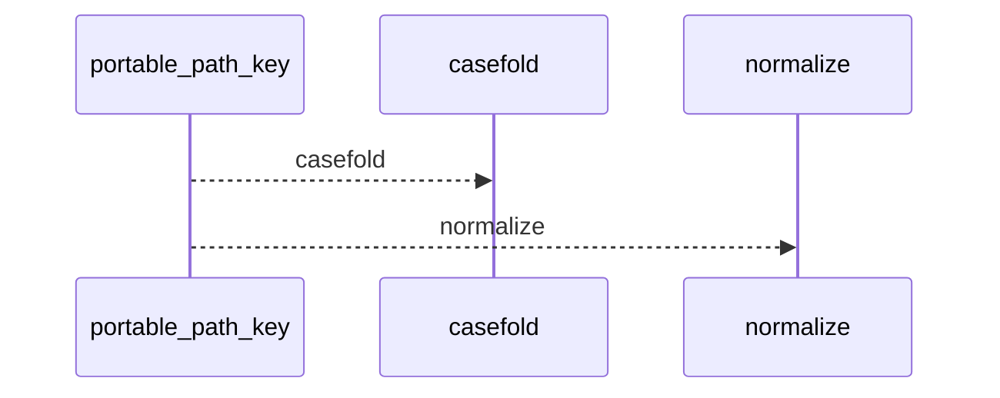
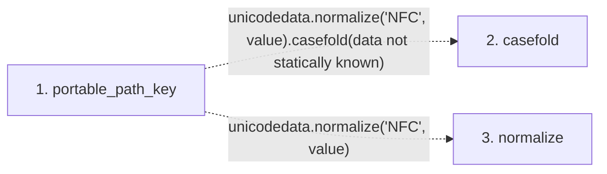

# portable_path_key

**Entry point:** `portable_path_key` (`api`)
**Source:** [validation](../modules/validation.md)
**Modules touched:** [validation](../modules/validation.md)

## Call sequence

<!-- Auto-generated from static call edges. Dashed arrows are external or unresolved calls. Reviewed runtime conditions and side effects belong in Behavior. -->

## Data flow

<!-- Auto-generated static analysis. Treat values and boundaries as best-effort hints, not runtime proof. -->

### Step data

| Step | Inputs | Reads | Writes | Returns |
|---|---|---|---|---|
| `portable_path_key` | `value: str` | - | - | `...` |
| `casefold` | - | - | - | - |
| `normalize` | - | - | - | - |

### Call data

| From | To | Line | Call |
|---|---|---:|---|
| portable_path_key | casefold | 412 | `unicodedata.normalize('NFC', value).casefold(data not statically known)` |
| portable_path_key | normalize | 412 | `unicodedata.normalize('NFC', value)` |

### Boundary effects

*No boundary effects detected.*

### Static analysis gaps

| Kind | Step | Target | Line |
|---|---|---|---:|
| external_call | `portable_path_key` | `unicodedata.normalize('NFC', value).casefold` | 412 |
| external_call | `portable_path_key` | `unicodedata.normalize` | 412 |

## Behavior

This flow starts at `portable_path_key` and is classified as `api`. The generated call and data-flow sections are bounded static projections; runtime conditions and side effects require source-level confirmation.
