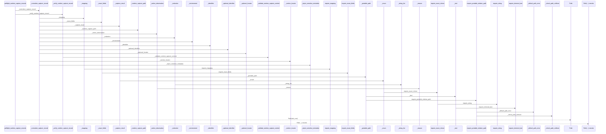
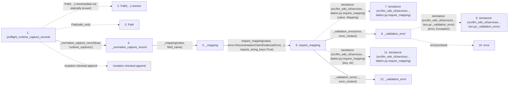

# preflight_runtime_capture_records

**Entry point:** `preflight_runtime_capture_records` (`api`)
**Source:** [documentation_claim_evidence](../modules/documentation_claim_evidence.md)
**Modules touched:** [documentation_claim_evidence](../modules/documentation_claim_evidence.md), [knowledge_evidence](../modules/knowledge_evidence.md), [validation](../modules/validation.md)

## Call sequence

> Static overview in presentation order, not runtime execution order. Arrows retain captured callers; representative internal continuations and boundary examples precede repeated helper detail.

<!-- Auto-generated from static call edges. Dashed arrows are external or unresolved calls. Reviewed runtime conditions and side effects belong in Behavior. -->

```mermaid
sequenceDiagram
    participant p0 as preflight_runtime_capture_records
    participant p1 as _normalize_capture_record
    participant p2 as _verify_runtime_capture_record
    participant p3 as _mapping
    participant p4 as _exact_fields
    participant p5 as _capture_result
    participant p6 as _runtime_capture_path
    participant p7 as _native_observation
    participant p8 as _redaction
    participant p9 as _environment
    participant p10 as _identifier
    participant p11 as _optional_identifier
    participant p12 as _optional_locator
    participant p13 as _validate_runtime_capture_content
    participant p14 as _section_locator
    participant p15 as _reject_sensitive_metadata
    participant p16 as require_mapping
    participant p17 as require_exact_fields
    participant p18 as _portable_path
    participant p19 as _enum
    participant p20 as _string_list
    participant p21 as _reason
    participant p22 as require_exact_choice
    participant p23 as _text
    participant p24 as require_portable_relative_path
    participant p25 as require_string
    participant p26 as require_trimmed_text
    participant p27 as _default_path_error
    participant p28 as _check_path_collision
    participant p29 as Path
    participant p30 as Path(…).resolve
    p0->>p1: _normalize_capture_record
    p0->>p2: _verify_runtime_capture_record
    p1->>p3: _mapping
    p1->>p4: _exact_fields
    p1->>p5: _capture_result
    p1->>p6: _runtime_capture_path
    p1->>p7: _native_observation
    p1->>p8: _redaction
    p1->>p9: _environment
    p1->>p10: _identifier
    p1->>p11: _optional_identifier
    p1->>p12: _optional_locator
    p2->>p13: _validate_runtime_capture_content
    p1->>p14: _section_locator
    p1->>p15: _reject_sensitive_metadata
    p3->>p16: require_mapping
    p4->>p17: require_exact_fields
    p6->>p18: _portable_path
    p5->>p19: _enum
    p8->>p20: _string_list
    p7->>p21: _reason
    p19->>p22: require_exact_choice
    p18->>p23: _text
    p18->>p24: require_portable_relative_path
    p22->>p25: require_string
    p23->>p26: require_trimmed_text
    p24->>p27: _default_path_error
    p24->>p28: _check_path_collision
    p0-->>p29: Path(wiki_root)
    p0-->>p30: Path(…).resolve
```

> Call sequence diagram shows 30 of 254 interactions; 224 omitted to keep the visualization within the 30-interaction and generated-diagram limits, with uncertain identities omitted rather than inferred.

> Captured boundary calls: external 1 of 73 (72 omitted); unresolved 1 of 54 (53 omitted). These counts cover the captured static trace.

Omitted captured detail, grouped by actual caller occurrence and target module:

| Caller | Parent step | Target module | Kind | Omitted interactions |
| --- | --- | --- | --- | --- |
| `src/llm_wiki_cli/services/validation.py:require_mapping` | 6 | - | external | 2 |
| `src/llm_wiki_cli/services/validation.py:require_mapping` | 6 | [src/llm_wiki_cli/services/validation.py](../modules/validation.md) | internal | 3 |
| `src/llm_wiki_cli/services/validation.py:_validation_error` | 8 | - | external | 1 |
| `src/llm_wiki_cli/services/validation.py:_validation_error` | 8 | - | unresolved | 1 |
| `src/llm_wiki_cli/services/validation.py:require_mapping` | 6 | - | unresolved | 1 |
| `src/llm_wiki_cli/services/documentation_claim_evidence.py:_mapping` | 5 | [src/llm_wiki_cli/services/documentation_claim_evidence.py](../modules/documentation_claim_evidence.md) | internal | 1 |
| `src/llm_wiki_cli/services/validation.py:require_exact_fields` | 17 | - | external | 9 |
| `src/llm_wiki_cli/services/validation.py:require_exact_fields` | 17 | [src/llm_wiki_cli/services/validation.py](../modules/validation.md) | internal | 1 |
> Omission summary shows 8 of 75 groups; 67 further groups are not expanded here. Counts above include all omitted interactions.
> Detailed flow queries retain their own coverage and limits; omitted paths may execute at runtime.

> Trace truncated at the depth limit; deeper calls are omitted.

## Data flow

<!-- Auto-generated static analysis. Treat values and boundaries as best-effort hints, not runtime proof. -->

### Analysis coverage

**Effect analysis partially available.** Flow assembly and source effect analysis are separate; empty observations do not prove an empty handler body.

Source steps: 128; effect analysis evaluated: 71, partial: 4, unavailable: 53. Counts include steps omitted from the displayed trace.

Collector observations for 75 source steps with known totals: observed: 330, emitted: 316, omitted: 14. Unavailable totals are excluded.

- Callable record unavailable for one or more source steps; those steps have no represented callable body.
- Effect collector omitted observations before flow assembly; displayed effects are partial.
- Effect collector totals unavailable; observed counts cover captured records only.

| Step | Callable record | Effect analysis | Collector totals | Observed | Emitted | Omitted |
|---|---|---|---|---:|---:|---:|
| `preflight_runtime_capture_records` | `available` | `evaluated` | `available` | `4` | `4` | `0` |
| `Path(…).resolve` | `not_applicable` | `not_applicable` | `not_applicable` | — | — | — |
| `Path` | `not_applicable` | `not_applicable` | `not_applicable` | — | — | — |
| `_normalize_capture_record` | `available` | `evaluated` | `available` | `9` | `9` | `0` |
| `_mapping` | `available` | `evaluated` | `available` | `3` | `3` | `0` |
| `require_mapping` | `available` | `evaluated` | `available` | `9` | `9` | `0` |
| `isinstance (src/llm_wiki_cli/services…dation.py:require_mapping)` | `not_applicable` | `not_applicable` | `not_applicable` | — | — | — |
| `_validation_error` | `available` | `evaluated` | `available` | `3` | `3` | `0` |
| `isinstance (src/llm_wiki_cli/services…tion.py:_validation_error)` | `not_applicable` | `not_applicable` | `not_applicable` | — | — | — |
| `error` | `not_applicable` | `not_applicable` | `not_applicable` | — | — | — |
| `isinstance (src/llm_wiki_cli/services…dation.py:require_mapping)` | `not_applicable` | `not_applicable` | `not_applicable` | — | — | — |
| `_validation_error` | `available` | `evaluated` | `available` | `3` | `3` | `0` |

```mermaid
flowchart LR
    s1["1. preflight_runtime_capture_records"]
    s2["2. Path(…).resolve"]
    s3["3. Path"]
    s4["4. _normalize_capture_record"]
    s5["5. _mapping"]
    s6["6. require_mapping"]
    s7["7. isinstance (src/llm_wiki_cli/services…dation.py:require_mapping)"]
    s8["8. _validation_error"]
    s9["9. isinstance (src/llm_wiki_cli/services…tion.py:_validation_error)"]
    s10["10. error"]
    s11["11. isinstance (src/llm_wiki_cli/services…dation.py:require_mapping)"]
    s12["12. _validation_error"]
    s1 -. "Path(…).resolve(data not statically known)" .-> s2
    s1 -. "Path(wiki_root)" .-> s3
    s1 -->|"_normalize_capture_record(raw, 'runtime_captures')"| s4
    s4 -->|"_mapping(value, field_name)"| s5
    s5 -->|"require_mapping(value, error=DocumentationClaimEvidenceError(...), require_string_keys=True)"| s6
    s6 -. "isinstance (src/llm_wiki_cli/services…dation.py:require_mapping)(value, Mapping)" .-> s7
    s6 -->|"_validation_error(error, error_context)"| s8
    s8 -. "isinstance (src/llm_wiki_cli/services…tion.py:_validation_error)(error, Exception)" .-> s9
    s8 -. "error(context)" .-> s10
    s6 -. "isinstance (src/llm_wiki_cli/services…dation.py:require_mapping)(key, str)" .-> s11
    s6 -->|"_validation_error(..., error_context)"| s12
    b0["mutation checked.append"]
    s1 -. "mutation checked.append" .-> b0
    click s1 "../modules/documentation_claim_evidence.md"
    click s4 "../modules/documentation_claim_evidence.md"
    click s5 "../modules/documentation_claim_evidence.md"
    click s6 "../modules/validation.md"
    click s8 "../modules/validation.md"
    click s12 "../modules/validation.md"
    classDef boundary stroke:#b45309,stroke-dasharray: 4 2
    class b0 boundary
```

### Step data

| Step | Inputs | Reads | Writes | Returns |
|---|---|---|---|---|
| `preflight_runtime_capture_records` | `records: Iterable[Mapping[str, Any]]`, `wiki_root: str \| Path` | - | - | `tuple(...)` |
| `Path(…).resolve` | - | - | - | - |
| `Path` | - | - | - | - |
| `_normalize_capture_record` | `value: object`, `field_name: str` | `_CAPTURE_FIELDS`, `_CAPTURE_REQUIRED`, `RUNTIME_CAPTURE_SCHEMA_VERSION`, `RUNTIME_CAPTURE_SCHEMA_VERSION`, `_UNINSPECTED_MEDIA_SUFFIXES`, `_UNINSPECTED_MEDIA_LIMITATIONS` | - | `normalized` |
| `_mapping` | `value: object`, `field_name: str` | - | - | `require_mapping(...)` |
| `require_mapping` | `value: object`, `error: _ValidationError`, `error_context: str`, `require_string_keys: bool`, `key_error: _ValidationError \| None`, `require_utf8_keys: bool`, `utf8_key_error: _ValidationError \| None` | `Mapping` | - | `value` |
| `isinstance (src/llm_wiki_cli/services…dation.py:require_mapping)` | - | - | - | - |
| `_validation_error` | `error: _ValidationError`, `context: str` | - | - | `...` |
| `isinstance (src/llm_wiki_cli/services…tion.py:_validation_error)` | - | - | - | - |
| `error` | - | - | - | - |
| `isinstance (src/llm_wiki_cli/services…dation.py:require_mapping)` | - | - | - | - |
| `_validation_error` | `error: _ValidationError`, `context: str` | - | - | `...` |

### Call data

| From | To | Line | Call |
|---|---|---:|---|
| preflight_runtime_capture_records | Path(…).resolve | 537 | `Path(wiki_root).resolve(data not statically known)` |
| preflight_runtime_capture_records | Path | 537 | `Path(wiki_root)` |
| preflight_runtime_capture_records | _normalize_capture_record | 540 | `_normalize_capture_record(raw, 'runtime_captures')` |
| _normalize_capture_record | _mapping | 650 | `_mapping(value, field_name)` |
| _mapping | require_mapping | 1423 | `require_mapping(value, error=DocumentationClaimEvidenceError(...), require_string_keys=True)` |
| require_mapping | isinstance (src/llm_wiki_cli/services…dation.py:require_mapping) | 783 | `isinstance(value, Mapping)` |
| require_mapping | _validation_error | 784 | `_validation_error(error, error_context)` |
| _validation_error | isinstance (src/llm_wiki_cli/services…tion.py:_validation_error) | 95 | `isinstance(error, Exception)` |
| _validation_error | error | 95 | `error(context)` |
| require_mapping | isinstance (src/llm_wiki_cli/services…dation.py:require_mapping) | 787 | `isinstance(key, str)` |
| require_mapping | _validation_error | 788 | `_validation_error(..., error_context)` |

### Boundary effects

| Kind | Target | Step | Line |
|---|---|---|---:|
| mutation | `checked.append` | `preflight_runtime_capture_records` | 542 |

### Static analysis gaps

| Kind | Step | Target | Line |
|---|---|---|---:|
| unresolved_call | `preflight_runtime_capture_records` | `Path(wiki_root).resolve` | 537 |
| external_call | `require_mapping` | `isinstance` | 783 |
| external_call | `_validation_error` | `isinstance` | 95 |
| unresolved_call | `_validation_error` | `error` | 95 |
| external_call | `require_mapping` | `isinstance` | 787 |
| step_limit | `preflight_runtime_capture_records` | `first 12 steps` | 0 |
| truncated_flow | `preflight_runtime_capture_records` | `depth limit` | 0 |

## Behavior

This flow starts at `preflight_runtime_capture_records` and is classified as `api`. The generated call and data-flow sections are bounded static projections; runtime conditions and side effects require source-level confirmation.
