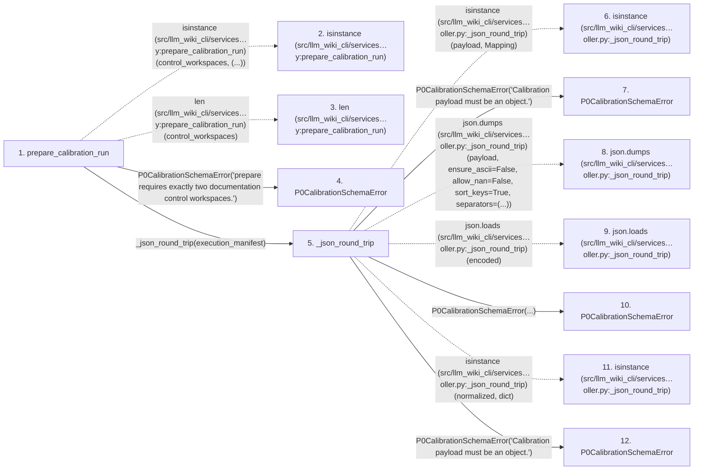

# prepare_calibration_run

**Entry point:** `prepare_calibration_run` (`api`)
**Source:** [controller](../modules/controller.md)
**Modules touched:** [broker](../modules/broker.md), [calibration_contracts](../modules/calibration_contracts.md), [controller](../modules/controller.md), [documentation_policy](../modules/documentation_policy.md), and 3 more

**Complete modules touched:**

- [broker](../modules/broker.md)
- [calibration_contracts](../modules/calibration_contracts.md)
- [controller](../modules/controller.md)
- [documentation_policy](../modules/documentation_policy.md)
- [filesystem_guard](../modules/filesystem_guard.md)
- [protected_artifacts](../modules/protected_artifacts.md)
- [validation](../modules/validation.md)

## Call sequence

```mermaid
sequenceDiagram
    participant p0 as prepare_calibration_run
    participant p1 as isinstance (src/llm_wiki_cli/services…y:prepare_calibration_run)
    participant p2 as len (src/llm_wiki_cli/services…y:prepare_calibration_run)
    participant p3 as P0CalibrationSchemaError
    participant p4 as _json_round_trip
    participant p5 as isinstance (src/llm_wiki_cli/services…oller.py:_json_round_trip)
    participant p6 as json.dumps (src/llm_wiki_cli/services…oller.py:_json_round_trip)
    participant p7 as json.loads (src/llm_wiki_cli/services…oller.py:_json_round_trip)
    participant p8 as _validate_execution_manifest
    participant p9 as _require_exact_fields
    participant p10 as require_exact_fields
    participant p11 as isinstance (src/llm_wiki_cli/services…n.py:require_exact_fields)
    participant p12 as str (src/llm_wiki_cli/services…n.py:require_exact_fields)
    participant p13 as set (src/llm_wiki_cli/services…n.py:require_exact_fields)
    participant p14 as tuple (src/llm_wiki_cli/services…n.py:require_exact_fields)
    participant p15 as sorted (src/llm_wiki_cli/services…n.py:require_exact_fields)
    participant p16 as invalid_error
    participant p17 as error_factory
    participant p18 as label.title (src/llm_wiki_cli/services….py:_require_exact_fields)
    participant p19 as AssertionError (src/llm_wiki_cli/services….py:_require_exact_fields)
    p0-->>p1: isinstance (src/llm_wiki_cli/services…y:prepare_calibration_run)
    p0-->>p2: len (src/llm_wiki_cli/services…y:prepare_calibration_run)
    p0->>p3: P0CalibrationSchemaError
    p0->>p4: _json_round_trip
    p4-->>p5: isinstance (src/llm_wiki_cli/services…oller.py:_json_round_trip)
    p4->>p3: P0CalibrationSchemaError
    p4-->>p6: json.dumps (src/llm_wiki_cli/services…oller.py:_json_round_trip)
    p4-->>p7: json.loads (src/llm_wiki_cli/services…oller.py:_json_round_trip)
    p4->>p3: P0CalibrationSchemaError
    p4-->>p5: isinstance (src/llm_wiki_cli/services…oller.py:_json_round_trip)
    p4->>p3: P0CalibrationSchemaError
    p0->>p8: _validate_execution_manifest
    p8->>p9: _require_exact_fields
    p9->>p10: require_exact_fields
    p10-->>p11: isinstance (src/llm_wiki_cli/services…n.py:require_exact_fields)
    p10-->>p12: str (src/llm_wiki_cli/services…n.py:require_exact_fields)
    p10-->>p13: set (src/llm_wiki_cli/services…n.py:require_exact_fields)
    p10-->>p13: set (src/llm_wiki_cli/services…n.py:require_exact_fields)
    p10-->>p13: set (src/llm_wiki_cli/services…n.py:require_exact_fields)
    p10-->>p14: tuple (src/llm_wiki_cli/services…n.py:require_exact_fields)
    p10-->>p15: sorted (src/llm_wiki_cli/services…n.py:require_exact_fields)
    p10-->>p14: tuple (src/llm_wiki_cli/services…n.py:require_exact_fields)
    p10-->>p15: sorted (src/llm_wiki_cli/services…n.py:require_exact_fields)
    p10-->>p16: invalid_error
    p10-->>p17: error_factory
    p9->>p3: P0CalibrationSchemaError
    p9-->>p18: label.title (src/llm_wiki_cli/services….py:_require_exact_fields)
    p9-->>p19: AssertionError (src/llm_wiki_cli/services….py:_require_exact_fields)
    p9-->>p19: AssertionError (src/llm_wiki_cli/services….py:_require_exact_fields)
    p9->>p3: P0CalibrationSchemaError
```

<!-- Auto-generated from static call edges. Dashed arrows are external or unresolved calls. Reviewed runtime conditions and side effects belong in Behavior. -->

> Call sequence diagram shows 30 of 1296 interactions; 1266 omitted to keep the visualization within the 30-interaction and generated-diagram limits.

> Trace truncated at the depth limit; deeper calls are omitted.

## Data flow

<!-- Auto-generated static analysis. Treat values and boundaries as best-effort hints, not runtime proof. -->

### Step data

| Step | Inputs | Reads | Writes | Returns |
|---|---|---|---|---|
| `prepare_calibration_run` | `root: str \| Path`, `control_workspaces: Sequence[str \| Path]`, `execution_manifest: Mapping[str, Any]` | `_MAX_BUNDLE_BYTES`, `_MAX_BUNDLE_BYTES`, `P0_CALIBRATION_RUNTIME_BINDINGS_SCHEMA_VERSION`, `P0_CALIBRATION_RUN_SCHEMA_VERSION`, `P0_CALIBRATION_DECISION_SCOPE`, `CALIBRATION_ROLES`, `_ZERO_HASH`, `ProtectedArtifactError` | - | `_commit_transition(...)` |
| `isinstance (src/llm_wiki_cli/services…y:prepare_calibration_run)` | - | - | - | - |
| `len (src/llm_wiki_cli/services…y:prepare_calibration_run)` | - | - | - | - |
| `P0CalibrationSchemaError` | - | - | - | - |
| `_json_round_trip` | `payload: Mapping[str, Any]` | `Mapping` | - | `normalized` |
| `isinstance (src/llm_wiki_cli/services…oller.py:_json_round_trip)` | - | - | - | - |
| `P0CalibrationSchemaError` | - | - | - | - |
| `json.dumps (src/llm_wiki_cli/services…oller.py:_json_round_trip)` | - | - | - | - |
| `json.loads (src/llm_wiki_cli/services…oller.py:_json_round_trip)` | - | - | - | - |
| `P0CalibrationSchemaError` | - | - | - | - |
| `isinstance (src/llm_wiki_cli/services…oller.py:_json_round_trip)` | - | - | - | - |
| `P0CalibrationSchemaError` | - | - | - | - |

### Call data

| From | To | Line | Call |
|---|---|---:|---|
| prepare_calibration_run | isinstance (src/llm_wiki_cli/services…y:prepare_calibration_run) | 508 | `isinstance(control_workspaces, (...))` |
| prepare_calibration_run | len (src/llm_wiki_cli/services…y:prepare_calibration_run) | 508 | `len(control_workspaces)` |
| prepare_calibration_run | P0CalibrationSchemaError | 509 | `P0CalibrationSchemaError('prepare requires exactly two documentation control workspaces.')` |
| prepare_calibration_run | _json_round_trip | 512 | `_json_round_trip(execution_manifest)` |
| _json_round_trip | isinstance (src/llm_wiki_cli/services…oller.py:_json_round_trip) | 6865 | `isinstance(payload, Mapping)` |
| _json_round_trip | P0CalibrationSchemaError | 6866 | `P0CalibrationSchemaError('Calibration payload must be an object.')` |
| _json_round_trip | json.dumps (src/llm_wiki_cli/services…oller.py:_json_round_trip) | 6868 | `json.dumps(payload, ensure_ascii=False, allow_nan=False, sort_keys=True, separators=(...))` |
| _json_round_trip | json.loads (src/llm_wiki_cli/services…oller.py:_json_round_trip) | 6875 | `json.loads(encoded)` |
| _json_round_trip | P0CalibrationSchemaError | 6877 | `P0CalibrationSchemaError(...)` |
| _json_round_trip | isinstance (src/llm_wiki_cli/services…oller.py:_json_round_trip) | 6880 | `isinstance(normalized, dict)` |
| _json_round_trip | P0CalibrationSchemaError | 6881 | `P0CalibrationSchemaError('Calibration payload must be an object.')` |

### Boundary effects

*No boundary effects detected.*

### Static analysis gaps

| Kind | Step | Target | Line |
|---|---|---|---:|
| external_call | `prepare_calibration_run` | `isinstance` | 508 |
| external_call | `_json_round_trip` | `isinstance` | 6865 |
| external_call | `_json_round_trip` | `json.dumps` | 6868 |
| external_call | `_json_round_trip` | `json.loads` | 6875 |
| external_call | `_json_round_trip` | `isinstance` | 6880 |
| step_limit | `prepare_calibration_run` | `first 12 steps` | 0 |
| truncated_flow | `prepare_calibration_run` | `depth limit` | 0 |

## Behavior

This flow starts at `prepare_calibration_run` and is classified as `api`. The generated call and data-flow sections are bounded static projections; runtime conditions and side effects require source-level confirmation.
