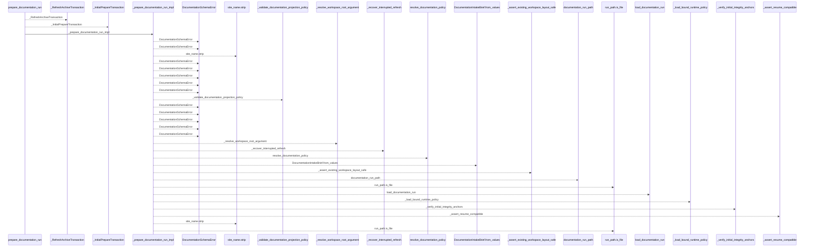
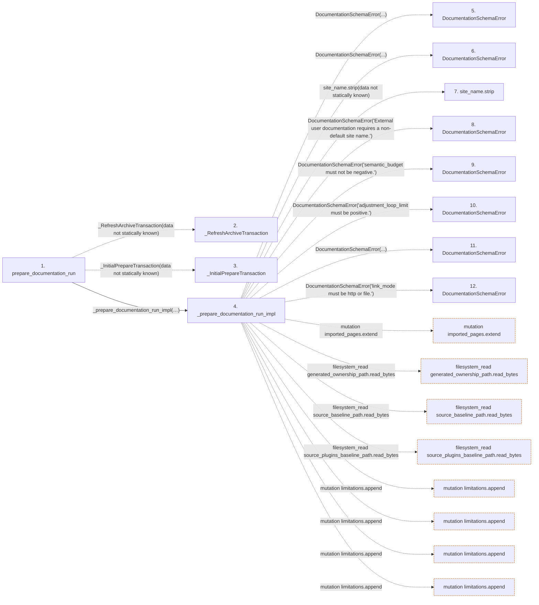

# prepare_documentation_run

**Entry point:** `prepare_documentation_run` (`api`)
**Source:** [prepare](../modules/prepare.md)
**Modules touched:** [api_contracts](../modules/api_contracts.md), [bootstrap_runtime](../modules/bootstrap_runtime.md), [bootstrap_service](../modules/bootstrap_service.md), [common](../modules/common.md), and 31 more

**Complete modules touched:**

- [api_contracts](../modules/api_contracts.md)
- [bootstrap_runtime](../modules/bootstrap_runtime.md)
- [bootstrap_service](../modules/bootstrap_service.md)
- [common](../modules/common.md)
- [data_flow](../modules/data_flow.md)
- [documentation_native](../modules/documentation_native.md)
- [documentation_wiki_input](../modules/documentation_wiki_input.md)
- [entrypoints](../modules/entrypoints.md)
- [extraction_service](../modules/extraction_service.md)
- [filesystem_guard](../modules/filesystem_guard.md)
- [imports](../modules/imports.md)
- [infrastructure_inventory](../modules/infrastructure_inventory.md)
- [infrastructure_sync](../modules/infrastructure_sync.md)
- [io](../modules/io.md)
- [knowledge_artifacts](../modules/knowledge_artifacts.md)
- [knowledge_envelope](../modules/knowledge_envelope.md)
- [knowledge_evidence](../modules/knowledge_evidence.md)
- [knowledge_freshness](../modules/knowledge_freshness.md)
- [knowledge_governance](../modules/knowledge_governance.md)
- [knowledge_observability](../modules/knowledge_observability.md)
- [knowledge_orchestration](../modules/knowledge_orchestration.md)
- [knowledge_reuse](../modules/knowledge_reuse.md)
- [module_maps](../modules/module_maps.md)
- [paths](../modules/paths.md)
- [prepare](../modules/prepare.md)
- [relationships](../modules/relationships.md)
- [services_dependencies](../modules/services_dependencies.md)
- [source_selection](../modules/source_selection.md)
- [source_snapshot](../modules/source_snapshot.md)
- [sync_manifest](../modules/sync_manifest.md)
- [validation](../modules/validation.md)
- [wiki_lifecycle](../modules/wiki_lifecycle.md)
- [wiki_media](../modules/wiki_media.md)
- [wiki_surface](../modules/wiki_surface.md)
- [wiki_surface_index](../modules/wiki_surface_index.md)

## Call sequence

<!-- Auto-generated from static call edges. Dashed arrows are external or unresolved calls. Reviewed runtime conditions and side effects belong in Behavior. -->

> Call sequence diagram shows 30 of 1387 interactions; 1357 omitted to keep the visualization within the 30-interaction and generated-diagram limits.

> Trace truncated at the depth limit; deeper calls are omitted.

## Data flow

<!-- Auto-generated static analysis. Treat values and boundaries as best-effort hints, not runtime proof. -->

### Step data

| Step | Inputs | Reads | Writes | Returns |
|---|---|---|---|---|
| `prepare_documentation_run` | `workspace: str \| Path`, `baseline_strategy: str`, `source_root: str \| Path \| None`, `source_selection: str \| Path \| None`, `input_wiki_root: str \| Path \| None`, `freshness_policy: str`, `site_name: str`, `audiences: Iterable[str] \| None` | - | - | `run` |
| `_RefreshArchiveTransaction` | - | - | - | - |
| `_InitialPrepareTransaction` | - | - | - | - |
| `_prepare_documentation_run_impl` | `workspace: str \| Path`, `baseline_strategy: str`, `source_root: str \| Path \| None`, `source_selection: str \| Path \| None`, `input_wiki_root: str \| Path \| None`, `freshness_policy: str`, `site_name: str`, `audiences: Iterable[str] \| None` | - | `integrity_anchors[...]`, `integrity_anchors[...]` | `existing`, `run` |
| `DocumentationSchemaError` | - | - | - | - |
| `DocumentationSchemaError` | - | - | - | - |
| `site_name.strip` | - | - | - | - |
| `DocumentationSchemaError` | - | - | - | - |
| `DocumentationSchemaError` | - | - | - | - |
| `DocumentationSchemaError` | - | - | - | - |
| `DocumentationSchemaError` | - | - | - | - |
| `DocumentationSchemaError` | - | - | - | - |

### Call data

| From | To | Line | Call |
|---|---|---:|---|
| prepare_documentation_run | _RefreshArchiveTransaction | 40 | `_RefreshArchiveTransaction(data not statically known)` |
| prepare_documentation_run | _InitialPrepareTransaction | 41 | `_InitialPrepareTransaction(data not statically known)` |
| prepare_documentation_run | _prepare_documentation_run_impl | 43 | `_prepare_documentation_run_impl(workspace, baseline_strategy=baseline_strategy, source_root=source_root, source_selection=source_selection, input_wiki_root=input_wiki_root, freshness_policy=freshness_policy, site_name=site_name, audiences=audiences, project_purpose=project_purpose, audience_intent=audience_intent, live_service_url=live_service_url, live_service_access_mode=live_service_access_mode, live_service_observation_allowed=live_service_observation_allowed, helper_cache_root=helper_cache_root, capture_root=capture_root, trust_source_plugins=trust_source_plugins, semantic_budget=semantic_budget, adjustment_loop_limit=adjustment_loop_limit, distribution_format=distribution_format, link_mode=link_mode, knowledge_mode=knowledge_mode, knowledge_public_repository_identity=knowledge_public_repository_identity, refresh=refresh, refresh_transaction=refresh_transaction, initial_prepare_transaction=initial_prepare_transaction)` |
| _prepare_documentation_run_impl | DocumentationSchemaError | 135 | `DocumentationSchemaError(...)` |
| _prepare_documentation_run_impl | DocumentationSchemaError | 139 | `DocumentationSchemaError(...)` |
| _prepare_documentation_run_impl | site_name.strip | 142 | `site_name.strip(data not statically known)` |
| _prepare_documentation_run_impl | DocumentationSchemaError | 143 | `DocumentationSchemaError('External user documentation requires a non-default site name.')` |
| _prepare_documentation_run_impl | DocumentationSchemaError | 147 | `DocumentationSchemaError('semantic_budget must not be negative.')` |
| _prepare_documentation_run_impl | DocumentationSchemaError | 149 | `DocumentationSchemaError('adjustment_loop_limit must be positive.')` |
| _prepare_documentation_run_impl | DocumentationSchemaError | 151 | `DocumentationSchemaError(...)` |
| _prepare_documentation_run_impl | DocumentationSchemaError | 155 | `DocumentationSchemaError('link_mode must be http or file.')` |

### Boundary effects

| Kind | Target | Step | Line |
|---|---|---|---:|
| mutation | `imported_pages.extend` | `_prepare_documentation_run_impl` | 478 |
| filesystem_read | `generated_ownership_path.read_bytes` | `_prepare_documentation_run_impl` | 549 |
| filesystem_read | `source_baseline_path.read_bytes` | `_prepare_documentation_run_impl` | 553 |
| filesystem_read | `source_plugins_baseline_path.read_bytes` | `_prepare_documentation_run_impl` | 557 |
| mutation | `limitations.append` | `_prepare_documentation_run_impl` | 605 |
| mutation | `limitations.append` | `_prepare_documentation_run_impl` | 607 |
| mutation | `limitations.append` | `_prepare_documentation_run_impl` | 609 |
| mutation | `limitations.append` | `_prepare_documentation_run_impl` | 623 |

### Static analysis gaps

| Kind | Step | Target | Line |
|---|---|---|---:|
| unresolved_call | `prepare_documentation_run` | `_RefreshArchiveTransaction` | 40 |
| unresolved_call | `prepare_documentation_run` | `_InitialPrepareTransaction` | 41 |
| unresolved_call | `_prepare_documentation_run_impl` | `DocumentationSchemaError` | 135 |
| unresolved_call | `_prepare_documentation_run_impl` | `DocumentationSchemaError` | 139 |
| unresolved_call | `_prepare_documentation_run_impl` | `site_name.strip` | 142 |
| unresolved_call | `_prepare_documentation_run_impl` | `DocumentationSchemaError` | 143 |
| unresolved_call | `_prepare_documentation_run_impl` | `DocumentationSchemaError` | 147 |
| unresolved_call | `_prepare_documentation_run_impl` | `DocumentationSchemaError` | 149 |
| unresolved_call | `_prepare_documentation_run_impl` | `DocumentationSchemaError` | 151 |
| unresolved_call | `_prepare_documentation_run_impl` | `DocumentationSchemaError` | 155 |
| step_limit | `prepare_documentation_run` | `first 12 steps` | 0 |
| truncated_flow | `prepare_documentation_run` | `depth limit` | 0 |

## Behavior

This flow starts at `prepare_documentation_run` and is classified as `api`. The generated call and data-flow sections are bounded static projections; runtime conditions and side effects require source-level confirmation.
