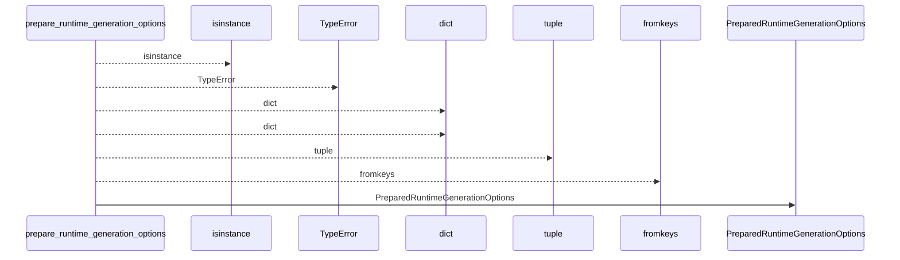
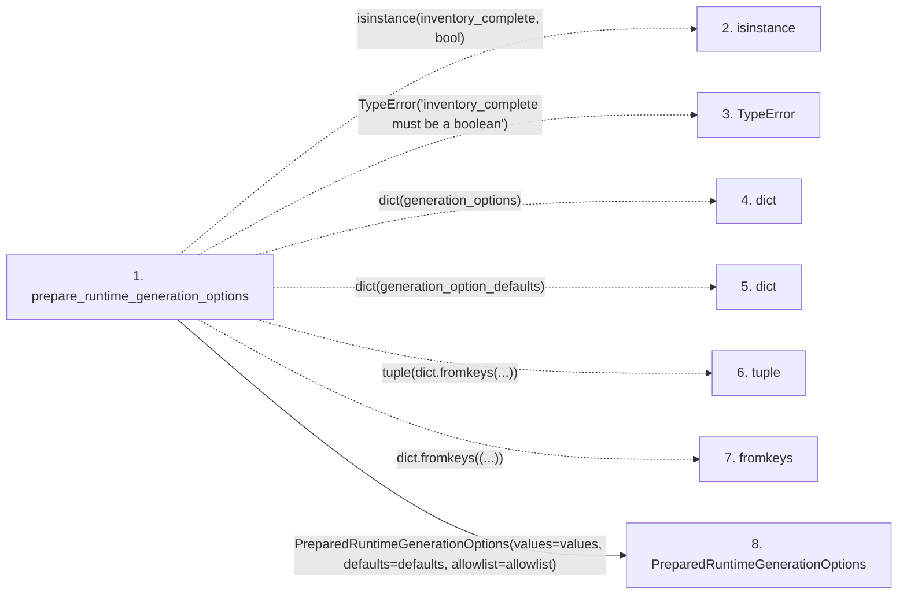

# prepare_runtime_generation_options

**Entry point:** `prepare_runtime_generation_options` (`api`)
**Source:** [knowledge_orchestration](../modules/knowledge_orchestration.md)
**Modules touched:** [knowledge_orchestration](../modules/knowledge_orchestration.md)

## Call sequence

<!-- Auto-generated from static call edges. Dashed arrows are external or unresolved calls. Reviewed runtime conditions and side effects belong in Behavior. -->

## Data flow

<!-- Auto-generated static analysis. Treat values and boundaries as best-effort hints, not runtime proof. -->

### Step data

| Step | Inputs | Reads | Writes | Returns |
|---|---|---|---|---|
| `prepare_runtime_generation_options` | `generation_options: Mapping[str, Any]`, `generation_option_defaults: Mapping[str, Any]`, `generation_option_allowlist: Sequence[str]`, `inventory_complete: bool` | - | `values[...]`, `defaults[...]` | `PreparedRuntimeGenerationOptions(...)` |
| `isinstance` | - | - | - | - |
| `TypeError` | - | - | - | - |
| `dict` | - | - | - | - |
| `dict` | - | - | - | - |
| `tuple` | - | - | - | - |
| `fromkeys` | - | - | - | - |
| `PreparedRuntimeGenerationOptions` | - | - | - | - |

### Call data

| From | To | Line | Call |
|---|---|---:|---|
| prepare_runtime_generation_options | isinstance | 219 | `isinstance(inventory_complete, bool)` |
| prepare_runtime_generation_options | TypeError | 220 | `TypeError('inventory_complete must be a boolean')` |
| prepare_runtime_generation_options | dict | 221 | `dict(generation_options)` |
| prepare_runtime_generation_options | dict | 223 | `dict(generation_option_defaults)` |
| prepare_runtime_generation_options | tuple | 225 | `tuple(dict.fromkeys(...))` |
| prepare_runtime_generation_options | fromkeys | 226 | `dict.fromkeys((...))` |
| prepare_runtime_generation_options | PreparedRuntimeGenerationOptions | 228 | `PreparedRuntimeGenerationOptions(values=values, defaults=defaults, allowlist=allowlist)` |

### Boundary effects

*No boundary effects detected.*

### Static analysis gaps

| Kind | Step | Target | Line |
|---|---|---|---:|
| unresolved_call | `prepare_runtime_generation_options` | `isinstance` | 219 |
| unresolved_call | `prepare_runtime_generation_options` | `TypeError` | 220 |
| unresolved_call | `prepare_runtime_generation_options` | `dict.fromkeys` | 226 |

## Behavior

This flow starts at `prepare_runtime_generation_options` and is classified as `api`. The generated call and data-flow sections are bounded static projections; runtime conditions and side effects require source-level confirmation.
