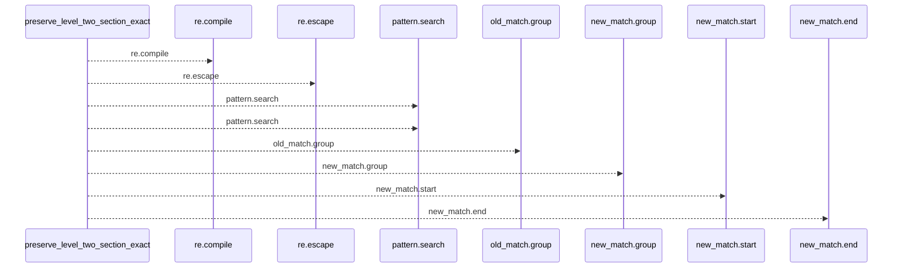
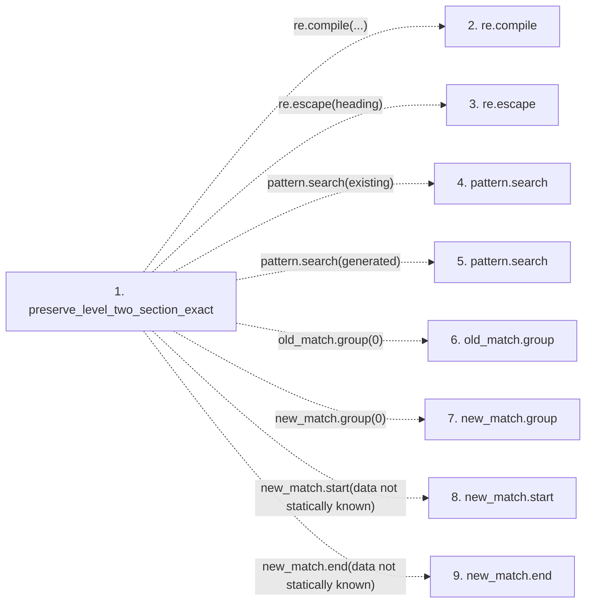

# preserve_level_two_section_exact

**Entry point:** `preserve_level_two_section_exact` (`api`)
**Source:** [markdown_sections](../modules/markdown_sections.md)
**Modules touched:** [markdown_sections](../modules/markdown_sections.md)

## Call sequence

<!-- Auto-generated from static call edges. Dashed arrows are external or unresolved calls. Reviewed runtime conditions and side effects belong in Behavior. -->

## Data flow

<!-- Auto-generated static analysis. Treat values and boundaries as best-effort hints, not runtime proof. -->

### Step data

| Step | Inputs | Reads | Writes | Returns |
|---|---|---|---|---|
| `preserve_level_two_section_exact` | `existing: str`, `generated: str`, `heading: str` | - | - | `generated`, `generated`, `...` |
| `re.compile` | - | - | - | - |
| `re.escape` | - | - | - | - |
| `pattern.search` | - | - | - | - |
| `pattern.search` | - | - | - | - |
| `old_match.group` | - | - | - | - |
| `new_match.group` | - | - | - | - |
| `new_match.start` | - | - | - | - |
| `new_match.end` | - | - | - | - |

### Call data

| From | To | Line | Call |
|---|---|---:|---|
| preserve_level_two_section_exact | re.compile | 720 | `re.compile(...)` |
| preserve_level_two_section_exact | re.escape | 721 | `re.escape(heading)` |
| preserve_level_two_section_exact | pattern.search | 724 | `pattern.search(existing)` |
| preserve_level_two_section_exact | pattern.search | 725 | `pattern.search(generated)` |
| preserve_level_two_section_exact | old_match.group | 728 | `old_match.group(0)` |
| preserve_level_two_section_exact | new_match.group | 729 | `new_match.group(0)` |
| preserve_level_two_section_exact | new_match.start | 732 | `new_match.start(data not statically known)` |
| preserve_level_two_section_exact | new_match.end | 734 | `new_match.end(data not statically known)` |

### Boundary effects

*No boundary effects detected.*

### Static analysis gaps

| Kind | Step | Target | Line |
|---|---|---|---:|
| external_call | `preserve_level_two_section_exact` | `re.compile` | 720 |
| external_call | `preserve_level_two_section_exact` | `re.escape` | 721 |
| unresolved_call | `preserve_level_two_section_exact` | `pattern.search` | 724 |
| unresolved_call | `preserve_level_two_section_exact` | `pattern.search` | 725 |
| unresolved_call | `preserve_level_two_section_exact` | `old_match.group` | 728 |
| unresolved_call | `preserve_level_two_section_exact` | `new_match.group` | 729 |
| unresolved_call | `preserve_level_two_section_exact` | `new_match.start` | 732 |
| unresolved_call | `preserve_level_two_section_exact` | `new_match.end` | 734 |

## Behavior

This flow starts at `preserve_level_two_section_exact` and is classified as `api`. The generated call and data-flow sections are bounded static projections; runtime conditions and side effects require source-level confirmation.
