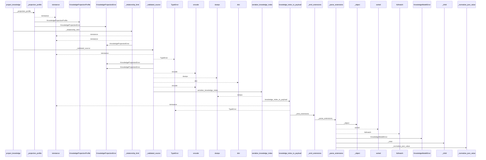
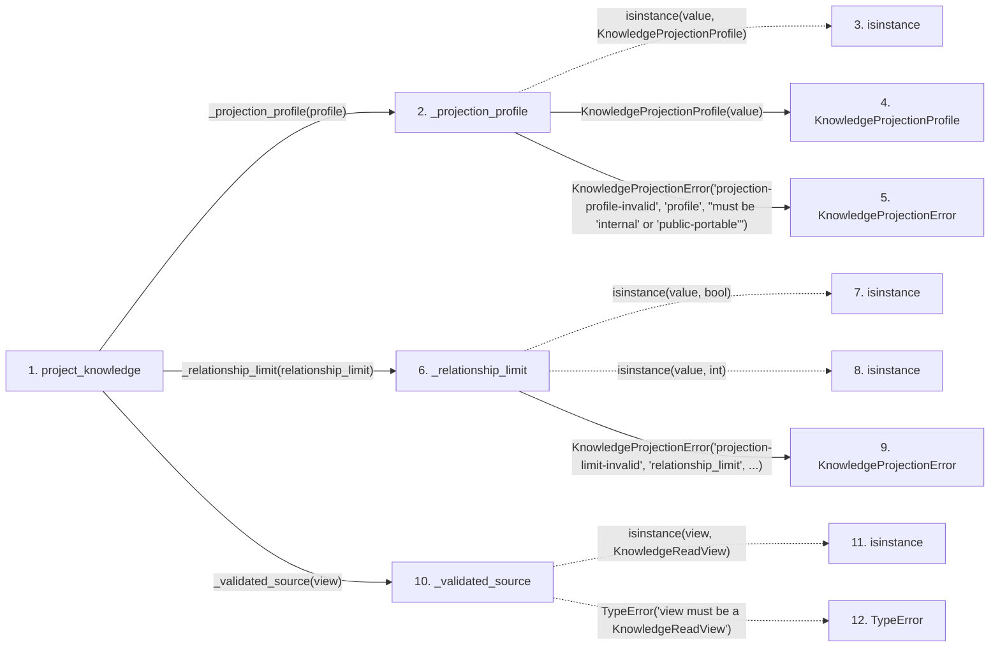

# project_knowledge

**Entry point:** `project_knowledge` (`api`)
**Source:** [knowledge_projection](../modules/knowledge_projection.md)
**Modules touched:** [concept_identity](../modules/concept_identity.md), [infrastructure_sync](../modules/infrastructure_sync.md), [knowledge_artifacts](../modules/knowledge_artifacts.md), and 13 more

**Complete modules touched:**

- [concept_identity](../modules/concept_identity.md)
- [infrastructure_sync](../modules/infrastructure_sync.md)
- [knowledge_artifacts](../modules/knowledge_artifacts.md)
- [knowledge_envelope](../modules/knowledge_envelope.md)
- [knowledge_evidence](../modules/knowledge_evidence.md)
- [knowledge_governance](../modules/knowledge_governance.md)
- [knowledge_graph](../modules/knowledge_graph.md)
- [knowledge_index](../modules/knowledge_index.md)
- [knowledge_links](../modules/knowledge_links.md)
- [knowledge_model](../modules/knowledge_model.md)
- [knowledge_observability](../modules/knowledge_observability.md)
- [knowledge_projection](../modules/knowledge_projection.md)
- [section_ownership](../modules/section_ownership.md)
- [validation](../modules/validation.md)
- [wiki_media](../modules/wiki_media.md)
- [wiki_surface](../modules/wiki_surface.md)

## Call sequence

<!-- Auto-generated from static call edges. Dashed arrows are external or unresolved calls. Reviewed runtime conditions and side effects belong in Behavior. -->

> Call sequence diagram shows 30 of 1633 interactions; 1603 omitted to keep the visualization within the 30-interaction and generated-diagram limits.

> Trace truncated at the depth limit; deeper calls are omitted.

## Data flow

<!-- Auto-generated static analysis. Treat values and boundaries as best-effort hints, not runtime proof. -->

### Step data

| Step | Inputs | Reads | Writes | Returns |
|---|---|---|---|---|
| `project_knowledge` | `view: KnowledgeReadView`, `profile: KnowledgeProjectionProfile \| str`, `relationship_limit: int`, `public_repository_identity: str \| None` | `UNKNOWN_VALUE`, `Mapping`, `PROJECTION_SCHEMA_VERSION` | `projected_concepts[...]` | `projection` |
| `_projection_profile` | `value: KnowledgeProjectionProfile \| str` | `KnowledgeProjectionProfile` | - | `...` |
| `isinstance` | - | - | - | - |
| `KnowledgeProjectionProfile` | - | - | - | - |
| `KnowledgeProjectionError` | - | - | - | - |
| `_relationship_limit` | `value: object` | `MAX_RELATIONSHIP_LIMIT`, `MAX_RELATIONSHIP_LIMIT` | - | `value` |
| `isinstance` | - | - | - | - |
| `isinstance` | - | - | - | - |
| `KnowledgeProjectionError` | - | - | - | - |
| `_validated_source` | `view: KnowledgeReadView` | `KnowledgeReadView`, `KnowledgeAvailability` | - | `(...)` |
| `isinstance` | - | - | - | - |
| `TypeError` | - | - | - | - |

### Call data

| From | To | Line | Call |
|---|---|---:|---|
| project_knowledge | _projection_profile | 288 | `_projection_profile(profile)` |
| _projection_profile | isinstance | 3477 | `isinstance(value, KnowledgeProjectionProfile)` |
| _projection_profile | KnowledgeProjectionProfile | 3478 | `KnowledgeProjectionProfile(value)` |
| _projection_profile | KnowledgeProjectionError | 3481 | `KnowledgeProjectionError('projection-profile-invalid', 'profile', "must be 'internal' or 'public-portable'")` |
| project_knowledge | _relationship_limit | 289 | `_relationship_limit(relationship_limit)` |
| _relationship_limit | isinstance | 3490 | `isinstance(value, bool)` |
| _relationship_limit | isinstance | 3491 | `isinstance(value, int)` |
| _relationship_limit | KnowledgeProjectionError | 3494 | `KnowledgeProjectionError('projection-limit-invalid', 'relationship_limit', ...)` |
| project_knowledge | _validated_source | 290 | `_validated_source(view)` |
| _validated_source | isinstance | 2257 | `isinstance(view, KnowledgeReadView)` |
| _validated_source | TypeError | 2258 | `TypeError('view must be a KnowledgeReadView')` |

### Boundary effects

*No boundary effects detected.*

### Static analysis gaps

| Kind | Step | Target | Line |
|---|---|---|---:|
| unresolved_call | `_projection_profile` | `isinstance` | 3477 |
| unresolved_call | `_relationship_limit` | `isinstance` | 3490 |
| unresolved_call | `_relationship_limit` | `isinstance` | 3491 |
| unresolved_call | `_validated_source` | `isinstance` | 2257 |
| unresolved_call | `_validated_source` | `TypeError` | 2258 |
| step_limit | `project_knowledge` | `first 12 steps` | 0 |
| truncated_flow | `project_knowledge` | `depth limit` | 0 |

## Behavior

This flow starts at `project_knowledge` and is classified as `api`. The generated call and data-flow sections are bounded static projections; runtime conditions and side effects require source-level confirmation.
