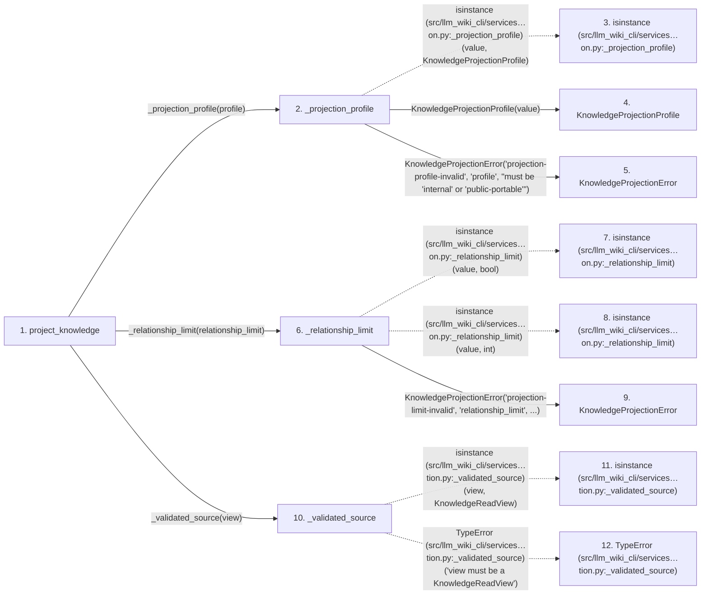

# project_knowledge

**Entry point:** `project_knowledge` (`api`)
**Source:** [knowledge_projection](../modules/knowledge_projection.md)
**Modules touched:** [canonical_json](../modules/canonical_json.md), [common](../modules/common.md), [concept_identity](../modules/concept_identity.md), [immutable](../modules/immutable.md), and 20 more

**Complete modules touched:**

- [canonical_json](../modules/canonical_json.md)
- [common](../modules/common.md)
- [concept_identity](../modules/concept_identity.md)
- [immutable](../modules/immutable.md)
- [infrastructure_sync](../modules/infrastructure_sync.md)
- [knowledge_artifacts](../modules/knowledge_artifacts.md)
- [knowledge_envelope](../modules/knowledge_envelope.md)
- [knowledge_evidence](../modules/knowledge_evidence.md)
- [knowledge_governance](../modules/knowledge_governance.md)
- [knowledge_graph](../modules/knowledge_graph.md)
- [knowledge_index](../modules/knowledge_index.md)
- [knowledge_model](../modules/knowledge_model.md)
- [knowledge_observability](../modules/knowledge_observability.md)
- [knowledge_packs](../modules/knowledge_packs.md)
- [knowledge_projection](../modules/knowledge_projection.md)
- [knowledge_reuse](../modules/knowledge_reuse.md)
- [knowledge_storage](../modules/knowledge_storage.md)
- [knowledge_storage_io](../modules/knowledge_storage_io.md)
- [manifest_storage](../modules/manifest_storage.md)
- [progress](../modules/progress.md)
- [section_ownership](../modules/section_ownership.md)
- [sync_manifest](../modules/sync_manifest.md)
- [validation](../modules/validation.md)
- [wiki_surface](../modules/wiki_surface.md)

## Call sequence

```mermaid
sequenceDiagram
    participant p0 as project_knowledge
    participant p1 as _projection_profile
    participant p2 as isinstance (src/llm_wiki_cli/services…on.py:_projection_profile)
    participant p3 as KnowledgeProjectionProfile
    participant p4 as KnowledgeProjectionError
    participant p5 as _relationship_limit
    participant p6 as isinstance (src/llm_wiki_cli/services…on.py:_relationship_limit)
    participant p7 as _validated_source
    participant p8 as isinstance (src/llm_wiki_cli/services…tion.py:_validated_source)
    participant p9 as TypeError (src/llm_wiki_cli/services…tion.py:_validated_source)
    participant p10 as require_validated_artifacts
    participant p11 as isinstance (src/llm_wiki_cli/services…quire_validated_artifacts)
    participant p12 as TypeError (src/llm_wiki_cli/services…quire_validated_artifacts)
    participant p13 as str (src/llm_wiki_cli/services…tion.py:_validated_source)
    participant p14 as (…).encode (src/llm_wiki_cli/services…tion.py:_validated_source)
    participant p15 as json.dumps (src/llm_wiki_cli/services…tion.py:_validated_source)
    participant p16 as dict (src/llm_wiki_cli/services…tion.py:_validated_source)
    participant p17 as serialize_knowledge_index(…).encode
    participant p18 as serialize_knowledge_index
    participant p19 as json.dumps (src/llm_wiki_cli/services…serialize_knowledge_index)
    participant p20 as knowledge_index_to_payload
    participant p21 as isinstance (src/llm_wiki_cli/services…nowledge_index_to_payload)
    participant p22 as TypeError (src/llm_wiki_cli/services…nowledge_index_to_payload)
    p0->>p1: _projection_profile
    p1-->>p2: isinstance (src/llm_wiki_cli/services…on.py:_projection_profile)
    p1->>p3: KnowledgeProjectionProfile
    p1->>p4: KnowledgeProjectionError
    p0->>p5: _relationship_limit
    p5-->>p6: isinstance (src/llm_wiki_cli/services…on.py:_relationship_limit)
    p5-->>p6: isinstance (src/llm_wiki_cli/services…on.py:_relationship_limit)
    p5->>p4: KnowledgeProjectionError
    p0->>p7: _validated_source
    p7-->>p8: isinstance (src/llm_wiki_cli/services…tion.py:_validated_source)
    p7-->>p9: TypeError (src/llm_wiki_cli/services…tion.py:_validated_source)
    p7->>p4: KnowledgeProjectionError
    p7->>p4: KnowledgeProjectionError
    p7->>p10: require_validated_artifacts
    p10-->>p11: isinstance (src/llm_wiki_cli/services…quire_validated_artifacts)
    p10-->>p12: TypeError (src/llm_wiki_cli/services…quire_validated_artifacts)
    p10-->>p11: isinstance (src/llm_wiki_cli/services…quire_validated_artifacts)
    p10-->>p12: TypeError (src/llm_wiki_cli/services…quire_validated_artifacts)
    p7->>p4: KnowledgeProjectionError
    p7-->>p13: str (src/llm_wiki_cli/services…tion.py:_validated_source)
    p7->>p4: KnowledgeProjectionError
    p7-->>p14: (…).encode (src/llm_wiki_cli/services…tion.py:_validated_source)
    p7-->>p15: json.dumps (src/llm_wiki_cli/services…tion.py:_validated_source)
    p7-->>p16: dict (src/llm_wiki_cli/services…tion.py:_validated_source)
    p7-->>p17: serialize_knowledge_index(…).encode
    p7->>p18: serialize_knowledge_index
    p18-->>p19: json.dumps (src/llm_wiki_cli/services…serialize_knowledge_index)
    p18->>p20: knowledge_index_to_payload
    p20-->>p21: isinstance (src/llm_wiki_cli/services…nowledge_index_to_payload)
    p20-->>p22: TypeError (src/llm_wiki_cli/services…nowledge_index_to_payload)
```

<!-- Auto-generated from static call edges. Dashed arrows are external or unresolved calls. Reviewed runtime conditions and side effects belong in Behavior. -->

> Call sequence diagram shows 30 of 1862 interactions; 1832 omitted to keep the visualization within the 30-interaction and generated-diagram limits.

> Trace truncated at the depth limit; deeper calls are omitted.

## Data flow

<!-- Auto-generated static analysis. Treat values and boundaries as best-effort hints, not runtime proof. -->

### Step data

| Step | Inputs | Reads | Writes | Returns |
|---|---|---|---|---|
| `project_knowledge` | `view: KnowledgeReadView`, `profile: KnowledgeProjectionProfile \| str`, `relationship_limit: int`, `public_repository_identity: str \| None` | `UNKNOWN_VALUE`, `Mapping`, `PROJECTION_SCHEMA_VERSION` | `projected_concepts[...]` | `projection` |
| `_projection_profile` | `value: KnowledgeProjectionProfile \| str` | `KnowledgeProjectionProfile` | - | `...` |
| `isinstance (src/llm_wiki_cli/services…on.py:_projection_profile)` | - | - | - | - |
| `KnowledgeProjectionProfile` | - | - | - | - |
| `KnowledgeProjectionError` | - | - | - | - |
| `_relationship_limit` | `value: object` | `MAX_RELATIONSHIP_LIMIT`, `MAX_RELATIONSHIP_LIMIT` | - | `value` |
| `isinstance (src/llm_wiki_cli/services…on.py:_relationship_limit)` | - | - | - | - |
| `isinstance (src/llm_wiki_cli/services…on.py:_relationship_limit)` | - | - | - | - |
| `KnowledgeProjectionError` | - | - | - | - |
| `_validated_source` | `view: KnowledgeReadView` | `KnowledgeReadView`, `KnowledgeAvailability` | - | `(...)`, `(...)` |
| `isinstance (src/llm_wiki_cli/services…tion.py:_validated_source)` | - | - | - | - |
| `TypeError (src/llm_wiki_cli/services…tion.py:_validated_source)` | - | - | - | - |

### Call data

| From | To | Line | Call |
|---|---|---:|---|
| project_knowledge | _projection_profile | 288 | `_projection_profile(profile)` |
| _projection_profile | isinstance (src/llm_wiki_cli/services…on.py:_projection_profile) | 3501 | `isinstance(value, KnowledgeProjectionProfile)` |
| _projection_profile | KnowledgeProjectionProfile | 3502 | `KnowledgeProjectionProfile(value)` |
| _projection_profile | KnowledgeProjectionError | 3505 | `KnowledgeProjectionError('projection-profile-invalid', 'profile', "must be 'internal' or 'public-portable'")` |
| project_knowledge | _relationship_limit | 289 | `_relationship_limit(relationship_limit)` |
| _relationship_limit | isinstance (src/llm_wiki_cli/services…on.py:_relationship_limit) | 3514 | `isinstance(value, bool)` |
| _relationship_limit | isinstance (src/llm_wiki_cli/services…on.py:_relationship_limit) | 3515 | `isinstance(value, int)` |
| _relationship_limit | KnowledgeProjectionError | 3518 | `KnowledgeProjectionError('projection-limit-invalid', 'relationship_limit', ...)` |
| project_knowledge | _validated_source | 290 | `_validated_source(view)` |
| _validated_source | isinstance (src/llm_wiki_cli/services…tion.py:_validated_source) | 2268 | `isinstance(view, KnowledgeReadView)` |
| _validated_source | TypeError (src/llm_wiki_cli/services…tion.py:_validated_source) | 2269 | `TypeError('view must be a KnowledgeReadView')` |

### Boundary effects

*No boundary effects detected.*

### Static analysis gaps

| Kind | Step | Target | Line |
|---|---|---|---:|
| external_call | `_projection_profile` | `isinstance` | 3501 |
| external_call | `_relationship_limit` | `isinstance` | 3514 |
| external_call | `_relationship_limit` | `isinstance` | 3515 |
| external_call | `_validated_source` | `isinstance` | 2268 |
| external_call | `_validated_source` | `TypeError` | 2269 |
| step_limit | `project_knowledge` | `first 12 steps` | 0 |
| truncated_flow | `project_knowledge` | `depth limit` | 0 |

## Behavior

This flow starts at `project_knowledge` and is classified as `api`. The generated call and data-flow sections are bounded static projections; runtime conditions and side effects require source-level confirmation.
