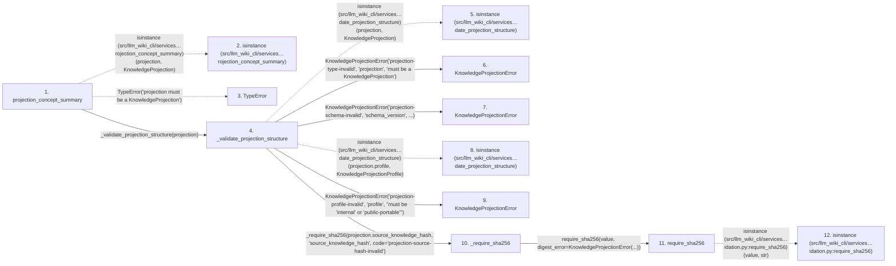

# projection_concept_summary

**Entry point:** `projection_concept_summary` (`api`)
**Source:** [knowledge_projection](../modules/knowledge_projection.md)
**Modules touched:** [concept_identity](../modules/concept_identity.md), [knowledge_envelope](../modules/knowledge_envelope.md), [knowledge_observability](../modules/knowledge_observability.md), and 2 more

**Complete modules touched:**

- [concept_identity](../modules/concept_identity.md)
- [knowledge_envelope](../modules/knowledge_envelope.md)
- [knowledge_observability](../modules/knowledge_observability.md)
- [knowledge_projection](../modules/knowledge_projection.md)
- [validation](../modules/validation.md)

## Call sequence

```mermaid
sequenceDiagram
    participant p0 as projection_concept_summary
    participant p1 as isinstance (src/llm_wiki_cli/services…rojection_concept_summary)
    participant p2 as TypeError
    participant p3 as _validate_projection_structure
    participant p4 as isinstance (src/llm_wiki_cli/services…date_projection_structure)
    participant p5 as KnowledgeProjectionError
    participant p6 as _require_sha256
    participant p7 as require_sha256
    participant p8 as isinstance (src/llm_wiki_cli/services…idation.py:require_sha256)
    participant p9 as require_trimmed_text
    participant p10 as require_nonempty_text
    participant p11 as isinstance (src/llm_wiki_cli/services….py:require_nonempty_text)
    participant p12 as value.strip (src/llm_wiki_cli/services….py:require_nonempty_text)
    participant p13 as any (src/llm_wiki_cli/services….py:require_nonempty_text)
    participant p14 as ord (src/llm_wiki_cli/services….py:require_nonempty_text)
    participant p15 as _SHA256_RE.fullmatch
    participant p16 as _require_mapping
    participant p17 as require_mapping
    participant p18 as isinstance (src/llm_wiki_cli/services…dation.py:require_mapping)
    participant p19 as key.encode
    participant p20 as _validate_projection_diagnostics
    participant p21 as isinstance (src/llm_wiki_cli/services…te_projection_diagnostics)
    p0-->>p1: isinstance (src/llm_wiki_cli/services…rojection_concept_summary)
    p0-->>p2: TypeError
    p0->>p3: _validate_projection_structure
    p3-->>p4: isinstance (src/llm_wiki_cli/services…date_projection_structure)
    p3->>p5: KnowledgeProjectionError
    p3->>p5: KnowledgeProjectionError
    p3-->>p4: isinstance (src/llm_wiki_cli/services…date_projection_structure)
    p3->>p5: KnowledgeProjectionError
    p3->>p6: _require_sha256
    p6->>p7: require_sha256
    p7-->>p8: isinstance (src/llm_wiki_cli/services…idation.py:require_sha256)
    p7->>p9: require_trimmed_text
    p9->>p10: require_nonempty_text
    p10-->>p11: isinstance (src/llm_wiki_cli/services….py:require_nonempty_text)
    p10-->>p12: value.strip (src/llm_wiki_cli/services….py:require_nonempty_text)
    p10-->>p13: any (src/llm_wiki_cli/services….py:require_nonempty_text)
    p10-->>p14: ord (src/llm_wiki_cli/services….py:require_nonempty_text)
    p10-->>p14: ord (src/llm_wiki_cli/services….py:require_nonempty_text)
    p7-->>p15: _SHA256_RE.fullmatch
    p6->>p5: KnowledgeProjectionError
    p3->>p16: _require_mapping
    p16->>p17: require_mapping
    p17-->>p18: isinstance (src/llm_wiki_cli/services…dation.py:require_mapping)
    p17-->>p18: isinstance (src/llm_wiki_cli/services…dation.py:require_mapping)
    p17-->>p19: key.encode
    p16->>p5: KnowledgeProjectionError
    p3->>p16: _require_mapping
    p3->>p20: _validate_projection_diagnostics
    p20-->>p21: isinstance (src/llm_wiki_cli/services…te_projection_diagnostics)
    p20-->>p21: isinstance (src/llm_wiki_cli/services…te_projection_diagnostics)
```

<!-- Auto-generated from static call edges. Dashed arrows are external or unresolved calls. Reviewed runtime conditions and side effects belong in Behavior. -->

> Call sequence diagram shows 30 of 614 interactions; 584 omitted to keep the visualization within the 30-interaction and generated-diagram limits.

> Trace truncated at the depth limit; deeper calls are omitted.

## Data flow

<!-- Auto-generated static analysis. Treat values and boundaries as best-effort hints, not runtime proof. -->

### Step data

| Step | Inputs | Reads | Writes | Returns |
|---|---|---|---|---|
| `projection_concept_summary` | `projection: KnowledgeProjection`, `canonical_path: str` | `KnowledgeProjection` | - | `_projection_concept_summary_unchecked(...)` |
| `isinstance (src/llm_wiki_cli/services…rojection_concept_summary)` | - | - | - | - |
| `TypeError` | - | - | - | - |
| `_validate_projection_structure` | `projection: KnowledgeProjection` | `KnowledgeProjection`, `PROJECTION_SCHEMA_VERSION`, `PROJECTION_SCHEMA_VERSION`, `KnowledgeProjectionProfile`, `UNEVALUATED_FRESHNESS_DISCLOSURE`, `UNEVALUATED_FRESHNESS_DISCLOSURE` | `concept_by_path[...]` | - |
| `isinstance (src/llm_wiki_cli/services…date_projection_structure)` | - | - | - | - |
| `KnowledgeProjectionError` | - | - | - | - |
| `KnowledgeProjectionError` | - | - | - | - |
| `isinstance (src/llm_wiki_cli/services…date_projection_structure)` | - | - | - | - |
| `KnowledgeProjectionError` | - | - | - | - |
| `_require_sha256` | `value: object`, `path: str`, `code: str` | - | - | `require_shared_sha256(...)` |
| `require_sha256` | `value: object`, `digest_error: Exception`, `text_error: Exception \| None`, `reject_control_characters: bool`, `allow_empty: bool` | - | - | `parsed`, `parsed` |
| `isinstance (src/llm_wiki_cli/services…idation.py:require_sha256)` | - | - | - | - |

### Call data

| From | To | Line | Call |
|---|---|---:|---|
| projection_concept_summary | isinstance (src/llm_wiki_cli/services…rojection_concept_summary) | 414 | `isinstance(projection, KnowledgeProjection)` |
| projection_concept_summary | TypeError | 415 | `TypeError('projection must be a KnowledgeProjection')` |
| projection_concept_summary | _validate_projection_structure | 416 | `_validate_projection_structure(projection)` |
| _validate_projection_structure | isinstance (src/llm_wiki_cli/services…date_projection_structure) | 797 | `isinstance(projection, KnowledgeProjection)` |
| _validate_projection_structure | KnowledgeProjectionError | 798 | `KnowledgeProjectionError('projection-type-invalid', 'projection', 'must be a KnowledgeProjection')` |
| _validate_projection_structure | KnowledgeProjectionError | 804 | `KnowledgeProjectionError('projection-schema-invalid', 'schema_version', ...)` |
| _validate_projection_structure | isinstance (src/llm_wiki_cli/services…date_projection_structure) | 809 | `isinstance(projection.profile, KnowledgeProjectionProfile)` |
| _validate_projection_structure | KnowledgeProjectionError | 810 | `KnowledgeProjectionError('projection-profile-invalid', 'profile', "must be 'internal' or 'public-portable'")` |
| _validate_projection_structure | _require_sha256 | 815 | `_require_sha256(projection.source_knowledge_hash, 'source_knowledge_hash', code='projection-source-hash-invalid')` |
| _require_sha256 | require_sha256 | 2229 | `require_shared_sha256(value, digest_error=KnowledgeProjectionError(...))` |
| require_sha256 | isinstance (src/llm_wiki_cli/services…idation.py:require_sha256) | 1100 | `isinstance(value, str)` |

### Boundary effects

*No boundary effects detected.*

### Static analysis gaps

| Kind | Step | Target | Line |
|---|---|---|---:|
| external_call | `projection_concept_summary` | `isinstance` | 414 |
| external_call | `projection_concept_summary` | `TypeError` | 415 |
| external_call | `_validate_projection_structure` | `isinstance` | 797 |
| external_call | `_validate_projection_structure` | `isinstance` | 809 |
| external_call | `require_sha256` | `isinstance` | 1100 |
| step_limit | `projection_concept_summary` | `first 12 steps` | 0 |
| truncated_flow | `projection_concept_summary` | `depth limit` | 0 |

## Behavior

This flow starts at `projection_concept_summary` and is classified as `api`. The generated call and data-flow sections are bounded static projections; runtime conditions and side effects require source-level confirmation.
